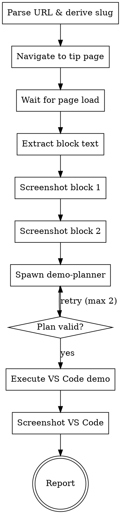

## IMPORTANT: VS Code Ownership

**Before starting, tell the user:**

> This skill will take full control of your VS Code window for screenshot capture.
> Do NOT interact with VS Code while this is running — any clicks or keystrokes will break the automation.
> Work in a different app (browser, other terminal) while this runs.

## Goal

Produce 3 screenshot images for a developer tip page, ready to share on Slack:
1. **Insights card** — Key Insights block from the tip page
2. **Actions card** — Action Items block from the tip page
3. **VS Code demo** — Live demonstration of the tip concept in VS Code

## Flow



## Node Details

### Parse URL & derive slug

Extract the slug from the URL path. Example:
- URL: `https://easingthemes.github.io/dx-aem-flow/learn/tldr/the-three-tools-you-need-to-know/`
- Slug: `the-three-tools-you-need-to-know`

Create output directory: `tools/screenshots/<slug>/`

### Navigate to tip page

```
mcp__chrome-devtools-mcp__navigate_page(type: "url", url: "<tip-url>")
```

### Wait for page load

Wait for the tip blocks to render:

```
mcp__chrome-devtools-mcp__wait_for(
  selector: ".tip-block",
  state: "visible",
  timeout: 10000
)
```

### Extract block text

Use `evaluate_script` to get the text content from both tip blocks. Both cards have the `tip-block` class — first is insights, second is actions.

```
mcp__chrome-devtools-mcp__evaluate_script(
  function: "() => {
    const blocks = document.querySelectorAll('.tip-block');
    return {
      insights: blocks[0]?.innerText || '',
      actions: blocks[1]?.innerText || '',
      focus: blocks[0]?.querySelector('[class*=bg-cyan]')?.innerText || 'All Tools'
    };
  }"
)
```

Save the extracted text — it becomes the input for the planner.

### Screenshot block 1

Inject ARIA attributes so `.tip-block` divs appear in the a11y tree with UIDs:

```
mcp__chrome-devtools-mcp__evaluate_script(
  function: "() => {
    const blocks = document.querySelectorAll('.tip-block');
    blocks[0]?.setAttribute('role', 'region');
    blocks[0]?.setAttribute('aria-label', 'tip-insights');
    blocks[1]?.setAttribute('role', 'region');
    blocks[1]?.setAttribute('aria-label', 'tip-actions');
    return blocks.length;
  }"
)
```

Take a snapshot to get UIDs — look for `region "tip-insights"` and `region "tip-actions"`:

```
mcp__chrome-devtools-mcp__take_snapshot()
```

Screenshot each block by UID:

```
mcp__chrome-devtools-mcp__take_screenshot(
  uid: "<tip-insights-uid>",
  filePath: "tools/screenshots/<slug>/<slug>-insights.png"
)
```

### Screenshot block 2

```
mcp__chrome-devtools-mcp__take_screenshot(
  uid: "<tip-actions-uid>",
  filePath: "tools/screenshots/<slug>/<slug>-actions.png"
)
```

### Spawn demo-planner

Spawn the `demo-planner` agent with the extracted block text:

```
Agent(
  subagent_type: "demo-planner",
  prompt: "Plan a VS Code demo for this tip.

Block 1 (Key Insights):
<insights text>

Block 2 (Action Items):
<actions text>

Focus: <focus value>

Return the demo plan in the specified format."
)
```

### Plan valid?

The planner returns a structured plan. Validate:
- Has at least 1 action
- Every `type:` action has `enter: true`
- Wait times are reasonable (1-30s each, total under 120s)
- Prompts are under 80 chars
- At least one tool matches the focus

If invalid, retry with feedback (max 2 retries).

### Execute VS Code demo

Execute the plan actions sequentially using vscode-automator MCP tools.

#### VS Code Layout

VS Code has two distinct areas for running AI tools:
- **Terminal Panel** (bottom) — standard integrated terminal. Claude Code runs here.
- **Editor Area** (top/main) — where files and editor tabs live. Copilot CLI opens here via Command Palette.
- **Chat Panel** (side panel) — VS Code Chat / Copilot Chat. Separate from both terminal and editor.

#### Verified Execution Sequence

**CRITICAL RULES:**
- `type` and `keystroke(enter)` must be back-to-back — NO intervening tool calls
- Always wait 1s after focus switch before typing (AppleScript race condition)
- Each tool needs a FRESH session — don't reuse existing ones
- Clear input before typing: `Ctrl+E` → `Ctrl+U` (readline fields only, NOT VS Code Chat)

#### Step-by-step (order matters):

```
 1. vscode_focus()

 2. vscode_command("Chat: New CLI Session to the Side")     → fresh Copilot CLI in Editor Area
 3. wait 5s (Copilot CLI init)
 4. Ctrl+E → Ctrl+U                                         → clear any leftover input
 5. type "<copilot prompt>" + enter                          → Copilot CLI working

 6. vscode_new_terminal()                                    → fresh terminal
 7. wait 1s
 8. type "claude" + enter                                    → Claude Code launching
 9. wait 12s (init + MCP servers)
10. type "<claude prompt>" + enter                           → Claude Code working

11. Cmd+Shift+I                                              → focus VS Code Chat
12. wait 1s
13. Cmd+N                                                    → NEW chat session (clean input)
14. wait 1s
15. type "<chat prompt>" + enter                             → Chat working

16. wait 30s                                                 → ALL THREE respond in parallel
17. vscode_screenshot
```

#### Focus Switching (for additional prompts after initial setup)

| Tool | Focus command | Wait | Clear input |
|------|-------------|------|-------------|
| **Copilot CLI** | `vscode_command("View: Focus First Editor Group")` | 1s | `Ctrl+E` → `Ctrl+U` |
| **Claude Code** | `vscode_keystroke(key: "\`", modifiers: ["control"])` | 1s | `Ctrl+E` → `Ctrl+U` |
| **VS Code Chat** | `vscode_keystroke(key: "i", modifiers: ["command", "shift"])` | 1s | `Cmd+N` (new chat, not clear) |

#### Action Mapping (from planner output)

| Plan action | MCP calls |
|-------------|-----------|
| `open_copilot_cli` | `vscode_command("Chat: New CLI Session to the Side")` |
| `new_terminal` | `vscode_new_terminal()` |
| `new_chat` | `Cmd+Shift+I` → wait 1s → `Cmd+N` → wait 1s |
| `focus_copilot` | `vscode_command("View: Focus First Editor Group")` → wait 1s |
| `focus_terminal` | `Ctrl+backtick` → wait 1s |
| `focus_chat` | `Cmd+Shift+I` → wait 1s |
| `clear_input` | `Ctrl+E` → `Ctrl+U` (terminal/CLI only) |
| `type: "text" \| enter: true` | `vscode_type(text)` then IMMEDIATELY `vscode_keystroke(key: "enter")` |
| `wait: N` | `vscode_wait(seconds: N)` |

After all actions + final wait from the plan:
- Proceed to screenshot

### Screenshot VS Code

```
mcp__vscode-automator__vscode_screenshot(
  output_path: "tools/screenshots/<slug>/<slug>-demo.png"
)
```

### Report

Print a summary with the 3 image paths:

```
## Screenshots Ready

| Image | Path |
|-------|------|
| Insights card | `tools/screenshots/<slug>/<slug>-insights.png` |
| Actions card | `tools/screenshots/<slug>/<slug>-actions.png` |
| VS Code demo | `tools/screenshots/<slug>/<slug>-demo.png` |

Ready to share on Slack.
```
