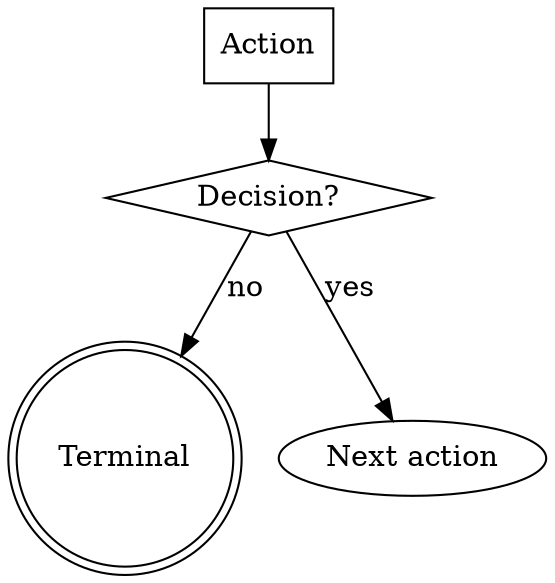

# CLAUDE.md

This file provides guidance to Claude Code (claude.ai/code) when working with code in this repository.

## What This Is

Four Claude Code plugins for AI-assisted Azure DevOps development workflows. There is no build system — plugins are pure Markdown (skills, agents, rules, templates) with shell helper scripts.

- **dx-core** (`plugins/dx-core/`) — Platform-agnostic ADO/Jira workflow: requirements → planning → execution → review → PR. Works with any tech stack. 45 skills (`dx-*`), 7 agents. 15 Copilot agent templates (incl. coordinators).
- **dx-hub** (`plugins/dx-hub/`) — Multi-repo orchestration: hub init, config, status. 3 skills (`dx-hub-*`).
- **dx-aem** (`plugins/dx-aem/`) — AEM-specific verification, QA, and demo capture. Includes AEM project knowledge (seed data). Requires dx. 12 skills (`aem-*`), 6 agents.
- **dx-automation** (`plugins/dx-automation/`) — Autonomous AI agents (DoR checker, DoD checker, DoD fixer, PR reviewer, PR answerer, BugFix agent, QA agent, DevAgent, DOCAgent, Estimation) running 24/7 as ADO pipelines triggered by AWS Lambda webhooks. Requires dx. 11 skills (`auto-*`).

AEM project knowledge (seed data) is now built into dx-aem — no separate plugin needed.

## Testing Changes

```bash
# Add local marketplace (once)
/plugin marketplace add /path/to/dx-aem-flow

# Install plugins from marketplace
/plugin install dx-core@dx-aem-flow
/plugin install dx-aem@dx-aem-flow

# Test a skill
/dx-init
/aem-init

# Test standalone scaffold (bootstraps for any AI agent)
node cli/bin/dx-scaffold.js /tmp/test-project --all
```

No compilation, linting, or automated test suite — verify skills manually by running them in a test project and checking that config is read correctly, output files land in expected locations, and no hardcoded values leak in.

### Standalone CLI (`cli/`)

`cli/bin/dx-scaffold.js` is a zero-dependency Node.js utility that replicates `/dx-init` + `/aem-init` output for any AI coding agent. It reads templates from `plugins/` at runtime — no bundling needed. When adding new templates or data files, the scaffold picks them up automatically (it iterates directories). Only changes to the scaffolding logic itself (new file categories, new placeholders) require updating `cli/lib/scaffold.js`.

**Always-generated files:** `.github/agents/` (agent definitions) and `AGENTS.md` (agent discovery) are always generated regardless of flags — they're consumed by Copilot CLI, VS Code Chat, Codex CLI, Windsurf, and the Copilot coding agent. The `--copilot` flag only controls extra Copilot-specific files (`copilot-instructions.md`, `.github/README.md`).

## Architecture

### Cross-Platform Agent Support

This repo supports multiple AI coding agents:

| File | Purpose | Platforms |
|------|---------|-----------|
| `CLAUDE.md` | Full contributor guide (primary) | Claude Code |
| `AGENTS.md` | Cross-tool instructions (subset of CLAUDE.md) | Codex, Copilot, Cursor, Windsurf, Zed, Jules, Gemini CLI |
| `GEMINI.md` | Gemini CLI context (references AGENTS.md) | Gemini CLI |
| `gemini-extension.json` | Gemini extension manifest | Gemini CLI |
| `.codex/INSTALL.md` | Codex skill symlink instructions | Codex |
| `.claude-plugin/` | Claude Code + Copilot CLI manifests | Claude Code, Copilot CLI |
| `.cursor-plugin/` | Cursor manifests (with explicit paths) | Cursor |

When updating architecture sections in CLAUDE.md, check if AGENTS.md needs a corresponding update.

### Four-Plugin Design

Plugins are independently installable. Non-AEM projects only need dx-core (+ dx-hub for multi-repo). Each plugin has:
```
plugin/
├── .claude-plugin/plugin.json   # Plugin manifest (shared by Claude Code + Copilot CLI)
├── .cursor-plugin/plugin.json   # Cursor manifest (with explicit skill/agent/hook paths)
├── .mcp.json                    # MCP server config
├── agents/                      # Agent definitions (*.md with YAML frontmatter)
├── skills/                      # Skill directories (*/SKILL.md)
├── rules/                       # Default prompt templates
├── hooks/                       # Plugin hooks (hooks.json)
├── data/                        # Seed files copied to project by init
├── shared/                      # Reference files read by skills
└── templates/                   # Init-time file templates
    ├── rules/                   #   Convention rules → .claude/rules/
    ├── instructions/            #   Detailed docs → .github/instructions/
    └── agents/                  #   Copilot agents → .github/agents/
```

### Config-Driven — Never Hardcode

All project-specific values live in `.ai/config.yaml` (generated by `/dx-init`, extended by `/aem-init`). Skills read config at runtime. Instead of hardcoding `mvn clean install`, read `build.command`. Instead of `develop`, read `scm.base-branch`. Instead of `http://localhost:4502`, read `aem.url`.

### Spec Directory Convention

Per-ticket output goes to `.ai/specs/<id>-<slug>/` with predictable filenames (`raw-story.md`, `explain.md`, `research.md`, `implement.md`, etc.). Skills find each other's output by convention — no data passing needed.

### Three-Layer Override System

```
.ai/rules/<topic>.md  >  config.yaml overrides:  >  plugin defaults (rules/*.md)
```

`.ai/rules/` contains shared rules (pr-review, pr-answer, pragmatism, plan-format) read by both dx skills and automation Lambda agents. Editing these files changes behavior for local development AND automated pipelines. System prompt wrappers in `.ai/automation/prompts/` reference shared rules via `{{PLACEHOLDER}}` tokens.

Projects can also shadow entire skills by creating `.claude/skills/<name>/SKILL.md`.

### Model Tier Strategy

Model tiering is applied at two levels: agents use `model:` in their frontmatter, and skills can also specify `model:` and `effort:` frontmatter for direct execution without an agent.

| Tier | Effort | Use | Agents / Skills |
|------|--------|-----|-----------------|
| Opus | `high` | Deep reasoning (code review, planning, verification) | dx-code-reviewer agent; dx-plan, dx-step-verify, dx-pr-review skills |
| Sonnet | (default) | Execution (steps, PR review, inspections) | dx-pr-reviewer agent, aem-inspector, aem-editorial-guide-capture, aem-bug-executor; dx-step, dx-req, dx-step-fix skills |
| Haiku | `low` | Simple lookups (file search, doc search) | dx-file-resolver, dx-doc-searcher, aem-page-finder agents; dx-ticket-analyze, dx-help skills |

### MCP Servers

- **dx:** ADO MCP (`@azure-devops/mcp`) — work items, PRs, repos
- **dx:** Atlassian MCP — Jira issues, Confluence pages
- **dx:** Figma MCP — design extraction, screenshots, tokens
- **dx:** axe MCP — accessibility testing
- **aem:** AEM MCP (HTTP) — JCR content, components, dialogs
- **aem:** Chrome DevTools MCP — browser automation

### Plugin MCP Tool Naming — CRITICAL

MCP servers in a plugin's `.mcp.json` get a prefixed tool name: `mcp__plugin_<plugin-name>_<server>__<tool>`. Always use the full prefix in skill/agent files:

| Server | Plugin | Full tool prefix | WRONG shorthand |
|--------|--------|-----------------|-----------------|
| ADO | *(project-level)* | `mcp__ado__` | *(n/a — no prefix)* |
| Atlassian | *(project-level)* | `mcp__atlassian__` | *(n/a — no prefix)* |
| Figma | dx-core | `mcp__plugin_dx-core_figma__` | `mcp__figma__` |
| axe | dx-core | `mcp__plugin_dx-core_axe-mcp-server__` | `mcp__axe-mcp-server__` |
| AEM | dx-aem | `mcp__plugin_dx-aem_AEM__` | `mcp__AEM__` |
| Chrome DevTools | dx-aem | `mcp__plugin_dx-aem_chrome-devtools-mcp__` | `mcp__chrome-devtools-mcp__` |

**Why:** Subagents resolve tools by exact name or ToolSearch. The shorthand doesn't match the actual registered tool names, causing "tool not found" failures.

### Hook System — Platform Separation

Plugin hooks and Copilot CLI hooks are **completely separate systems** with no overlap:

| Hook source | Active in |
|-------------|-----------|
| Plugin `hooks/hooks.json` | Claude Code CLI only |
| `.github/hooks/hooks.json` | Copilot CLI only (v1.0.10+) |
| Agent frontmatter `hooks:` | VS Code Chat only (1.111+) |

To give both platforms the same safety hooks, install to both locations. `/dx-init` step 9h handles this for the branch-guard hook. See the docs site (`website/`) for full details.

### Hook Profiles — `DX_HOOK_PROFILE`

Control hook strictness via the `DX_HOOK_PROFILE` environment variable:

| Profile | Level | Behavior |
|---------|-------|----------|
| `minimal` | 1 | Only blocking safety hooks (branch-guard). Skip informational hooks. |
| `standard` | 2 | **Default.** All hooks enabled. |
| `strict` | 3 | All hooks + extra guardrails (future use). |

Set in your shell: `export DX_HOOK_PROFILE=minimal` to suppress informational hooks during focused work, or `strict` for CI/pipeline environments. Hook scripts use `source hook-profile.sh && require_profile "standard"` to gate themselves.

### Hook Authoring — Key Fields

| Field | Purpose | Example |
|-------|---------|---------|
| `matcher` | Which tool events to listen for | `"Bash"`, `"Edit"`, `"mcp__*figma*"` |
| `if` | Fine-grained permission rule filter (evaluated before spawning) | `"Bash(git commit*)"`, `"Edit(**/.claude-plugin/**)"` |
| `statusMessage` | Spinner text while hook runs | `"Checking branch protection..."` |
| `async` | Non-blocking background execution | `true` for observational hooks |
| `timeout` | Seconds before canceling | `30` for quick checks |

**Exit codes:** `0` = success (parse JSON from stdout), `2` = blocking error (stderr as feedback), other = non-blocking error. **Never use exit 1 for blocking** — it's treated as a non-blocking error (shown only in verbose mode).

## Conventions for Adding Skills/Agents

### Skill Structure

```yaml
---
name: my-skill
description: One-line with trigger phrases
argument-hint: "<what user passes>"
model: sonnet          # optional — opus | sonnet | haiku
effort: medium         # optional — low | medium | high | max
context: fork          # optional — run in isolated subagent
agent: agent-name      # optional — subagent type for context: fork
paths: ["**/*.ts"]     # optional — limit auto-activation to file patterns
---
```

- Skills go in `plugins/{dx-core,dx-hub,dx-aem,dx-automation}/skills/<name>/SKILL.md`
- Helper scripts go in `skills/<name>/scripts/*.sh`
- Naming: kebab-case, plugin prefix required. Format: `{plugin}-{name}` (e.g., `dx-req-all`, `aem-init`). Group prefixes within dx: `dx-req-*`, `dx-plan-*`, `dx-step-*`, `dx-pr-*`, `dx-bug-*`, `dx-agent-*`. Coordinators use `-all` suffix.

### Flow Control (branching skills only)

Skills with decision gates, retry loops, or conditional paths use a DOT digraph as the single source of truth for execution flow:



Detailed instructions go in `## Node Details` sections keyed by node name. Every digraph node must have a matching `### Section` heading (exact match). Do NOT use numbered steps for branching skills — the graph IS the flow.

Linear skills (no branching) continue to use numbered steps.

### Agent Structure

```yaml
---
name: dx-my-agent
description: What it does
tools: Read, Write, Glob, Grep, Bash
model: sonnet
---
```

- Agents go in `plugins/{dx-core,dx-aem}/agents/<name>.md`
- Naming: plugin prefix + descriptive role (`dx-code-reviewer`, `aem-inspector`)

### Plugin Manifest (Dual-Platform)

`plugin.json` is read by **both** Claude Code and Copilot CLI. **NEVER** add `agents` or `skills` fields when using default directories (`agents/`, `skills/`) — specifying them **breaks Claude Code** with `"agents: Invalid input"` validation errors. Both platforms auto-discover default directories automatically. Only add these fields for non-standard paths (e.g., `"agents": ["./specialized-agents"]`).

Full schema and compatibility matrix: see the docs site (`website/`) → "Plugin Manifest — Dual-Platform Format"

### Checklist

- No hardcoded org URLs, project names, paths, build commands, or branch names
- Config fields documented if new ones are introduced
- Update `docs/reference/skill-catalog.md` or `docs/reference/agent-catalog.md`
- Shell scripts are `chmod +x`
- **Versioning is automated** — semantic-release bumps all 4 version files on push to `main` based on conventional commit prefixes. Use `feat:` for minor, `fix:` for patch, `BREAKING CHANGE:` in body for major. `chore:`, `docs:`, `ci:` do not trigger releases. Do NOT manually edit version numbers.

### Superpowers Soft-Dependency Pattern

Skills can optionally reference [superpowers](https://github.com/obra/superpowers) methodology skills using a soft-dependency pattern:

```markdown
If `superpowers:<skill-name>` is available, invoke it to [benefit].

**Fallback (if superpowers not installed):** [condensed inline guidance]
```

This works across all platforms: Claude Code invokes via Skill tool, Copilot CLI/VS Code Chat follow the fallback. Six skills currently use this pattern: dx-plan, dx-step, dx-step-fix, dx-step-verify, dx-agent-all, dx-pr.

## TODO Tracking

All TODOs live in `docs/todo/`. Structure:

```
docs/todo/
├── TODO.md              # Master tracker — numbered table with links
├── todo-testing.md      # Detail file per topic
├── todo-copilot-cli.md
├── todo-automation.md
├── todo-config.md
├── todo-website.md
├── todo-naming-ux.md
├── todo-pipeline.md
└── todo-bugs.md
```

**Rules:**
- `TODO.md` is the single index — every item gets a numbered row with priority, status, date, and link to a detail file
- Detail files are grouped by topic (`todo-<topic>.md`), not by date or conversation
- When adding a TODO: add a row to `TODO.md` AND add/update the relevant detail file
- Multiple items can link to different sections of the same detail file
- Never scatter TODOs in other locations — always use `docs/todo/`

**Detail file item format — every item MUST include:**
```markdown
## Item title

**Added:** YYYY-MM-DD
**Problem:** What's wrong or missing — describe the problem, not just a solution. Problems don't change; solutions do.
**Scope:** Exact files, directories, or skills affected. Agent must know WHERE to look.
**Done-when:** A concrete, verifiable check — a command to run, a file to check, a grep to execute. An agent must be able to confirm completion without guessing.
**Approach:** (optional) Proposed solution, migration steps, or design notes.
```

**Verification rule:** When checking TODO status, run the `Done-when` check. Do not infer status from absence of files that might have been intentionally deleted — that's the whole point of having an explicit check.

## Documentation

Documentation lives in two places:

| Location | Purpose |
|----------|---------|
| `website/` | Astro docs site — full documentation, tutorials, architecture |
| `docs/reference/` | Machine-readable catalogs and config schema (used by skills) |

To run the docs site locally:
```bash
cd website && npm install && npm run dev
```

Always organize docs by topic in the website. Use `docs/reference/` only for files that skills read programmatically.
