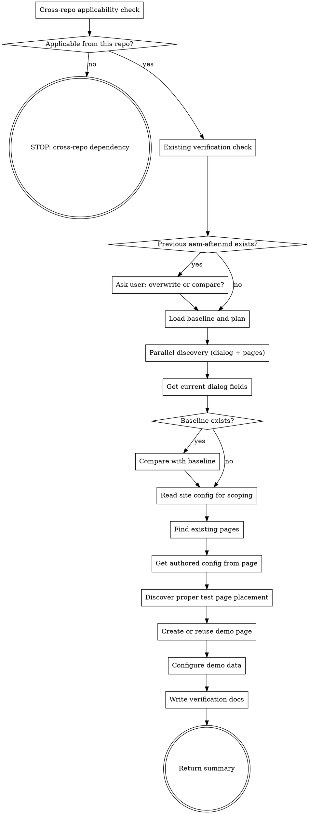

**Platform note:** This skill uses `context: fork` + `agent: aem-inspector` for isolated execution. If subagent dispatch is unavailable (e.g., VS Code Chat), you may run inline but AEM MCP tools (`AEM/*`, `chrome-devtools-mcp/*`) must be available. If they are not, inform the user: "AEM verification requires AEM and Chrome DevTools MCP servers. Please use Claude Code or Copilot CLI."

## Applicability Check (Cross-Repo Dependencies)

Before running, determine if AEM verification is meaningful from the current repo alone.

Read `.ai/config.yaml` for `repos` section. If the project uses multiple repos (e.g., separate BE and FE):

**Backend-only repos:**
- CAN verify: dialog changes, HTL template changes, model/exporter JSON data, component definitions
- CANNOT verify: visual rendering that depends on FE code from another repo
- **Skip if changes require FE code** from a separate frontend repo

**Frontend-only repos:**
- CAN verify: FE-only changes where the BE is already deployed to AEM (styling, JS behavior, FE rendering)
- CANNOT verify: changes that depend on new BE code not yet deployed
- **Skip if changes require BE code** from a separate backend repo not yet deployed to AEM

**How to determine:** Check `.ai/specs/*-*/explain.md` or `.ai/specs/*-*/research.md` for "Repos Required" or "Cross-Repo Scope". If the other repo's changes are a prerequisite, skip.

## Flow



## Node Details

### Cross-repo applicability check

Read `.ai/config.yaml` for `repos` section and check `.ai/specs/*-*/explain.md` or `.ai/specs/*-*/research.md` for "Repos Required" or "Cross-Repo Scope". Determine if AEM verification is meaningful from the current repo alone based on change type (BE-only, FE-only, full-stack).

### Applicable from this repo?

If the other repo's changes are a prerequisite for verification, take the "no" path. Otherwise, take the "yes" path.

### STOP: cross-repo dependency

Print: "Cross-repo dependency — skipping. Deploy the other repo first, then re-run verification."

STOP.

### Existing verification check

Check for existing `$SPEC_DIR/aem-after.md`.

### Previous aem-after.md exists?

If `aem-after.md` exists in the spec directory, take the "yes" path. Otherwise, take the "no" path.

### Ask user: overwrite or compare?

Ask user: "Previous verification found. Overwrite or compare with new results?"
- If "compare", load previous results for delta comparison after current verification
- If "overwrite", proceed normally

### Load baseline and plan

**Task:** Verify the AEM component **$ARGUMENTS** after deployment, create a demo page, and save verification docs. Compare against baseline if available.

**Environment flag:** If `--qa` is present in arguments, use `aem.author-url-qa` for all doc links and Chrome DevTools URLs instead of `aem.author-url`. Without `--qa`, defaults to local (`aem.author-url`). Note: MCP calls always go to whichever AEM instance the MCP server is connected to — the `--qa` flag only affects documentation links and browser navigation URLs.

If no component name was provided, check `.ai/specs/*-*/aem-before.md`, `.ai/specs/*-*/implement.md`, or `.ai/specs/*-*/aem-after.md` to infer it. If unclear, state what you need and stop.

Check if `<spec-dir>/aem-before.md` exists.
- **If it exists:** read it to get the baseline field list. Extract baseline field names from the Dialog Fields tables.
- **If it does NOT exist:** no baseline comparison — skip "Compare with baseline" and mark all current fields as "CURRENT" instead of ADDED/UNCHANGED.

Read `<spec-dir>/implement.md` to get new field names and expected test values.

### Parallel discovery (dialog + pages)

These can run simultaneously (single message, multiple AEM MCP calls):
1. Get current dialog fields (`getComponents` or `getNodeContent`)
2. Search for pages using this component (`enhancedPageSearch` or `searchContent`)

Wait for both. Use dialog fields for comparison; use page list for demo page selection.

### Get current dialog fields

Walk the dialog tree to extract all fields.

### Baseline exists?

If `aem-before.md` was found in "Load baseline and plan", take the "yes" path. Otherwise, take the "no" path (skip comparison, list all current fields as the definitive field inventory).

### Compare with baseline

For each field, categorize as: **ADDED**, **REMOVED**, **UNCHANGED**, **MODIFIED**.

Mark the "Changes from Baseline" section accordingly.

If no baseline: mark the section as "No baseline available — showing current state".

### Read site config for scoping

Read `.ai/config.yaml` `aem.content-paths` (or discover via `mcp__plugin_dx-aem_AEM__fetchSites`). Use these to:
- **Scope page searches** — search configured content paths
- **Guide test page placement** — prefer the first configured content tree
- **Identify resource type** — read from `.ai/config.yaml` `aem.resource-type-pattern`

### Find existing pages

Search configured content paths first (faster, more targeted).

JCR query for `sling:resourceType = '<resource-type-pattern>/$ARGUMENTS'`, limit 10.
Count total. Extract top 3 page paths.

### Get authored config from page

For the first page found, read the component node (depth 4) to capture authored values.
Also examine the **container chain** — what's between `jcr:content/root` and the component.

### Discover proper test page placement

Read `shared/demo-page-setup.md` for the **Page Selection Rule** — it applies to this skill.

**Key rule:** New pages are ONLY for new components. For updates to existing components (enhancements, a11y fixes, bug fixes), find the best representative existing page with the component and reuse it for screenshots and QA URLs. Do NOT modify production pages — just use them as-is. Only fall back to creating a new page if no existing page has the component.

Discover component placement:

**If pages were found (existing component):**
- Find the **best representative page** — prefer production content pages over demo/test pages, prefer pages where the component is prominent, prefer the same market/brand as the story
- Record the page path for QA URLs (Author Edit + Preview)
- Find the **language root** from that page — use the same site/brand as the production page
- Record the **template** used by that page (`jcr:content/cq:template`)
- Record the **container chain** (parent sling:resourceType from root to component)

**Language root detection:** Some sites have duplicated country/lang segments (e.g., `/content/brand/ca/en/ca/en/...`). The language root is the FULL path before the content pages start — use `mcp__plugin_dx-aem_AEM__fetchLanguageMasters` or walk up the page tree checking `jcr:content/jcr:language` to find the actual root. Do NOT assume a fixed depth — always verify.

**Create the test page on the SAME site** as the production pages.

**If no pages found (new component):**
- Read `<spec-dir>/explain.md` or `<spec-dir>/raw-story.md` for target project/brand
- Find a similar component in the same `componentGroup` using `mcp__plugin_dx-aem_AEM__getComponents`
- Query for where THAT component is used
- Use its page's language root, template, and container chain
- Last resort: `mcp__plugin_dx-aem_AEM__fetchSites` then first site then find language root

### Create or reuse demo page

Follow the demo page workflow from `shared/demo-page-setup.md`:

a. Read `aem.demo-parent-path` from `.ai/config.yaml` (e.g., `/content/brand-a/ca/en/ca/en/demo`). If not set, fall back to `<language-root>/demo`.
b. Ensure the parent path exists (create folder page if missing, using same template as sibling pages)
c. **Check if `<demo-parent-path>/<spec-slug>` already exists** — use `mcp__plugin_dx-aem_AEM__getPageProperties` or `mcp__plugin_dx-aem_AEM__getNodeContent` to check
   - **If page exists:** reuse it, skip page creation. Log: "Demo page already exists, reusing."
   - **If page does NOT exist:** create with the same template as the source page
d. Recreate container chain if needed (e.g., add section first, then component inside it)
e. **Check if the component is already added** — use `mcp__plugin_dx-aem_AEM__getNodeContent` on the container to look for a child with `sling:resourceType` matching the component
   - **If component exists:** reuse it, skip adding. Log: "Component already on page, reusing."
   - **If component does NOT exist:** add it to the correct container

### Configure demo data

**First check if the component already has data configured** — use `mcp__plugin_dx-aem_AEM__getNodeContent` on the component node (depth 3) to inspect existing properties.

- **If data already exists** (non-empty `data/` child node with authored properties): log "Demo data already configured, skipping." and move on.
- **If data is empty or missing:** configure using real data from an existing component instance.

**Get real data from an existing component instance:**
1. From prior page search, you already found pages using this component — pick one with authored content
2. Use `mcp__plugin_dx-aem_AEM__getNodeContent` (depth 5) on that component instance to extract all its properties
3. Copy those real property values to the demo component via `mcp__plugin_dx-aem_AEM__updateComponent`
4. Skip internal JCR properties (`jcr:*`, `sling:*`, `cq:*`) — only copy authored data properties

**Map dialog fields to properties:**
- Dialog field `name="./data/heading"` maps to property `data/heading`
- Multifield items may need child node creation — set what you can, note the rest

**Fallback (only for fields with no real data found):**
- Text fields: "Test <fieldLabel>"
- Booleans: true (to exercise the feature)
- Selects: first available option if known

### Write verification docs

**Determine author URL:** If `--qa` flag was passed, read `aem.author-url-qa` from `.ai/config.yaml`. Otherwise read `aem.author-url` (defaults to `http://localhost:4502`). Use this URL for all doc links in the output. (MCP calls use JCR paths — the MCP server handles which AEM instance to connect to.)
Read the exporter selector from `.ai/config.yaml` `aem.selector` (if configured).

Write `<spec-dir>/aem-after.md`:

```markdown
# AEM Verification: <title> (`<name>`)

**Verified:** <date>
**Component:** `<component-path>/<name>`
**Pages using component:** <N>
**Test page:** <author-url>/editor.html<test-page-path>.html
**Test JSON:** <author-url><component-node-path>.<selector>.json

## Changes from Baseline

_If baseline exists:_

| Change | Field | Type | Label | JCR Property |
|--------|-------|------|-------|-------------|
| ADDED | ... | ... | ... | ... |
| REMOVED | ... | ... | ... | ... |
| UNCHANGED | ... | ... | ... | ... |

**Summary:** <N> added, <N> removed, <N> unchanged

_If no baseline:_ "No baseline available — showing current field inventory"

## Current Dialog Fields (<N> total)

### Tab: <tab-title>

| Field | Type | Label | JCR Property |
|-------|------|-------|-------------|
| ... | ... | ... | ... |

## Current Authored Config

_From: <existing-page-path>_

| Property | Value |
|----------|-------|
| ... | ... |

## Test Page

- **Path:** `<test-page-path>`
- **Author:** <author-url>/editor.html<test-page-path>.html
- **JSON:** <author-url><component-node-path>.<selector>.json
- **Language root:** `<language-root>`
- **Template:** `<template-path>`
- **Container chain:** responsivegrid > <section if needed> > <component>
- **Demo data:** configured/partial/needs manual authoring
- **Notes:** <any manual steps needed>

## Pages Using This Component (<N> total, top 3)

| # | Page Path | Author Link |
|---|-----------|-------------|
| 1 | ... | <author-url>/editor.html/....html |

## Verification Checklist

- [ ] Component dialog opens without errors
- [ ] New fields visible and functional
- [ ] Show/hide logic works (if applicable)
- [ ] JSON output includes new fields
- [ ] Existing fields unchanged
- [ ] Demo data renders correctly
```

### Return summary

Return ONLY:
- Field changes: N added, N removed, N unchanged
- List ADDED and REMOVED field names
- Number of pages using component
- Top 3 page author links
- Test page author link
- Test page JSON endpoint link
- Language root used
- Container chain used
- Demo data status (configured/partial/manual)
- Spec dir where aem-after.md was saved

## Success Criteria

- [ ] `aem-after.md` exists in spec directory
- [ ] All dialog fields documented
- [ ] Comparison with baseline (aem-before.md) if exists
- [ ] Regressions flagged explicitly
- [ ] Demo page created or reused

## Examples

### Verify after deployment (with baseline)
```
/aem-verify hero
```
If `/aem-snapshot hero` was run before development, compares current dialog fields against baseline. Shows ADDED, REMOVED, UNCHANGED fields. Creates demo page under `<demo-parent-path>/<slug>/`, configures demo data, writes `aem-after.md`.

### Verify new component (no baseline)
```
/aem-verify my-new-component
```
No baseline exists — shows current field inventory instead of diff. Finds a similar component to determine placement (template, container chain), creates test page, configures demo data.

### Re-run (idempotent)
```
/aem-verify hero
```
If test page already exists, reuses it. If demo data is already configured, skips reconfiguration. Only regenerates `aem-after.md`.

## Troubleshooting

### "Cannot determine component name"
**Cause:** No argument provided and no spec files to infer from.
**Fix:** Pass the component name explicitly: `/aem-verify hero`.

### Test page creation fails
**Cause:** Language root detection failed (some sites have duplicated country/lang segments), or the template is restricted.
**Fix:** Check the language root path in the error. The skill walks up the page tree to find it — if the site structure is unusual, specify the target path in `explain.md`.

### "Cross-repo dependency — skipping"
**Cause:** The component needs both BE and FE changes, but the other repo's code isn't deployed yet.
**Fix:** Deploy the other repo first, then re-run verification. Or verify only the aspects available in the current repo (dialog changes for BE-only, styling for FE-only).

## Decision Examples

### Regression Detected
**Before:** Dialog had 5 fields (title, subtitle, image, link, linkText)
**After:** Dialog has 4 fields — linkText missing
**Decision:** REGRESSION — field removed. Flag and compare against spec.

### Intentional Change
**Before:** Dialog had 5 fields
**After:** Dialog has 6 fields (new: backgroundColor)
**Spec says:** "Add background color field to hero dialog"
**Decision:** NOT regression — intentional addition per spec. Verify field works correctly.
