You are the top-level coordinator. You orchestrate the entire development pipeline from ADO story to pull request.

## Argument

The argument is the ADO work item ID — a numeric value (e.g., `2435084`).

If the user provides a full ADO URL, extract the numeric ID.

If no argument is provided, ask the user for the work item ID.

### Run-State Management

Maintain run state in `$SPEC_DIR/run-state.json`:

```json
{
  "skill": "dx-agent-all",
  "ticket": "<id>",
  "started": "<ISO-8601>",
  "last_phase_completed": 0,
  "total_phases": 0
}
```

**On invocation:**
1. Check for existing `$SPEC_DIR/run-state.json`
2. If exists and fresh (<2 hours) → ask: "Previous run found at phase {last_phase_completed}/{total_phases}. Resume or start fresh?"
3. If stale → start fresh, delete old state
4. If not exists → create new

**During execution:** Update after each phase.
**On completion:** Delete run-state.json.

## Execution Mode

Check if the user specified a mode:
- **interactive** (default) — pause after each phase for human review
- **autonomous** — run straight through, only stop on errors

If the user said "autonomous", "auto", or "hands-free", use autonomous mode.

## Context Management

**Critical:** Every phase MUST run via Skill tool calls to keep the orchestrator context lean.

- Phase 1 invokes `Skill(/dx-req <id>)` — runs the full requirements pipeline
- Phase 2 invokes `Skill(/dx-plan)`, `Skill(/dx-plan-validate)`, `Skill(/dx-plan-resolve)` as needed
- Phase 3 invokes `Skill(/dx-step-all)` — runs the execution loop
- Phases 4, 4.5 invoke `Skill(/dx-step-build)`, `Skill(/dx-step-verify)`
- **Never read spec files in the main orchestrator** — trust skill return summaries
- Keep dev-all's own context to orchestration only: phase status, short summaries, user interaction

## Progress Logging

Before starting the pipeline, count the total phases that will run (including optional ones that apply). Assign each phase a sequential number. Every phase log message MUST include the progress counter in `(current/total)` format.

Example: `Phase 4: Build & Deploy — (6/8)` means 6th phase out of 8 total.

All phases in order (max 15):

| # | Phase | Condition |
|---|-------|-----------|
| 1 | Requirements | always |
| 1.5-enrich | Project Enrichment | only if project.yaml exists |
| 1.5 | Figma Design-to-Code | only if Figma URL in story |
| 2 | Planning | always |
| 3 | Feature Branch | always |
| 4 | Execution | always |
| 5 | Build | always |
| 5+ | AEM Baseline | only if /aem-snapshot exists + component found + not FE-only |
| 6 | Full Code Review | skipped if build failed |
| 6+ | AEM Verification | only if AEM Baseline ran + build passed |
| 6++ | AEM FE Verification | only if build passed + AEM MCP on localhost + Chrome DevTools available |
| 7 | Commit | skipped if build/review failed |
| 7.5 | Editorial Guide | only if AEM Verification passed + AEM MCP available |
| 8 | Pull Request | skipped if commit failed |
| 9 | Documentation | optional (if doc-gen skills available) |

At the start, determine which optional phases will run and calculate the total. Update the total if a phase gets skipped mid-run (e.g., build failure skips review, commit, PR).

**Progress file:** Create `.ai/specs/<id>-<slug>/dev-all-progress.md` at pipeline start. Update after each phase:

```markdown
# Pipeline Progress: #<id>

| Phase | Status | Time |
|-------|--------|------|
| Requirements | ✓ done | — |
| Project Enrichment | ⊘ skipped | — |
| Planning | ⏳ running | — |
| Execution | — | — |
```

Status values: `✓ done`, `⊘ skipped`, `✗ failed`, `⏳ running`, `—` (not started).

### Execution Methodology

If `superpowers:executing-plans` is available, invoke it before starting Phase 1 to set execution discipline.

**Fallback (if superpowers not installed):** Follow these execution principles:
- Review plan critically before starting — flag concerns with user.
- Stop immediately when blocked (don't force through).
- Mark phases in_progress → completed for tracking.
- Never start on main/master without explicit user consent.

## Progress Tracking

Before creating tasks, use `TaskList` to check for existing tasks from a previous run (e.g., user interrupted and restarted). If stale tasks exist, delete them all first with `TaskUpdate` (status: `cancelled`) so the list is clean. Then create a task for each applicable phase using `TaskCreate`. Mark each `in_progress` when starting, `completed` when done. Delete tasks for phases that get skipped at runtime.

Use the phase table above to determine which phases apply. Example tasks for a typical run:

1. Requirements (fetch, DoR, explain, research, share)
2. Planning (plan, validate, resolve)
3. Feature branch
4. Execution (dx-step-all)
5. Build
6. Code review
7. Commit
8. Pull request

Add conditional phases (Figma, AEM baseline, AEM verify, editorial guide, docs) only when their conditions are met. Delete them if conditions turn out false mid-run.

## Flow

```dot
digraph agent_all {
    "Parse argument + check run-state" [shape=box];
    "Determine execution mode (interactive/autonomous)" [shape=box];
    "Phase 1: Requirements (fetch - dor - explain - research - share)" [shape=box];
    "Interactive: user review checkpoint" [shape=diamond];
    "project.yaml exists?" [shape=diamond];
    "Phase 1.5-enrich: Project Enrichment" [shape=box];
    "Figma URL in story?" [shape=diamond];
    "Phase 1.5: Figma Design-to-Code" [shape=box];
    "Phase 1.5a: Cross-Repo Check (pipeline mode)" [shape=box];
    "Phase 1.5b: Hub Dispatch" [shape=box];
    "Hub dispatch complete — collect results" [shape=box];
    "Phase 2: Planning (plan - validate - resolve)" [shape=box];
    "Plan valid?" [shape=diamond];
    "STOP: Plan validation failed" [shape=doublecircle];
    "Phase 2.5: Create feature branch" [shape=box];
    "Phase 3: Execution (invoke dx-step-all)" [shape=box];
    "Execution complete?" [shape=diamond];
    "STOP: Step failures" [shape=doublecircle];
    "Phase 4: Build (invoke dx-step-build)" [shape=box];
    "Build passed?" [shape=diamond];
    "Phase 4.5: Code Review (invoke dx-step-verify)" [shape=box];
    "Review passed?" [shape=diamond];
    "Phase 4.5-heal: Self-healing review (max 2 cycles)" [shape=box];
    "Heal succeeded?" [shape=diamond];
    "Phase 5: AEM Baseline (conditional)" [shape=box];
    "Phase 5+: AEM Verify (conditional)" [shape=box];
    "Phase 5++: AEM FE Verify (conditional)" [shape=box];
    "Phase 5a: Commit (if auto-commit)" [shape=box];
    "Phase 6: Pull Request (if auto-pr)" [shape=box];
    "Phase 6.5: Editorial Guide (conditional)" [shape=box];
    "Phase 7: Documentation (conditional)" [shape=box];
    "Final Summary" [shape=doublecircle];

    "Parse argument + check run-state" -> "Determine execution mode (interactive/autonomous)";
    "Determine execution mode (interactive/autonomous)" -> "Phase 1: Requirements (fetch - dor - explain - research - share)";
    "Phase 1: Requirements (fetch - dor - explain - research - share)" -> "Interactive: user review checkpoint";
    "Interactive: user review checkpoint" -> "project.yaml exists?" [label="continue (or autonomous)"];
    "project.yaml exists?" -> "Phase 1.5-enrich: Project Enrichment" [label="yes"];
    "project.yaml exists?" -> "Phase 1.5a: Cross-Repo Check (pipeline mode)" [label="no"];
    "Phase 1.5-enrich: Project Enrichment" -> "Phase 1.5a: Cross-Repo Check (pipeline mode)";
    "Phase 1.5a: Cross-Repo Check (pipeline mode)" -> "Phase 1.5b: Hub Dispatch";
    "Phase 1.5b: Hub Dispatch" -> "Figma URL in story?" [label="not hub mode or single repo"];
    "Phase 1.5b: Hub Dispatch" -> "Hub dispatch complete — collect results" [label="hub dispatched"];
    "Hub dispatch complete — collect results" -> "Final Summary";
    "Figma URL in story?" -> "Phase 1.5: Figma Design-to-Code" [label="yes"];
    "Figma URL in story?" -> "Phase 2: Planning (plan - validate - resolve)" [label="no"];
    "Phase 1.5: Figma Design-to-Code" -> "Phase 2: Planning (plan - validate - resolve)";
    "Phase 2: Planning (plan - validate - resolve)" -> "Plan valid?";
    "Plan valid?" -> "STOP: Plan validation failed" [label="no"];
    "Plan valid?" -> "Phase 2.5: Create feature branch" [label="yes"];
    "Phase 2.5: Create feature branch" -> "Phase 3: Execution (invoke dx-step-all)";
    "Phase 3: Execution (invoke dx-step-all)" -> "Execution complete?";
    "Execution complete?" -> "STOP: Step failures" [label="no"];
    "Execution complete?" -> "Phase 4: Build (invoke dx-step-build)" [label="yes"];
    "Phase 4: Build (invoke dx-step-build)" -> "Build passed?";
    "Build passed?" -> "Phase 4.5: Code Review (invoke dx-step-verify)" [label="yes"];
    "Build passed?" -> "Final Summary" [label="no (skip review, commit, PR)"];
    "Phase 4.5: Code Review (invoke dx-step-verify)" -> "Review passed?";
    "Review passed?" -> "Phase 5: AEM Baseline (conditional)" [label="yes"];
    "Review passed?" -> "Phase 4.5-heal: Self-healing review (max 2 cycles)" [label="no"];
    "Phase 4.5-heal: Self-healing review (max 2 cycles)" -> "Heal succeeded?";
    "Heal succeeded?" -> "Phase 5: AEM Baseline (conditional)" [label="yes"];
    "Heal succeeded?" -> "Final Summary" [label="no (skip commit, PR)"];
    "Phase 5: AEM Baseline (conditional)" -> "Phase 5+: AEM Verify (conditional)";
    "Phase 5+: AEM Verify (conditional)" -> "Phase 5++: AEM FE Verify (conditional)";
    "Phase 5++: AEM FE Verify (conditional)" -> "Phase 5a: Commit (if auto-commit)";
    "Phase 5a: Commit (if auto-commit)" -> "Phase 6: Pull Request (if auto-pr)";
    "Phase 6: Pull Request (if auto-pr)" -> "Phase 6.5: Editorial Guide (conditional)";
    "Phase 6.5: Editorial Guide (conditional)" -> "Phase 7: Documentation (conditional)";
    "Phase 7: Documentation (conditional)" -> "Final Summary";
}
```



## Node Details

### Parse argument + check run-state

Extract the numeric ADO work item ID from the argument. If a full URL is provided, parse the ID. If no argument, ask the user. Then check for existing run-state per the Run-State Management rules above.

### Determine execution mode (interactive/autonomous)

Check if the user specified a mode. If "autonomous", "auto", or "hands-free" was used, set autonomous mode. Otherwise default to interactive.

### Phase 1: Requirements (fetch - dor - explain - research - share)

Invoke `Skill(/dx-req <id>)` — this runs the full requirements pipeline (fetch, DoR, explain, research, share) in a single call.

Print: `Phase 1: Requirements — (<N>/<total>) complete.`

**Interactive mode:** Print:
```markdown
## Phase 1: Requirements — (<N>/<total>) Complete

Review the spec documents in `.ai/specs/<id>-<slug>/`:
1. `dor-report.md` — review DoR gaps + blocking questions, send to BA
2. `explain.md` — are the requirements accurate?

Type "continue" to proceed to planning, or adjust the specs first.
```

Wait for user confirmation before continuing.

**Autonomous mode:** Continue immediately.

### Interactive: user review checkpoint

In interactive mode, wait for user confirmation after Phase 1. In autonomous mode, pass through immediately.

### project.yaml exists?

Check if `.ai/project/project.yaml` exists. If yes, proceed to Project Enrichment. If no, skip to Cross-Repo Check.

### Phase 1.5-enrich: Project Enrichment

**Guard:** `.ai/project/project.yaml` exists.

Run enhanced `/dx-ticket-analyze` (which now includes AEM enrichment — market detection, file resolution, page finding).

Invoke `Skill(/dx-ticket-analyze <id>)`.

This is **non-fatal** — if enrichment times out or fails, continue with a warning. Project enrichment is additive context only, not a pipeline gate.

Print: `Phase 1.5-enrich: Project Enrichment — (<N>/<total>) <done|skipped|WARN: timed out>.`

**If `.ai/project/project.yaml` does not exist:** Skip silently. Print: `Phase 1.5-enrich: Project Enrichment — skipped (no project.yaml).`

### Phase 1.5a: Cross-Repo Check (pipeline mode)

If the environment variable `DX_PIPELINE_MODE` is set (check via Bash: `echo "$DX_PIPELINE_MODE"`):

1. Find the spec directory: `.ai/specs/<id>-*/`
2. Read `research.md` and look for `## Cross-Repo Scope` section
3. If found, check if the current repo (`SOURCE_REPO_NAME` env var) is listed in the "What's needed" column:
   - If current repo is NOT a target (work belongs entirely to another repo):
     a. Parse the target repo name from the table
     b. Read `CROSS_REPO_PIPELINE_MAP` env var (JSON: `{"RepoName":"pipelineId"}`)
     c. If map has the target repo, write `.ai/run-context/delegate.json`:
        ```json
        {"targetRepo":"<repo>","pipelineId":"<id>","reason":"<from table>","templateParameters":{"workItemId":"<id>","eventId":"<from env or empty>"}}
        ```
        ```bash
        mkdir -p .ai/run-context
        ```
        Print: `⚡ Delegating to <repo> pipeline (ID: <id>) — this repo is not the target.`
        **STOP** — do not proceed to Phase 1.5 or beyond.
     d. If map is empty or missing the repo, print: `⚠ Cross-repo detected (<repo>) but no pipeline mapped. Continuing locally.`
   - If current repo IS a target (but other repos are also listed):
     Continue normally. After Phase 6 (PR) or final summary, write `delegate.json` for the OTHER repos.

If `DX_PIPELINE_MODE` is not set: skip this phase entirely (local mode).

Read `shared/repo-discovery.md` for full protocol details.

### Phase 1.5b: Hub Dispatch

Read `shared/hub-dispatch.md` for hub detection logic.

**Skip this phase if:**
- `DX_PIPELINE_MODE` is set (pipeline mode took precedence in Phase 1.5a)
- Hub mode is not active (no `hub.enabled: true` or cwd is not `.hub/`)

**If hub mode is active:**

Print: `Hub mode detected. Use /dx-hub-dispatch <ticket-id> to dispatch this ticket to repo terminals.` STOP.

Hub dispatch is handled by the dedicated `/dx-hub-dispatch` skill, which opens independent VS Code terminals for each repo. Individual skills no longer dispatch directly.

### Figma URL in story?

After Phase 1 completes, check the raw-story.md for Figma URLs matching `figma.com/design/`. If found, proceed to Figma Design-to-Code. If not, skip to Planning.

### Phase 1.5: Figma Design-to-Code

**Guard:** Figma URL found in raw-story.md matching `figma.com/design/`.

Runs the full Figma workflow (extract, prototype, verify).

Invoke `Skill(/dx-figma-all <id>)`.

**If no Figma URL found:** Skip silently. Print: `Phase 1.5: Figma Design-to-Code — (<N>/<total>) skipped (no Figma URL in story).`

**If succeeds:** Print: `Phase 1.5: Figma Design-to-Code — (<N>/<total>) extract + prototype + verify complete.`

**If Figma MCP fails:** Print warning but continue — Figma context is optional. Print: `Phase 1.5: Figma Design-to-Code — (<N>/<total>) WARN: Figma workflow failed (<reason>). Continuing without design reference.`

### Phase 2: Planning (plan - validate - resolve)

**Graph context (optional):** Before invoking the planner, check if decision lineage exists from previous tickets:

```bash
find .ai/graph/edges/ -name "*.yaml" -type f 2>/dev/null | head -20
```

If edge files exist, scan for `verified-by` edges — these indicate decisions that were confirmed by code review. Print a brief summary for the user:

```markdown
### Graph Context
- **Decision nodes:** <count> across <ticket-count> tickets
- **Verified decisions:** <count> (confirmed by code review)
- Patterns available: <count> in `.ai/graph/nodes/patterns/`
```

This is informational only — dx-plan itself reads patterns and decisions during planning. The summary helps the user understand how much cross-ticket knowledge is available.

If no edge files exist (new project or early tickets), skip silently.

Invoke `Skill(/dx-plan <id>)`.

Then invoke `Skill(/dx-plan-validate <id>)`.

If validation FAILs:
- Print the validation report
- STOP — "Plan validation failed. Fix implement.md and run `/dx-plan-validate` to retry."

If validation PASSes WITH WARNINGS or risks were flagged:

Invoke `Skill(/dx-plan-resolve <id>)`.

If plan-resolve updated steps, re-validate:

Invoke `Skill(/dx-plan-validate <id>)`.

Print: `Phase 2: Planning — (<N>/<total>) complete.`

**Interactive mode:** Print the plan summary. If validation passed (with or without resolved risks), **auto-continue** to Phase 3. Only pause on FAIL.

**Autonomous mode:** Continue if validation passed.

### Plan valid?

Check the plan-validate result. If FAIL, stop. If PASS (with or without warnings), continue to feature branch creation.

### STOP: Plan validation failed

Terminal state. Print the validation report and instruct: "Plan validation failed. Fix implement.md and run `/dx-plan-validate` to retry."

### Phase 2.5: Create feature branch

Before any code changes, create and switch to a feature branch using the shared script:

```bash
bash .ai/lib/ensure-feature-branch.sh .ai/specs/<id>-<slug>
```

The script:
- No-ops if already on a `feature/*` or `bugfix/*` branch
- Creates `feature/<id>-<slug>` if on any other branch
- Saves the branch name to `.ai/specs/<id>-<slug>/.branch` for downstream skills

Print: `Phase 2.5: Feature Branch — (<N>/<total>) <BRANCH> (<BRANCH_ACTION>)`

**This is a hard gate** — do not proceed to Phase 3 until confirmed on a feature branch.

### Phase 3: Execution (invoke dx-step-all)

Invoke `Skill(/dx-step-all <id>)` — it runs the full execution loop for all plan steps.

If step-all stops due to fix failures, STOP and report.

Print: `Phase 3: Execution — (<N>/<total>) all steps executed.`

### Execution complete?

Check if all steps in `implement.md` completed successfully. If any steps failed, stop. If all done, continue to build.

### STOP: Step failures

Terminal state. Report which steps failed and suggest: "Run `/dx-step-all` to retry execution."

### Phase 4: Build (invoke dx-step-build)

Invoke the `/dx-step-build` skill. It has `context: fork` — build commands, error diagnosis, and fix loops all run in an isolated context (max 6 fix attempts). Only the final pass/fail result returns here.

**If build succeeds:**
- Print: `Phase 4: Build — (<N>/<total>) passed.`
- Continue to Phase 4.5.

**If build fails after 6 fix attempts:**
- Print: `Phase 4: Build — (<N>/<total>) FAILED after 6 attempts.`
- **Do NOT stop** — skip Phase 4.5 (no review of broken code) and skip Phase 5a (no commit). Continue to Final Summary with the failure recorded.

### Build passed?

If build passed, continue to code review. If build failed, skip review/commit/PR and go to Final Summary.

### Phase 4.5: Code Review (invoke dx-step-verify)

**Guard:** Phase 4 (build) passed — code review on broken code is not useful.

Invoke the `/dx-step-verify` skill. It has `context: fork` — the full review-fix loop (git diffs, file reads, code-reviewer subagent, rebuilds) all runs in an isolated context. Only the final verdict and summary returns here.

**This phase is always autonomous** — no interactive pause regardless of mode. Print the review summary from the skill's return, then:

**If PASSED** — print: `Phase 4.5: Code Review — (<N>/<total>) passed in <C> cycles.` Continue to Phase 5.
**If FAILED** (issues remain after 3 cycles) — go to Phase 4.5-heal (self-healing).

### Review passed?

If review passed, continue to AEM Baseline. If failed, go to self-healing.

### Phase 4.5-heal: Self-healing review (max 2 cycles)

Track healing cycles. Max 2 healing cycles at this level.

**Step 1:** Invoke step-fix in heal mode with the review failure context.

Invoke `Skill(/dx-step-fix)` with healing context:
```
/dx-step-fix .ai/specs/<id>-<slug> --heal --failure-type review-failed
```

Check the step-fix return:
- **`unrecoverable`** → print: `Phase 4.5-heal: Unrecoverable after healing. Human intervention needed.` Skip Phase 5a. Continue to Final Summary.
- **`healed`** → continue to Step 2.

**Step 2:** Execute the new corrective steps.

Invoke `/dx-step-all <id>` via Skill tool — skip commits, only run pending steps (the newly created R* steps).

**Step 3:** Rebuild.

Invoke the `/dx-step-build` skill (context: fork).

If build fails → print: `Phase 4.5-heal: Build failed after healing. Human intervention needed.` Skip Phase 5a. Continue to Final Summary.

**Step 4:** Re-review.

Invoke the `/dx-step-verify` skill (context: fork).

If PASSED → print: `Phase 4.5: Code Review — (<N>/<total>) passed after healing cycle <H>.` Continue to Phase 5.
If FAILED and healing cycle < 2 → repeat Phase 4.5-heal from Step 1.
If FAILED and healing cycle = 2 → print: `Phase 4.5: Code Review — (<N>/<total>) FAILED after 2 healing cycles.` Skip Phase 5a. Continue to Final Summary.

### Heal succeeded?

If healing produced a passing review, continue to AEM Baseline. If healing failed or was unrecoverable, skip commit/PR and go to Final Summary.

### Phase 5: AEM Baseline (conditional)

**Guard:** ALL of:
1. `/aem-snapshot` skill exists
2. A component was identified in research.md
3. Changes are NOT FE-only (FE-only changes don't affect AEM dialog/content)

If FE-only: ask user to confirm skip.

Invoke `/aem-snapshot` skill (context: fork). Captures component state before development — dialog fields, properties, pages where it's used.

Print: `Phase 5: AEM Baseline — (<N>/<total>) <captured|skipped>.`

### Phase 5+: AEM Verify (conditional)

**Guard:**
1. Phase 5 (AEM Baseline) was run
2. Phase 4 (Build) passed

Invoke `/aem-verify` skill (context: fork).

**If fails:** Pause — report component broken, wait for user instruction.

Print: `Phase 5+: AEM Verification — (<N>/<total>) <passed|FAILED>.`

### Phase 5++: AEM FE Verify (conditional)

**Guard:** ALL of:
1. Phase 4 (Build) passed
2. AEM MCP is connected to localhost (`aem.author-url` contains `localhost`)
3. Chrome DevTools MCP is available
4. A component was identified in research.md or implement.md

**This phase does NOT require AEM Baseline (Phase 5).** It verifies frontend rendering, not dialog fields. It runs even for FE-only changes.

Invoke `/aem-fe-verify` skill (context: fork). It creates/reuses a demo page, screenshots the component in `wcmmode=disabled`, and compares against Figma reference (if available) or requirements.

**Decision tree:**
- **PASS** → continue
- **PASS WITH MINOR GAPS** → warn but continue (minor gaps are acceptable)
- **NEEDS ATTENTION** → warn but continue (not a hard gate — fix loop already attempted 3 iterations)
- **BLOCKED** → warn and continue (AEM not on localhost, MCP unavailable)

Print: `Phase 5++: AEM FE Verification — (<N>/<total>) <PASS|PASS WITH MINOR GAPS|NEEDS ATTENTION|BLOCKED|skipped>.`

### Phase 5a: Commit (if auto-commit)

**Guard:** Phase 4 (build) AND Phase 4.5 (code review) both passed. If either failed, skip entirely — do not commit broken or unreviewed code.

Read `.ai/config.yaml` and check the **preferences** section for `auto_commit`:
- **If `true`:** Invoke `Skill(/dx-pr-commit)`.
  Print: `Phase 5a: Commit — (<N>/<total>) committed.`
- **If `false` or not found:** Print: `Phase 5a: Commit — (<N>/<total>) skipped (auto-commit disabled).`

### Phase 6: Pull Request (if auto-pr)

**Guard:** Phase 5a (commit) completed successfully. If commit was skipped or any prior phase failed, skip entirely.

Read `.ai/config.yaml` and check the **preferences** section for `auto_pr`:
- **If `true`:** Invoke the `/dx-pr` skill to create the pull request automatically.
  Print: `Phase 6: Pull Request — (<N>/<total>) PR created.`
- **If `false` or not found:** Print: `Phase 6: Pull Request — (<N>/<total>) skipped (auto-PR disabled).`

### Phase 6.5: Editorial Guide (conditional)

**Guard:**
1. AEM Verification (Phase 5+) passed
2. AEM MCP is available

Ask user: "Capture editorial guide? (y/n)"

If yes: invoke `/aem-editorial-guide` skill (context: fork). Captures dialog screenshots and writes authoring guide.

Print: `Phase 6.5: Editorial Guide — (<N>/<total>) <captured|skipped>.`

### Phase 7: Documentation (conditional)

**Guard:**
1. Phase 6 (PR) completed successfully (code is committed and PR created)
2. The `/dx-doc-gen` skill exists (check if the skill is available)

If both conditions are met, invoke documentation generation. **Run aem-doc-gen FIRST** (it produces screenshots and authoring-guide.md), then dx-doc-gen (it reads aem-doc-gen output and embeds Authoring/Website sections in the wiki page).

If `/aem-doc-gen` skill is available (AEM project), invoke it first:

Invoke `Skill(/aem-doc-gen <id>)` (if the skill is available — skip if not found).

Then invoke dx-doc-gen (reads aem-doc-gen output if available):

Invoke `Skill(/dx-doc-gen <id>)` (if the skill is available — skip if not found).

**If skills not available:** Print: `Phase 7: Documentation — skipped (doc-gen skills not installed).`
**If executed:** Print: `Phase 7: Documentation — (<N>/<total>) generated.`

### Final Summary

```markdown
## Pipeline Complete: #<id>

**<Title>**
**Branch:** `feature/<id>-<slug>`

| Phase | Status | Details |
|-------|--------|---------|
| Requirements | Done | <N> docs generated |
| Project Enrichment | Done/Skip | <N> files, <P> pages / skipped (no project.yaml) |
| Figma Design-to-Code | Done/Skip | Extract + prototype + verify / skipped (no URL) |
| Planning | Done | <N> steps planned |
| Execution | Done | <N> steps completed |
| Build | Pass/Fail | passed / failed after 6 attempts |
| AEM Baseline | Done/Skip | snapshot captured / skipped |
| Full Code Review | Pass/Skip | PASSED in <N> cycles (+ <H> healing) / skipped (build failed) |
| AEM Verification | Done/Skip | passed / failed / skipped |
| AEM FE Verification | Done/Skip | PASS / PASS WITH MINOR GAPS / NEEDS ATTENTION / skipped |
| Commit | Done/Skip | committed / skipped (build/review failed or auto-commit off) |
| Editorial Guide | Done/Skip | captured / skipped |
| Pull Request | Done/Skip | PR created / skipped (auto-PR off or prior failure) |
| Documentation | Done/Skip | Wiki + demo pages / skipped (skills not installed) |

Review the results above.
If build failed, fix the issues and run `/dx-step-build` to retry.
If review failed after fixing, run `/dx-step-fix` manually to diagnose, then `/dx-step-verify`.
If auto-PR was off, create PR manually with `/dx-pr`.
```

## Validation Gates

| After Phase | Gate | Fail Action |
|------------|------|-------------|
| Phase 1 (Requirements) | `explain.md` and `research.md` exist in spec directory | STOP — "Requirements phase incomplete." |
| Phase 2 (Planning) | `implement.md` exists with ≥1 step | STOP — "Planning failed." |
| Phase 3 (Execution) | All steps in `implement.md` are `done` | STOP — "Execution incomplete: N steps remain." |
| Phase 4 (Build) | Build command exits 0 | Enter fix loop (max 6 attempts), then STOP if still failing |
| Phase 4.5 (Review) | Review verdict is not CHANGES REQUESTED (after fix cycle) | STOP — "Code review failed after fix attempts." |
| Phase 5a (Commit) | Git commit created, branch pushed | WARN — PR creation skipped but work is committed |

## Examples

1. `/dx-agent-all 2416553` — Runs the full pipeline in interactive mode: Requirements (fetch, DoR check, explain, research, share) with a review checkpoint, Planning (plan + validate + resolve), Feature Branch creation, Execution (all plan steps), Build verification, Code Review with auto-fix, Commit, and PR creation. Pauses after requirements for human review.

2. `/dx-agent-all 2416553 autonomous` — Runs the entire pipeline without pausing for review. Only stops on errors (build failure, plan validation failure). Produces a final summary table showing all phase statuses.

3. `/dx-agent-all 2435084` (AEM project with Figma) — Detects a Figma URL in the story, runs `/dx-figma-all` (extract + prototype + verify), includes AEM Baseline snapshot before execution, runs AEM Verification after build, captures a demo, and generates wiki documentation.

## Troubleshooting

- **Pipeline stops at "Plan validation failed"**
  **Cause:** The generated plan doesn't cover all requirements, has dependency order issues, or has scope creep.
  **Fix:** Review the validation report, fix `implement.md` in the spec directory, and run `/dx-plan-validate` to retry. Then resume with `/dx-step-all`.

- **Build fails after 6 fix attempts**
  **Cause:** The implementation has a fundamental issue that auto-fix can't resolve (missing dependency, architectural mismatch).
  **Fix:** The pipeline skips commit and review but continues to the final summary. Fix the build issue manually, then run `/dx-step-build` to retry.

- **Code review fails after healing cycles**
  **Cause:** Critical issues remain that require architectural changes beyond what the auto-healer can address.
  **Fix:** Review the "Remaining Issues" in the output, fix manually, then run `/dx-step-verify` to re-validate.

## Error Handling

If any phase fails:
1. Print which phase failed and the error
2. Print which phases succeeded
3. Suggest the specific skill to re-run: "Run `/dx-step-all` to retry execution"
4. STOP — don't continue past a failed phase (exception: Phase 4 build failure skips commit and review but continues to Final Summary)

## Rules

- **Coordinator only** — never implement anything yourself
- **Phase dependencies are strict** — can't plan without requirements, can't execute without a plan
- **Interactive by default** — always pause for review unless explicitly told otherwise
- **Clean error reporting** — if something fails, clearly state what and suggest the fix
- **Don't retry failed phases** — report and let the user decide
- **Ignore skill "Next steps"** — skills print "Next steps" for standalone usage; as orchestrator, always continue to the next pipeline step regardless

## Platform Compatibility

This skill uses `Skill()` tool calls which work on both Claude Code and Copilot CLI.

**Copilot CLI / VS Code Chat fallback:** If subagent skill invocation fails, run the skills manually in sequence:
1. `/dx-req <id>` — requirements (fetch, DoR, explain, research, share)
2. `/dx-plan <id>` — generate implementation plan
3. `/dx-plan-validate <id>` — validate plan
4. `/dx-step-all <id>` — execute all steps (or run `/dx-step` per step)
5. `/dx-step-build` — build and verify
6. `/dx-step-verify` — full code review
7. `/dx-pr-commit` — commit changes
8. `/dx-pr` — create pull request
