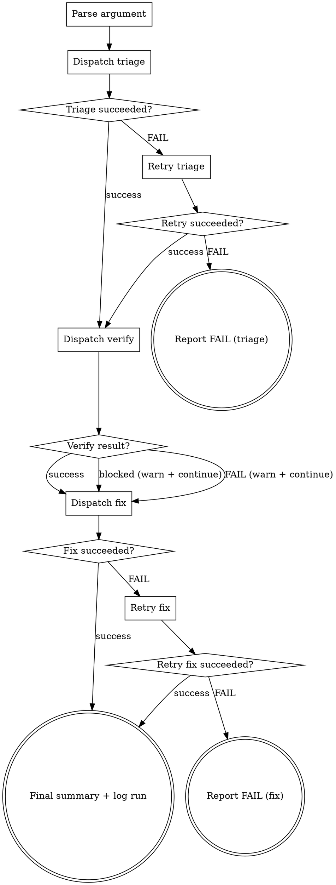

**Platform check:** This skill requires subagent orchestration (`context: fork` + `agent: dx-step-executor`). If subagent spawning is not available in your environment (e.g., VS Code Chat), inform the user: "This workflow requires subagent orchestration. Please use Claude Code or Copilot CLI to run /dx-bug-all." Do NOT attempt to run the pipeline inline.

You are a coordinator. You do NOT implement anything yourself. You delegate each workflow step to the `dx-step-executor` agent via the Task tool, then report progress.

## Flow



## Node Details

### Parse argument

The argument is the ADO work item ID — a numeric value (e.g., `2453532`).

If the user provides a full ADO URL, extract the numeric ID.

If no argument is provided, ask the user for the work item ID.

### Dispatch triage

Use the Task tool to invoke the `dx-step-executor` agent:
```
Use the dx-step-executor agent to: Execute bug-triage for work item <id>
```
Print: `Step 1/3 done —` followed by the agent's summary.

### Triage succeeded?

- **success** — triage completed, `raw-bug.md` + `triage.md` created → proceed to "Dispatch verify"
- **FAIL** — agent returned failure → go to "Retry triage"

### Retry triage

Retry the failed step **once** with the same agent.

### Retry succeeded?

- **success** → proceed to "Dispatch verify"
- **FAIL** → go to "Report FAIL (triage)"

### Report FAIL (triage)

Print which step failed and the error. Cannot proceed without bug data. Suggest: "Run `/dx-bug-triage` to retry." STOP.

### Dispatch verify

Use the Task tool to invoke the `dx-step-executor` agent:
```
Use the dx-step-executor agent to: Execute bug-verify for work item <id>
```
Print: `Step 2/3 done —` followed by the agent's summary.

### Verify result?

- **success** — verification completed → proceed to "Dispatch fix"
- **blocked** — browser unavailable, URL unreachable → print warning, **continue** to "Dispatch fix". Verification enhances confidence but is not required for the fix.
- **FAIL** — agent returned failure → print warning, **continue** to "Dispatch fix". Verification enhances confidence but is not required for the fix.

### Dispatch fix

Use the Task tool to invoke the `dx-step-executor` agent:
```
Use the dx-step-executor agent to: Execute bug-fix for work item <id>
```
Print: `Step 3/3 done —` followed by the agent's summary.

### Fix succeeded?

- **success** — fix completed → proceed to "Final summary + log run"
- **FAIL** — agent returned failure → go to "Retry fix"

### Retry fix

Retry the failed step **once** with the same agent.

### Retry fix succeeded?

- **success** → proceed to "Final summary + log run"
- **FAIL** → go to "Report FAIL (fix)"

### Report FAIL (fix)

Print which step failed and the error. Print which steps succeeded and their outputs. Suggest: "Run `/dx-bug-fix` to retry." STOP.

### Final summary + log run

Find the spec directory and present:

```markdown
## ADO #<id> — Bug Fix Complete

**<Title>**
**Branch:** `bugfix/<id>-<slug>`
**Directory:** `.ai/specs/<id>-<slug>/`

| Document | Status | Highlights |
|----------|--------|------------|
| raw-bug.md | <status> | Severity: <sev>, Priority: <pri> |
| triage.md | <status> | Component: <name>, <N> files |
| verification.md | <status> | <result> — <N> screenshots |
| implement.md | <status> | <N> steps, all done |
| verification-local.md | <status> | <result> — <N> post-fix screenshots |

**PR:** <PR URL or "Not created">

### What was done:
1. Fetched bug ticket and identified affected component
2. <Reproduced/Could not reproduce> the bug via browser automation
3. Fixed: <1-line root cause summary>
4. Verified fix on local AEM: <Fix Verified/Fix Partial/Fix Failed/Blocked>
5. Created PR with <N> file changes
```

**Log run:**

Ensure directory:
```bash
mkdir -p .ai/learning/raw
```

Append run record to `.ai/learning/raw/runs.jsonl`:
```json
{"timestamp":"<ISO-8601>","ticket":"<id>","flow":"bug-all","severity":"<from triage>","priority":"<from triage>","component":"<from triage>","verification":"<reproduced|not-reproduced|blocked>","fix_result":"<success|failed>","local_verification":"<fix-verified|fix-partial|fix-failed|blocked>","pr_created":<true|false>}
```

Append bug pattern to `.ai/learning/raw/bugs.jsonl`:
```json
{"timestamp":"<ISO-8601>","ticket":"<id>","component":"<from triage>","root_cause":"<category from fix summary>","files_changed":<count>}
```

**Bug hotspot check:** Read `.ai/learning/raw/bugs.jsonl`. Count bugs per `component` value. If any component has 3 or more bugs:
- Print: `Learning: <component> has had <N> bugs. Consider adding focused test coverage.`

**Known pattern check:** If `.ai/learning/raw/fixes.jsonl` exists, read it and check if the root cause type from this bug matches any known fix pattern (by `error_type`). If match:
- Print: `Learning: Root cause "<root_cause>" matches a known fix pattern from previous runs.`

If no hotspots and no pattern matches, skip silently.

## Error Handling

If any agent returns `FAIL`:

1. Print the failure with the agent's error message
2. Retry the failed step **once** with the same agent
3. If still failing:
   - Print which step failed and the error
   - Print which steps succeeded and their outputs
   - Suggest running the individual skill manually: "Run `/dx-bug-<skill>` to retry"

**Dependency rules:**
- Step 1 (triage) FAIL → **STOP**. Cannot proceed without bug data.
- Step 2 (verify) FAIL → **WARN and continue**. Fix can proceed on triage alone.
- Step 3 (fix) FAIL → **STOP**. Report what was accomplished.

## Rules

- **Coordinator only** — all implementation happens inside the agent's isolated context
- **Never implement steps yourself** — always delegate via Task tool
- **Sequential dependencies** — never dispatch step N+1 until step N returns (except: verify FAIL allows continue to fix)
- **Keep main context lean** — you only see compact summaries, not file contents
- **Progress reporting** — print status after each step so the user can see progress
- **Same quality as individual skills** — running `/dx-bug-all` produces identical output to running each skill separately
