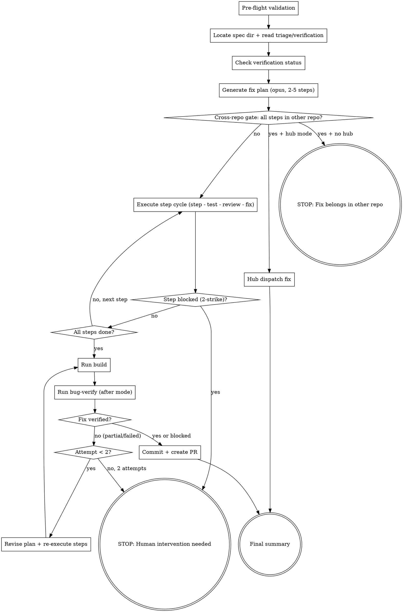

You are a coordinator. You do NOT implement anything yourself. You delegate each workflow phase to the `subagent` agent via the Task tool, then report progress.

## Flow



## Node Details

### Pre-flight validation

Before starting the bug fix workflow, validate prerequisites:

1. **Spec directory exists** — run `bash .ai/lib/dx-common.sh find-spec-dir $ARGUMENTS`. If not found, STOP with: "No spec directory found. Run `/dx-bug-triage <id>` first."
2. **Required files exist** — check for `triage.md` in the spec directory. If missing, STOP.
3. **MCP health** — run `bash .ai/lib/mcp-health-check.sh all`. Report any failures as warnings (non-blocking — fix may not need MCP).
4. **Feature branch** — run `bash .ai/lib/ensure-feature-branch.sh <spec-dir>`.

If any blocking check fails, STOP with a clear message listing what's missing.

### Locate spec dir + read triage/verification

```bash
SPEC_DIR=$(bash .ai/lib/dx-common.sh find-spec-dir $ARGUMENTS)
```

Read from `$SPEC_DIR`:
- `raw-bug.md` — **required**. If missing: "Run `/dx-bug-triage` first."
- `triage.md` — **required**. If missing: "Run `/dx-bug-triage` first."
- `verification.md` — **optional**. If missing or result is "Blocked", warn but continue.

Print: `Bug fix starting for ADO #<id> — <title>`

### Check verification status

If `verification.md` exists, read the `**Result:**` line:
- `Reproduced` → proceed normally
- `Partially Reproduced` → proceed with caution note
- `Could Not Reproduce` → warn: "Bug was not reproduced — fix is based on code analysis only."
- `Blocked` → warn: "Verification was blocked — proceeding on triage analysis alone."

If `verification.md` doesn't exist → same warning as "Blocked".

### Generate fix plan (opus, 2-5 steps)

Delegate to a subagent with **model: opus** for deep reasoning:

```
Generate implement.md for bug fix in spec directory <SPEC_DIR>.

Read raw-bug.md, triage.md, and verification.md (if exists).
Use the root cause hypothesis from triage.md and the evidence from verification.md
to generate a concrete fix plan.

Before writing implement.md, load coding standards for the affected file types
(from triage.md's Affected Files table):
- Check .claude/rules/ for rules matching the file types being fixed
- If .github/instructions/ exists, read the relevant instruction file:
  - .js files → .github/instructions/fe.javascript.instructions.md (or fe.javascript.md)
  - .scss/.css files → .github/instructions/fe.css-styles.md (or fe.styles.instructions.md)
  - .html (HTL) files → .github/instructions/be.htl.md
  - .java files → .github/instructions/be.sling-models.md
  - Dialog XML → .github/instructions/be.dialog.md
  - Accessibility-related bugs → .github/instructions/accessibility.instructions.md
- If the bug involves AEM frontend modals, overlays, or focus management,
  also read shared/aem-dom-rules.md from the dx-aem plugin for DOM constraints.
These conventions MUST inform the fix approach — do not generate steps that violate them.

Write implement.md to <SPEC_DIR>/implement.md with:
- Root Cause (1-2 sentences)
- Approach (2-3 sentences)
- If triage.md has a "Cross-Repo Scope" section, add: **Other repos required:** <repo name(s)> — run `/dx-bug-all <id>` there after this fix
- Steps (2-5, each with Status: pending, Files, What, Why, Test)
- Testing Plan (unit tests + manual verification)

Rules for plan generation:
- 2-5 steps maximum (bugs are simpler than features)
- Every file reference must come from triage.md's Affected Files table
- Steps ordered by implementation dependency
- Each step has **Status:** pending
- Include regression test in at least one step
- Root Cause must be grounded in actual code, not speculation
```

Print: `Phase 1 done — implement.md created with <N> steps`

### Cross-repo gate: all steps in other repo?

After implement.md is generated, check if the fix belongs in another repo:

1. Read implement.md for the `**Other repos required:**` line
2. Check if **any step modifies source code** (JS, CSS, Java, etc.) in the current repo — or if steps only touch spec/doc files (triage.md, verification.md, etc.)

**If all steps are doc-only / dead-code cleanup** (no functional fix in this repo) → go to "STOP: Fix belongs in other repo".

**If at least one step modifies functional source code** in this repo → go to "Execute step cycle (step - test - review - fix)". The cross-repo note will appear in the final summary.

### Hub dispatch fix

**Entered when:** Cross-repo gate detected all fix steps belong to another repo AND hub mode is active.

Read `shared/hub-dispatch.md` for the full protocol.

1. Resolve target repo from cross-repo scope using hub-dispatch repo resolution
2. Check `hub.auto-dispatch` — if `false`, confirm with user
3. Build and execute: `cd <target-repo.path> && claude -p "/dx-bug-fix <ticket-id>" --output-format json --allowedTools "Bash,Read,Edit,Write,Glob,Grep" --permission-mode bypassPermissions`
4. Collect result, write `state/<ticket-id>/results/<repo>.json`
5. Print: `✓ <repo> — <status> (<duration>, $<cost>)`
6. Go to → "Final summary" with hub dispatch results

> **Note:** If hub mode is NOT active, the existing "STOP: Fix belongs in other repo" behavior applies unchanged.

### STOP: Fix belongs in other repo

Print a prominent warning and STOP:

```markdown
## Cross-Repo Bug: Fix belongs in <other repo(s)>

**ADO #<id> — <title>**

The root cause is in **<other repo(s)>**, not in this repo. No functional fix can be applied here.

**Root cause:** <1-line from implement.md>

**What's needed in <other repo>:**
<Extract the specific fix description from implement.md's "Other repos required" line or approach section>

### Next steps:
1. `cd <path-to-other-repo>` (from `.ai/config.yaml` repos section)
2. Run `/dx-bug-triage <id>` → `/dx-bug-fix <id>` there
3. _(Optional)_ Come back here to clean up dead code after the upstream fix ships

### Dead code in this repo (optional cleanup):
<List any dead-code steps from implement.md, e.g., "Remove unused fix from brand.js">
Run `/dx-bug-fix <id>` again with `--cleanup` intent if you want to proceed with just the cleanup steps.
```

Do not proceed to any further sections. The user must fix the other repo first.

> **Note:** If hub mode is active, this node is bypassed — the fix is dispatched to the target repo instead. See "Hub dispatch fix" above.

### Execute step cycle (step - test - review - fix)

For each pending step in implement.md, run the step-test-review-fix cycle:

**Execute Step:**

```
Invoke /dx-step for spec directory <SPEC_DIR>
```

`/dx-step` handles implementation, testing, review, and commit in one pass. If step is marked `blocked` → go to fix sub-cycle.

**Fix (if needed):**

```
Invoke /dx-step-fix for spec directory <SPEC_DIR>
```

Track fix attempts per step. If fix succeeds → re-run tests (loop back to Run Tests above).

**Progress Report:** After each step cycle: `Step <N>/<total> done — <step title>`

### Step blocked (2-strike)?

Track consecutive fix failures per step. **2-strike rule:** If 2nd consecutive fix on the same step fails:

- **yes** → go to "STOP: Human intervention needed"
- **no** → go to "All steps done?"

### STOP: Human intervention needed

Print error details and: "Step <N> blocked after 2 fix attempts. Human intervention needed."

STOP the entire workflow.

### All steps done?

Check implement.md for remaining pending steps:

- **no, next step** → go back to "Execute step cycle (step - test - review - fix)" with the next pending step
- **yes** → go to "Run build"

### Run build

After all steps complete:

```
Invoke /dx-step-build for spec directory <SPEC_DIR>
```

If build fails, delegate to step-fix. 2-strike rule applies.

### Run bug-verify (after mode)

Run local verification to confirm the fix resolved the issue:

```
Invoke /dx-bug-verify <id> after
```

This runs `dx-bug-verify` in `after` mode — swaps the repro URL to local AEM, re-runs the repro steps, and confirms the bug is no longer present. Output goes to `verification-local.md`.

Read `verification-local.md` for the result.

Print: `Local verification: <result>`

### Fix verified?

Read the result from `verification-local.md`:

- **yes (Fix Verified)** → go to "Commit + create PR"
- **blocked** → go to "Commit + create PR" (warn but proceed — local verification is best-effort, e.g., Chrome DevTools unavailable)
- **no (partial/failed)** → go to "Attempt < 2?"

### Attempt < 2?

Check how many fix-verify iterations have been attempted:

- **yes (first attempt)** → go to "Revise plan + re-execute steps"
- **no, 2 attempts** → STOP. Write diagnostic to `<spec-dir>/fix-loop-report.md`:

```
## Bug Fix Loop — Blocked After 2 Attempts

**Original issue:** <from triage.md>
**Attempt 1 result:** <from verification-local.md>
**Attempt 2 result:** <from verification-local.md>
**Diagnosis:** <what changed between attempts, what's still failing>

Human intervention needed. The verification output suggests: <actionable next step>
```

Go to "STOP: Human intervention needed".

**Cap:** 2 fix-verify iterations maximum. Never loop more than twice.

### Revise plan + re-execute steps

1. Read the verification failure details from `verification-local.md`
2. Append failure context to `triage.md` under a new `## Fix Attempt 1 — Failure Analysis` heading
3. Re-read the original triage + failure context
4. Generate a revised fix plan — update `implement.md` with new steps (mark old steps as `done` or `superseded`)
5. Execute the revised steps via `/dx-step` (same 2-strike rule per step)

After revised steps complete → go to "Run build".

### Commit + create PR

```
Invoke /dx-pr-commit for spec directory <SPEC_DIR>.
Commit message format: #<id> Fix <short description from bug title>
```

Print: `PR created: <PR URL>`

### Final summary

```markdown
## Bug Fix Complete: ADO #<id>

**<Title>**
**Root Cause:** <1-line from implement.md>
**Branch:** `bugfix/<id>-<slug>`
**PR:** <PR URL>

| Phase | Status | Details |
|-------|--------|---------|
| Triage | Done | <N> files identified, layer: <layer> |
| Verification | <result> | <N> screenshots |
| Fix Plan | <N> steps | All pending → done |
| Execution | <N>/<N> done | <N> fix attempts |
| Build | Passed | |
| Local Verify | <result> | <N> post-fix screenshots |
| PR | Created | <PR URL> |

### Files Changed:
<list from git diff --name-only>

### Cross-Repo Note:
<If implement.md has "Other repos required", print:>
> This fix covers **<current repo>** only. Switch to **<other repo(s)>** and run `/dx-bug-all <id>` there.
<Otherwise omit this section.>
```

## Error Handling

| Scenario | Action |
|----------|--------|
| triage.md missing | STOP — "Run `/dx-bug-triage` first." |
| triage.md has no affected files | STOP — "Cannot generate fix plan without affected files." |
| implement.md generation fails | Retry once. If still fails, suggest: "Run `/dx-plan` manually." |
| All fix steps are in another repo | STOP — print cross-repo gate message (section "STOP: Fix belongs in other repo"). Advise user to `cd` to that repo and run `/dx-bug-triage` + `/dx-bug-fix` there. |
| Step blocked (2-strike) | STOP loop. Report which step blocked. |
| Build fails after all steps | Delegate to step-fix loop (max 6 attempts per build pattern). |
| Local verification Fix Failed (attempt 1) | Revise fix plan, re-execute steps, retry once (attempt 2). |
| Local verification Fix Failed (attempt 2) | STOP. Write `fix-loop-report.md`. Human intervention needed. |
| Local verification Blocked | WARN and continue to commit. Chrome DevTools may be unavailable. |
| commit fails | Report error. Suggest: "Run `/dx-pr-commit` manually." |

## Rules

- **Coordinator only** — never implement code yourself. Always delegate via Task tool.
- **Sequential phases** — plan → execute → build → commit. Never skip.
- **2-strike rule** — stop after 2 consecutive fix failures. Don't brute-force.
- **Re-read implement.md** — re-read between steps to get latest status.
- **Bugfix branch required** — never execute on a protected branch. Check `.branch` file.
- **Progress reporting** — print status after each phase and step.
- **Commit message format** — `#<id> Fix <description>` (not `#<id> Add` or `#<id> Update`).
