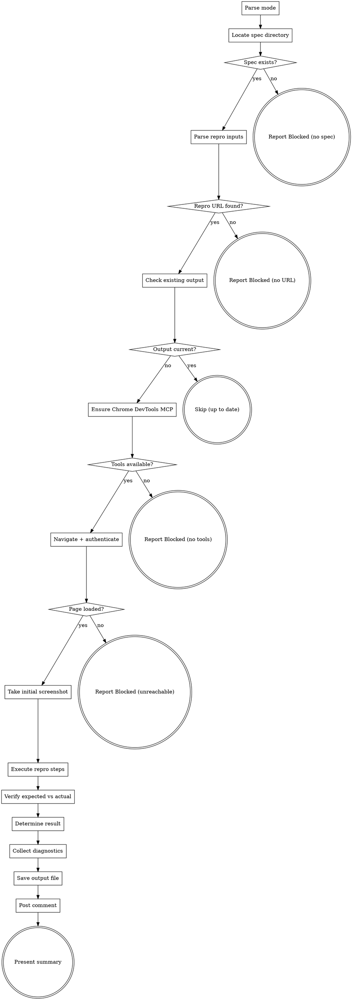

## Defaults

Read `shared/provider-config.md` for provider detection and tool mapping.

Read `.ai/config.yaml`:
- `tracker.provider` (or `scm.provider` for backward compat) — `ado` (default) or `jira`

**If provider = ado:**
- **Organization:** `scm.org`
- **Project:** `scm.project`

**If provider = jira:**
- **Jira URL:** `jira.url`
- **Project Key:** `jira.project-key`

You reproduce a bug using Chrome DevTools MCP — navigate to the repro URL, execute the repro steps, take screenshots at each step, and confirm whether the bug is reproducible.

## Flow



## Node Details

### Parse mode

Parse the argument for an optional mode keyword:
- `before` (default) — pre-fix verification on QA/remote. Confirms the bug exists.
- `after` — post-fix verification on local AEM. Confirms the fix works.
- `qa` — post-merge verification on QA/remote. Confirms the fix is deployed and working.

Examples: `2453532`, `2453532 before`, `2453532 after`, `2453532 qa`, `qa` (uses most recent spec).

Set `MODE` to `before`, `after`, or `qa`. This affects URL selection, output file, screenshot prefix, result interpretation, and ADO comment.

| Aspect | `before` | `after` | `qa` |
|--------|----------|---------|------|
| URL source | Repro URL from `raw-bug.md` (QA/remote) | Same page path on local AEM (`aem.author-url` from `.ai/config.yaml`) | Repro URL from `raw-bug.md` (QA/remote) |
| Output file | `verification.md` | `verification-local.md` | `verification-qa.md` |
| Screenshot prefix | `step-` | `post-fix-step-` | `qa-step-` |
| Success = | `Reproduced` (bug confirmed) | `Fix Verified` (bug no longer present) | `Fix Verified on QA` (bug gone in deployed env) |
| Failure = | `Could Not Reproduce` | `Fix Failed` (bug still present) | `Fix Failed on QA` (bug still present after deploy) |
| ADO comment tag | `[BugVerify]` | `[BugVerifyLocal]` | `[BugVerifyQA]` |

### Locate spec directory

```bash
SPEC_DIR=$(bash .ai/lib/dx-common.sh find-spec-dir $ARGUMENTS)
```

Read `raw-bug.md` from `$SPEC_DIR`. Also read `triage.md` if it exists (for component context, but not required).

**`after` mode extra requirement:** `verification.md` (pre-fix) should exist. If missing, warn: "No pre-fix verification found — proceeding with post-fix verification only."

**`qa` mode extra requirement:** `verification-local.md` (local post-fix) should exist. If missing, warn: "No local verification found — proceeding with QA verification only." Also check that the PR for this bug has been merged (look for `implement.md` or PR link in the spec directory).

### Spec exists?

- **yes** — `raw-bug.md` found in `$SPEC_DIR` → proceed to "Parse repro inputs"
- **no** — file not found → go to "Report Blocked (no spec)"

### Report Blocked (no spec)

Tell the user: "Run `/dx-bug-triage` first." STOP.

### Parse repro inputs

From `raw-bug.md`, extract:
- **Repro URL** — first URL found in `## Steps to Reproduce` section
- **Repro steps** — numbered/bulleted list of actions
- **Expected behavior** — from `## Expected Behavior`
- **Actual behavior** — from `## Actual Behavior`

**`qa` mode — uses the original QA/remote URL** (same as `before` mode). No URL swap needed.

**`after` mode — URL swap to local:**

1. Read `aem.author-url` from `.ai/config.yaml` (e.g., `http://localhost:4502`)
2. Extract the **path** from the original repro URL (e.g., `/content/brand-a/gb/en/homepage.html`)
3. Construct the local URL: `<author-url><path>` (e.g., `http://localhost:4502/content/brand-a/gb/en/homepage.html`)
4. If the original URL is an AEM editor URL (`/editor.html/content/...`), preserve the `/editor.html` prefix
5. If no `aem.author-url` in config → fall back to `http://localhost:4502`

### Repro URL found?

- **yes** — URL extracted or constructed → proceed to "Check existing output"
- **no** — check if triage.md has a repro URL, try to construct from component path. If still no URL → go to "Report Blocked (no URL)"

### Report Blocked (no URL)

Save output file with `**Result:** Blocked — No repro URL found` and STOP.

### Check existing output

Set `OUTPUT_FILE` based on mode:
- `before` → `verification.md`
- `after` → `verification-local.md`
- `qa` → `verification-qa.md`

If `$OUTPUT_FILE` exists, check if title/ID match and if screenshots exist in `screenshots/`.

### Output current?

- **yes** — file exists, title/ID match, screenshots present → go to "Skip (up to date)"
- **no** — file missing or stale → proceed to "Ensure Chrome DevTools MCP"

### Skip (up to date)

Print: `$OUTPUT_FILE already up to date — skipping` and STOP.

### Ensure Chrome DevTools MCP

Chrome DevTools tools have the full name `mcp__plugin_dx-aem_chrome-devtools-mcp__<tool>`.

**Try calling a tool directly first** (e.g., `mcp__plugin_dx-aem_chrome-devtools-mcp__list_pages`). If it works, tools are pre-loaded — continue using them directly.

If you get a "tool not found" error, **fall back to ToolSearch**:
```
ToolSearch query: "+chrome-devtools navigate"
```

**IMPORTANT:** Do NOT start with ToolSearch. If tools are pre-loaded (e.g., when running as a subagent), ToolSearch returns nothing because it only finds deferred tools — and you'll wrongly conclude Chrome DevTools is unavailable.

### Tools available?

- **yes** — tools pre-loaded or discovered via ToolSearch → proceed to "Navigate + authenticate"
- **no** — neither pre-loaded nor discoverable → go to "Report Blocked (no tools)"

### Report Blocked (no tools)

Save verification.md with `**Result:** Blocked — Chrome DevTools MCP unavailable` and STOP.

### Navigate + authenticate

**QA/Stage URL** (e.g., `https://qa.example.com/...`):

1. **Check for basic auth rule:** Read `.claude/rules/qa-basic-auth.md` — if it exists, QA sites require HTTP Basic Auth.
2. **First navigation:** Embed credentials in the URL for browser-native Basic Auth:
   ```
   mcp__plugin_dx-aem_chrome-devtools-mcp__navigate_page
     url: "https://<user>:<pass>@<host>/<path>"
   ```
   Use the primary credentials from the rule. This sets a session cookie for subsequent requests.
3. **Verify page loaded:** Take a snapshot and check for actual page content (not a 401 or blank page).
4. **If page didn't load (401/empty):** Fall back to `evaluate_script` with `fetch()` + Authorization header:
   ```
   mcp__plugin_dx-aem_chrome-devtools-mcp__evaluate_script
     function: |
       async () => {
         const creds = btoa('<user>:<pass>');
         const resp = await fetch(window.location.href, {
           headers: { 'Authorization': 'Basic ' + creds },
           credentials: 'include'
         });
         if (resp.ok) { location.reload(); return { authenticated: true }; }
         return { authenticated: false, status: resp.status };
       }
   ```
   If primary credentials fail, try fallback credentials from the rule.
5. **Subsequent navigations:** Use clean URLs without credentials — the cookie persists for the session.
6. If no basic auth rule exists, navigate directly without credentials.
- Wait for page load via `mcp__plugin_dx-aem_chrome-devtools-mcp__wait_for`

**Local dev server** (e.g., `http://localhost:...`):
- Navigate to URL
- Check for login/auth page:
  ```
  mcp__plugin_dx-aem_chrome-devtools-mcp__evaluate_script
    expression: "document.querySelector('input[type=password]') !== null"
  ```
- If login page detected, fill credentials using `evaluate_script`:
  ```
  mcp__plugin_dx-aem_chrome-devtools-mcp__evaluate_script
    expression: |
      // Find and fill login form fields — adapt selectors to the app
      const userInput = document.querySelector('input[name=username], input[type=email], #username');
      const passInput = document.querySelector('input[type=password]');
      if (userInput) { userInput.value = 'admin'; userInput.dispatchEvent(new Event('input', { bubbles: true })); }
      if (passInput) { passInput.value = 'admin'; passInput.dispatchEvent(new Event('input', { bubbles: true })); }
      document.querySelector('button[type=submit], input[type=submit], #submit-button')?.click();
  ```
- Wait for app to load:
  ```
  mcp__plugin_dx-aem_chrome-devtools-mcp__wait_for
    text: "<expected text after login>"
    timeout: 15000
  ```

### Page loaded?

- **yes** — page content visible (not 401/blank/error) → proceed to "Take initial screenshot"
- **no** — navigation error, 404, 500 → go to "Report Blocked (unreachable)"

### Report Blocked (unreachable)

Take screenshot of error page. Save verification.md with `**Result:** Blocked — URL unreachable (<status>)` and STOP.

### Take initial screenshot

Set `SS_PREFIX` based on mode:
- `before` → `step-`
- `after` → `post-fix-step-`
- `qa` → `qa-step-`

After page loads:
```
mcp__plugin_dx-aem_chrome-devtools-mcp__take_screenshot
  filePath: "<SPEC_DIR>/screenshots/<SS_PREFIX>0-initial.png"
```

### Execute repro steps

For each step in the repro instructions:

**Map natural language to Chrome DevTools action:**

| Repro Step Pattern | Chrome DevTools Action |
|-------------------|----------------------|
| "Navigate to X" / "Go to X" | `navigate_page` with URL |
| "Click X" / "Press X button" | `take_snapshot` → find element UID → `click` with UID |
| "Upload a file" / "Choose file" | `take_snapshot` → find file input UID → `upload_file` with test file |
| "Type X into Y" / "Enter X" | `take_snapshot` → find input UID → `fill` with value |
| "Press Enter/Escape/Tab" | `press_key` with key name |
| "Wait for X" / "X appears" | `wait_for` with text, timeout 10s |
| "Scroll to X" | `evaluate_script` with `element.scrollIntoView()` |
| "Cancel" (file dialog) | See file dialog cancel note below |
| "Refresh/Reload page" | `navigate_page` with same URL |
| "Fill out form" | `fill_form` with field values |

**File dialog cancel note:** OS-native file dialogs cannot be directly controlled via Chrome DevTools. To simulate "cancel file upload":
1. If the component has a cancel/remove button in the UI, click that
2. Alternatively, use `evaluate_script` to clear the file input: `document.querySelector('input[type=file]').value = ''` and dispatch a change event
3. Note the limitation in verification.md

**Element discovery pattern:** Before clicking/filling, find the target element:

```
mcp__plugin_dx-aem_chrome-devtools-mcp__take_snapshot
```

This returns an accessibility tree with UIDs. Search the tree for the target element by:
- Text content (button label, input placeholder)
- Role (button, textbox, link)
- Name attribute

Then use the UID in the action:
```
mcp__plugin_dx-aem_chrome-devtools-mcp__click
  uid: "<found-uid>"
```

**Capture evidence after each step:**

1. **Screenshot:**
   ```
   mcp__plugin_dx-aem_chrome-devtools-mcp__take_screenshot
     filePath: "<SPEC_DIR>/screenshots/<SS_PREFIX><N>-<action>.png"
   ```

2. **Console errors (check periodically, not after every step):**
   ```
   mcp__plugin_dx-aem_chrome-devtools-mcp__list_console_messages
     type: "error"
   ```

3. **Observations:** Note what changed on the page after the action.

### Verify expected vs actual

After completing all repro steps:

1. **Visual check:** Take a final screenshot of the current state
2. **DOM state check:** Use `evaluate_script` to programmatically verify:
   ```
   mcp__plugin_dx-aem_chrome-devtools-mcp__evaluate_script
     expression: |
       // Adapt to the specific bug — check relevant DOM state
       const targetEl = document.querySelector('<relevant-selector>');
       const input = document.querySelector('input[type="file"], input[type="text"]');
       return {
         elementVisible: targetEl ? targetEl.style.display !== 'none' : false,
         inputValue: input ? input.value || input.files?.length : null,
         elementState: targetEl ? targetEl.getAttribute('data-state') : null
       };
   ```
3. **Compare:**
   - **`before` mode:** Does the observed state match the "Actual Behavior" (buggy behavior) described in raw-bug.md?
   - **`after` / `qa` mode:** Does the observed state match the "Expected Behavior" (correct behavior) described in raw-bug.md?

### Determine result

**`before` mode (pre-fix):**

| Condition | Result |
|-----------|--------|
| Observed behavior matches bug description | `Reproduced` |
| Some aspects match, others differ | `Partially Reproduced` |
| Expected (correct) behavior occurs | `Could Not Reproduce` |
| URL unreachable, auth failed, steps unclear | `Blocked` |

**`after` mode (post-fix, local):**

| Condition | Result |
|-----------|--------|
| Expected (correct) behavior occurs — bug is gone | `Fix Verified` |
| Bug partially fixed — some aspects remain | `Fix Partial` |
| Bug still present — same buggy behavior | `Fix Failed` |
| URL unreachable, auth failed, steps unclear | `Blocked` |

**`qa` mode (post-merge, QA environment):**

| Condition | Result |
|-----------|--------|
| Expected (correct) behavior occurs — bug is gone on QA | `Fix Verified on QA` |
| Bug partially fixed on QA — some aspects remain | `Fix Partial on QA` |
| Bug still present on QA — deployment may have failed or fix incomplete | `Fix Failed on QA` |
| URL unreachable, auth failed, steps unclear | `Blocked` |

### Collect diagnostics

```
mcp__plugin_dx-aem_chrome-devtools-mcp__list_console_messages
  type: "error"
```

```
mcp__plugin_dx-aem_chrome-devtools-mcp__list_network_requests
  resourceType: "xhr,fetch"
```

Filter for failed requests (status >= 400 or network errors).

### Save output file

Save to `$OUTPUT_FILE` (`verification.md` for `before`, `verification-local.md` for `after`, `verification-qa.md` for `qa`).

**`before` mode header:**
```markdown
# Verification: <Title> (ADO #<id>)

**Result:** Reproduced / Partially Reproduced / Could Not Reproduce / Blocked
```

**`after` mode header:**
```markdown
# Local Verification: <Title> (ADO #<id>)

**Mode:** Post-fix (local AEM)
**Result:** Fix Verified / Fix Partial / Fix Failed / Blocked
```

**`qa` mode header:**
```markdown
# QA Verification: <Title> (ADO #<id>)

**Mode:** Post-merge (QA environment)
**Result:** Fix Verified on QA / Fix Partial on QA / Fix Failed on QA / Blocked
```

**Common body (both modes):**
```markdown
**URL:** <url tested>
**Date:** <YYYY-MM-DD>
**Environment:** Chrome DevTools MCP, <domain>

---

## Repro Steps Executed

### Step 1: <step description from raw-bug.md>
**Action:** `<Chrome DevTools tool>` — <what was done>
**Screenshot:** `screenshots/<SS_PREFIX>1-<action>.png`
**Observations:** <what happened on the page>

### Step 2: <step description>
**Action:** `<Chrome DevTools tool>` — <what was done>
**Screenshot:** `screenshots/<SS_PREFIX>2-<action>.png`
**Observations:** <what happened>

<repeat for each step>

---

## Expected vs Actual

**Expected (from bug report):**
<Expected behavior text from raw-bug.md>

**Actual (observed during reproduction):**
<What actually happened during this reproduction attempt>

**Match:** Yes / No / Partial
<1-2 sentences explaining the match/mismatch>

---

## Console Errors

<List of JS console errors observed during reproduction, or "None">
- `<error message>` (at <source>:<line>)

## Network Issues

<List of failed network requests, or "None">
- `<method> <url>` — <status code or error>

## DOM State at End

<Key DOM observations from evaluate_script, if performed>
- Element visible: <yes/no>
- Input value: <value or empty>
- <other relevant state>

---

## Evidence Summary

- **Screenshots captured:** <N>
- **Console errors:** <N>
- **Network failures:** <N>
- **Reproduction result:** <result with 1-line explanation>
```

### Post comment

Read `shared/ado-config.md` for ADO project (or `shared/provider-config.md` for Jira).

Use `mcp__ado__wit_add_work_item_comment` to post the result. **Always pass `format: "markdown"`** so ADO renders the comment correctly.

**If provider = jira**, use `mcp__atlassian__jira_add_comment` instead:
```
mcp__atlassian__jira_add_comment
  issue_key: "<issue key>"
  comment: "<comment text — same format as below>"
```

**Comment structure rules:**
- **URL on its own row** — always `**URL:** <clickable-url>` as a separate line, never buried in sentences
- **Footer** — always end with `---` separator + `_[Tag] | <ISO timestamp> · <context hint>_` (matches DoR, QAHandoff, PRReview style)

**`before` mode comments:**

If Reproduced:
```markdown
**[BugVerify] Bug Reproduced**

**URL:** <url>

Automated browser testing confirmed this bug.

**Steps executed:** <N> steps followed successfully
**Key evidence:** <1-2 sentences, e.g., "Preview image (src set to blob URL) remains visible after file input is cleared. DOM confirms input.files.length === 0 but img.src is still set.">
**Console errors:** <N or "None">

---
_[BugVerify] | <ISO timestamp> · Verified via Chrome DevTools MCP_
```

If Could Not Reproduce:
```markdown
**[BugVerify] Could Not Reproduce**

**URL:** <url>

Automated browser testing did not reproduce this bug.

**Steps executed:** <N> steps
**Observed behavior:** <what happened instead>
**Possible reasons:** Environment-specific, intermittent, or already fixed.

---
_[BugVerify] | <ISO timestamp> · Verified via Chrome DevTools MCP_
```

If Blocked:
```markdown
**[BugVerify] Verification Blocked**

**URL:** <url>

Could not complete automated reproduction: <reason>.

---
_[BugVerify] | <ISO timestamp> · Manual reproduction recommended_
```

**`after` mode comments:**

If Fix Verified:
```markdown
**[BugVerifyLocal] Fix Verified on Local AEM**

**URL:** <url>

Post-fix browser testing confirms the bug is resolved.

**Steps executed:** <N> repro steps — bug no longer occurs
**Evidence:** <1-2 sentences, e.g., "Preview image is correctly cleared when file input is cancelled. DOM confirms both input.files.length === 0 and img.src is empty.">
**Console errors:** <N or "None">

---
_[BugVerifyLocal] | <ISO timestamp> · Verified via Chrome DevTools MCP_
```

If Fix Failed:
```markdown
**[BugVerifyLocal] Fix Failed — Bug Still Present**

**URL:** <url>

Post-fix browser testing shows the bug is **still present**.

**Steps executed:** <N> repro steps
**Observed behavior:** <what still happens>

---
_[BugVerifyLocal] | <ISO timestamp> · Fix needs further work_
```

If Fix Partial:
```markdown
**[BugVerifyLocal] Fix Partially Verified**

**URL:** <url>

Post-fix browser testing shows the bug is **partially fixed**.

**Fixed:** <what improved>
**Remaining:** <what still fails>

---
_[BugVerifyLocal] | <ISO timestamp> · Verified via Chrome DevTools MCP_
```

If Blocked:
```markdown
**[BugVerifyLocal] Local Verification Blocked**

**URL:** <url>

Could not complete post-fix verification on local AEM: <reason>.

---
_[BugVerifyLocal] | <ISO timestamp> · Manual local testing recommended_
```

**`qa` mode comments:**

If Fix Verified on QA:
```markdown
**[BugVerifyQA] Fix Verified on QA**

**URL:** <url>

Post-merge browser testing confirms the fix is deployed and working.

**Steps executed:** <N> repro steps — bug no longer occurs on QA
**Evidence:** <1-2 sentences summarizing what was observed>
**Console errors:** <N or "None">

---
_[BugVerifyQA] | <ISO timestamp> · Verified via Chrome DevTools MCP_
```

If Fix Failed on QA:
```markdown
**[BugVerifyQA] Fix Failed on QA — Bug Still Present**

**URL:** <url>

Post-merge browser testing shows the bug is **still present** after deployment.

**Steps executed:** <N> repro steps
**Observed behavior:** <what still happens>
**Possible causes:** Deployment not yet complete, environment-specific issue, or fix incomplete.

---
_[BugVerifyQA] | <ISO timestamp> · Manual QA investigation recommended_
```

If Fix Partial on QA:
```markdown
**[BugVerifyQA] Fix Partially Verified on QA**

**URL:** <url>

Post-merge browser testing shows the bug is **partially fixed**.

**Fixed:** <what improved>
**Remaining:** <what still fails>

---
_[BugVerifyQA] | <ISO timestamp> · Verified via Chrome DevTools MCP_
```

If Blocked:
```markdown
**[BugVerifyQA] QA Verification Blocked**

**URL:** <url>

Could not complete post-merge verification on QA: <reason>.

---
_[BugVerifyQA] | <ISO timestamp> · Manual QA testing recommended_
```

### Present summary

**`before` mode:**
```markdown
## Bug #<id> Verification

**<Title>**
**Result:** <result>
**URL:** <url>
**Screenshots:** <N> captured in `.ai/specs/<id>-<slug>/screenshots/`

### Next steps:
- `/dx-bug-fix` — plan and execute the fix
- Review screenshots in `screenshots/` for visual confirmation
```

**`after` mode:**
```markdown
## Bug #<id> Local Verification

**<Title>**
**Result:** <result>
**URL:** <url> (local AEM)
**Screenshots:** <N> captured in `.ai/specs/<id>-<slug>/screenshots/` (post-fix-step-* prefix)

### Next steps:
<If Fix Verified:>
- Fix confirmed — ready to commit and create PR
<If Fix Failed or Fix Partial:>
- Fix needs further work — review `verification-local.md` for details
- Run `/dx-step-fix` to address remaining issues, then re-run `/dx-bug-verify <id> after`
```

**`qa` mode:**
```markdown
## Bug #<id> QA Verification

**<Title>**
**Result:** <result>
**URL:** <url> (QA environment)
**Screenshots:** <N> captured in `.ai/specs/<id>-<slug>/screenshots/` (qa-step-* prefix)

### Next steps:
<If Fix Verified on QA:>
- Bug confirmed fixed on QA — work item can be closed
<If Fix Failed on QA:>
- Bug still present on QA — check deployment status, review `verification-qa.md` for details
- If deployment confirmed, reopen the bug or create a follow-up ticket
<If Fix Partial on QA:>
- Partial fix on QA — review `verification-qa.md` and create follow-up ticket for remaining issues
```

## Error Handling

| Scenario | Action |
|----------|--------|
| Chrome DevTools MCP not found (ToolSearch fails) | Save verification.md with `Blocked`. Continue workflow. |
| No browser pages listed | Try `new_page` to open one. If fails → `Blocked`. |
| Navigation timeout | Screenshot current state. Note in verification.md. |
| Element not found for click/fill | Take snapshot, look for alternatives. If still not found, skip step with note. |
| File upload step (OS dialog) | Use `evaluate_script` to set input value programmatically. Note limitation. |
| Auth/login redirect | Follow login pattern in "Navigate + authenticate". If fails → `Blocked`. |
| Page crashes or goes blank | Screenshot, check console. Note in verification.md. |

## Rules

- **Always produce verification.md** — even with partial results or blocked steps
- **Screenshot every step** — visual evidence is the primary output
- **Don't guess elements** — always use `take_snapshot` to find UIDs before interacting
- **Timeout gracefully** — use `wait_for` with 10-15s timeout, don't hang
- **Report honestly** — if reproduction is ambiguous, say "Partially Reproduced" not "Reproduced"
- **No code changes** — this skill is read-only; it only observes and reports
- **Handle file dialogs realistically** — OS-native dialogs can't be automated; use programmatic alternatives and note limitations
