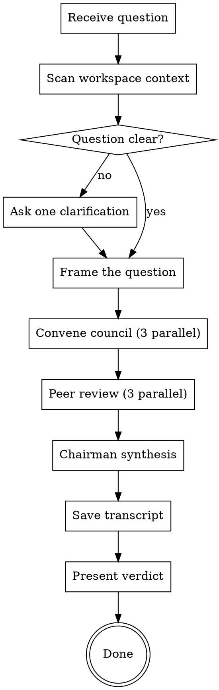

Run a question, decision, or artifact through a council of 3 independent advisors who analyze from fundamentally different angles, peer-review each other anonymously, then a chairman synthesizes the final verdict. Adapted from Andrej Karpathy's LLM Council methodology — dispatching to multiple thinking lenses instead of multiple models.

The council is for questions where being wrong is expensive. Do NOT council trivial questions with one right answer, creation tasks, or processing tasks. The council shines when there is genuine uncertainty, multiple viable options, and the cost of a bad call is high.

## The Three Advisors

Each advisor is a thinking lens, not a persona. They create three natural tensions.

**The Critic** — Finds what is wrong, what is missing, what will fail, and what is confusing. Merges the contrarian (assumes a fatal flaw exists and hunts for it) with the outsider (sees what fresh eyes see, catches the curse of knowledge). The Critic saves you from bad deals by asking the questions you are avoiding AND flags things obvious to you but baffling to everyone else.

**The Architect** — Strips away assumptions and rebuilds the problem from the ground up, then looks for upside everyone else is missing. Merges first-principles thinking (are we solving the right problem?) with expansionist thinking (what could be bigger? what adjacent opportunity is hiding?). Sometimes the most valuable output is the Architect saying "you are asking the wrong question entirely" followed by "and here is the much bigger opportunity."

**The Operator** — Only cares about one thing: can this actually be done, and what is the fastest path? Ignores theory and big-picture thinking. Looks at every idea through the lens of "what do you do Monday morning?" If an idea sounds brilliant but has no clear first step, the Operator will say so. If there is a shortcut everyone is overcomplicating, the Operator will find it.

**Why three:** Critic vs Architect (tear down vs rebuild). Architect vs Operator (rethink everything vs just ship). Critic vs Operator (it is broken vs it is good enough). Three tensions, seven sub-agent calls total (3 advisors + 3 reviewers + 1 chairman) instead of eleven.

## Flow



## Node Details

### Receive question

Parse the user's argument. Detect **context shortcuts**:

| Argument contains | Meaning |
|---|---|
| `the plan` or `plan` | Council the implementation plan — auto-load spec dir plan files |
| `the implementation` or `implementation` | Council the implementation approach — auto-load spec dir + recent code changes |
| `the architecture` or `architecture` | Council architectural decisions — auto-load config + project structure |
| `the PR` or `PR` | Council the pull request — auto-load PR diff and description |
| anything else | Freeform question — use as-is with workspace enrichment |

If the argument references a spec dir artifact, resolve the spec directory:

```bash
SPEC_DIR=$(bash .ai/lib/dx-common.sh find-spec-dir $ARGUMENTS 2>/dev/null)
```

If the script is not available or fails, fall back to scanning `.ai/specs/` for the most recently modified directory.

### Scan workspace context

Spend no more than 30 seconds on context gathering. Use Glob and quick Read calls to find the 2-3 files that give advisors specific, grounded context instead of generic takes.

**Always check:**
- `CLAUDE.md` or `claude.md` in the project root (business context, preferences, constraints)
- `.ai/config.yaml` (project stack, team conventions, tech constraints)

**Check based on context shortcut detected:**

| Shortcut | Files to load |
|---|---|
| plan | `$SPEC_DIR/implement.md`, `$SPEC_DIR/explain.md`, `$SPEC_DIR/raw-story.md` |
| implementation | `$SPEC_DIR/implement.md`, recent `git diff` output, `$SPEC_DIR/explain.md` |
| architecture | `.ai/config.yaml` (full), `.ai/rules/*.md`, project structure via Glob |
| PR | PR description and diff via git |
| freeform | Any `memory/` folder, `.ai/me.md`, recent council transcripts in workspace |

Read only the most relevant files. Summarize long files mentally — do not paste entire file contents into the framed question. Extract the key facts, constraints, and numbers that advisors need.

### Question clear?

The question is clear if it has:
1. A core decision or question that can be analyzed from multiple angles
2. Enough context to give specific (not generic) advice

If the argument is too vague (e.g., "council this: my project"), ask **one** clarifying question. Just one. Then proceed regardless of the answer quality.

If the user provided a context shortcut and the relevant files exist, the question is always clear — the files ARE the context.

### Ask one clarification

Ask a single focused question that would most improve the council's output. Examples:
- "What are the 2-3 options you're choosing between?"
- "What happens if you pick wrong — what's at stake?"
- "What constraints are non-negotiable?"

Do not ask more than one question. Proceed after the user responds.

### Frame the question

Take the user's raw question AND the enriched context and reframe it as a clear, neutral prompt that all three advisors will receive. The framed question should include:

1. **The core decision or question** — what exactly is being decided
2. **Key context from the user** — their words, their framing
3. **Key context from workspace** — project stack, constraints, past decisions, relevant numbers, acceptance criteria (whatever is relevant from the scan)
4. **What is at stake** — why this decision matters, what happens if wrong

Do not add your own opinion. Do not steer toward an answer. But DO ensure each advisor has enough context to give specific, grounded analysis rather than generic advice.

Save the framed question — it goes into the transcript.

### Convene council (3 parallel)

Spawn all 3 advisors simultaneously as sub-agents. Each gets their advisor identity, the framed question, and clear instructions to lean fully into their perspective.

**Advisor prompt template:**

For each advisor, use the Agent tool with `model: sonnet`:

```
You are [The Critic / The Architect / The Operator] on an LLM Council.

Your thinking style: [paste the full advisor description from "The Three Advisors" section above]

A user has brought this question to the council:

---
[framed question with all enriched context]
---

Respond from your perspective. Be direct and specific. Do not hedge or try to be balanced — the other advisors cover the angles you are not covering. Lean fully into your assigned thinking lens.

If you see a fatal flaw, say it plainly. If you see massive upside, say it plainly. If the first step is obvious, say it plainly. Your job is to represent your angle as strongly as possible. The synthesis comes later.

Respond in 150-300 words. No preamble. Go straight into your analysis.
```

Wait for all 3 to complete. Collect responses.

### Peer review (3 parallel)

This is the step that makes the council more than "ask 3 times." It is the core of Karpathy's insight.

Collect all 3 advisor responses. Anonymize them as Response A, B, C. **Randomize** the mapping (do not always assign Critic=A, Architect=B, Operator=C) so there is no positional bias.

Spawn 3 reviewers simultaneously. Each reviewer sees all 3 anonymized responses and answers three questions.

**Reviewer prompt template:**

For each reviewer, use the Agent tool with `model: haiku`:

```
You are reviewing the outputs of an LLM Council. Three advisors independently answered this question:

---
[framed question]
---

Here are their anonymized responses:

**Response A:**
[response]

**Response B:**
[response]

**Response C:**
[response]

Answer these three questions. Be specific. Reference responses by letter.

1. Which response is the strongest? Why? (pick one)
2. Which response has the biggest blind spot? What is it missing?
3. What did ALL three responses miss that the council should consider?

Keep your review under 150 words. Be direct.
```

Wait for all 3 to complete. Collect reviews.

### Chairman synthesis

One agent gets everything: the original question, all 3 advisor responses (de-anonymized so the chairman sees which advisor said what), and all 3 peer reviews.

Use the Agent tool with `model: opus`:

```
You are the Chairman of an LLM Council. Your job is to synthesize the work of 3 advisors and their peer reviews into a final verdict.

The question brought to the council:

---
[framed question]
---

ADVISOR RESPONSES:

**The Critic:**
[response]

**The Architect:**
[response]

**The Operator:**
[response]

PEER REVIEWS (each reviewer saw anonymized responses and evaluated independently):

[Review 1]

[Review 2]

[Review 3]

Produce the council verdict using this exact structure:

## Council Verdict

### Where the Council Agrees
Points multiple advisors converged on independently. These are high-confidence signals.

### Where the Council Clashes
Genuine disagreements. Present both sides. Explain why reasonable advisors disagree.

### Blind Spots the Council Caught
Things that only emerged through peer review — things individual advisors missed that others flagged.

### The Recommendation
A clear, direct recommendation. Not "it depends." Not "consider both sides." A real answer with reasoning. You CAN disagree with the majority if the reasoning of the minority is stronger — explain why.

### The One Thing to Do First
A single concrete next step. Not a list. One thing. What do you do Monday morning?

Be direct. Do not hedge. The whole point of the council is to give the user clarity they could not get from a single perspective.
```

### Save transcript

Save the complete council transcript as markdown. Location depends on context:

- If a spec dir was resolved: `$SPEC_DIR/council-transcript.md`
- Otherwise: `council-transcript-<YYYY-MM-DD-HHmm>.md` in project root

Transcript structure:

```markdown
# Council Transcript

**Date:** <ISO date>
**Question:** <original user question>

## Framed Question

<the framed question with enriched context>

## Advisor Responses

### The Critic
<full response>

### The Architect
<full response>

### The Operator
<full response>

## Peer Reviews

**Anonymization mapping:** A = <advisor>, B = <advisor>, C = <advisor>

### Reviewer 1
<full review>

### Reviewer 2
<full review>

### Reviewer 3
<full review>

## Chairman Verdict

<full chairman synthesis>
```

### Present verdict

Display the chairman's verdict directly in the terminal. This is the primary output — no separate file needed to read the result.

Format the output as:

```markdown
---

## Council Verdict

[chairman's full verdict sections]

---

*Transcript saved to <path>*
```

If the user wants the full advisor responses or peer reviews, they can read the transcript.

## Rules

- **Always spawn advisors in parallel.** Sequential spawning wastes time and lets earlier responses influence later ones.
- **Always anonymize for peer review.** If reviewers know which advisor said what, they defer to thinking styles instead of evaluating on merit.
- **Always randomize the anonymization mapping.** A = Critic every time creates positional bias.
- **The chairman can disagree with the majority.** If 2 out of 3 say "do it" but the dissenter's reasoning is strongest, the chairman should side with the dissenter and explain why.
- **Do not council trivial questions.** If the user asks something with one right answer, just answer it directly and explain why the council is not needed.
- **Context shortcuts are first-class.** "Council the plan" should just work without the user having to explain what plan or paste content.
- **Transcript is always saved.** It is cheap and enables running the council again after making changes to compare how thinking evolved.
- **No HTML report by default.** Terminal output of the verdict is the primary UX. If the user explicitly asks for a visual report, generate a self-contained HTML file.
