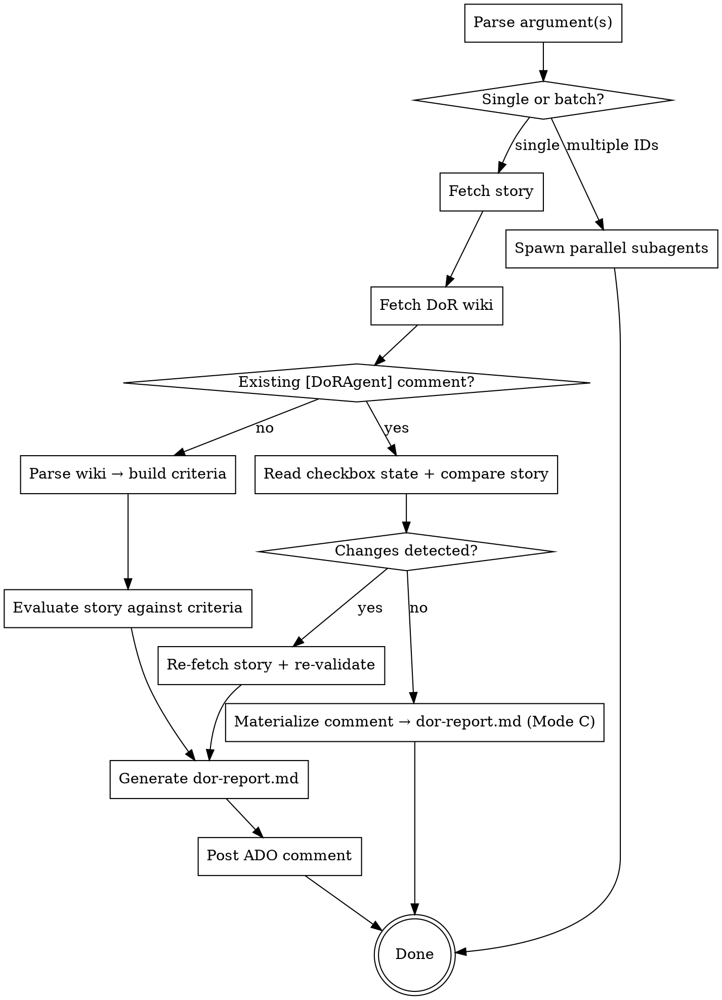

Validate one or more work items against the project's Definition of Ready checklist. Fetches the DoR wiki page, evaluates each criterion against the story content, generates a scorecard, and posts an interactive ADO/Jira comment with checkboxes for BA collaboration. Supports three modes: first post (Mode A), update after changes (Mode B), and reuse when nothing changed (Mode C). Supports `mandatory` tag for hard-gate checks that block regardless of overall score.

## Flow



## Node Details

### Parse argument(s)

- Read shared config: `shared/provider-config.md`, `shared/external-content-safety.md`
- Read `.ai/config.yaml` for provider, project, repo
- Parse argument: split on whitespace to produce a list of IDs
- If no argument provided, check for an active spec dir and extract the ID from its directory name

### Single or batch?

- If 1 ID: continue to "Fetch story"
- If 2+ IDs: continue to "Spawn parallel subagents"

### Spawn parallel subagents

- For each ID, use the Agent tool to dispatch a subagent with prompt: `Run /dx-dor <id>`
- Run all agents in parallel
- Collect results and present a summary table

### Fetch story

- If `.ai/specs/<id>-*/` exists, reuse it as `$SPEC_DIR`. Otherwise fetch title via MCP, slugify, create `mkdir -p .ai/specs/<id>-<slug>/`
- Fetch work item via MCP (ADO: `mcp__ado__wit_get_work_item`, Jira: `mcp__atlassian__jira_get_issue`)
- Fetch comments (ADO: `mcp__ado__wit_list_work_item_comments`, Jira: comments included in issue response)
- If `raw-story.md` doesn't exist, convert HTML to markdown per `shared/external-content-safety.md` and write it. If it exists and is current, reuse.

### Fetch DoR wiki

- Read `references/wiki-parsing.md` for the full parsing and fallback chain logic
- Fetch the wiki page using the URL from config (`scm.wiki-dor-url`) or Confluence (`confluence.dor-page-title`)

### Existing [DoRAgent] comment?

- Scan fetched comments for text containing `[DoRAgent] Definition of Ready Check`
- If found: continue to "Read checkbox state"
- If not found: continue to "Parse wiki -> build criteria"

### Read checkbox state + compare story

Two change checks — either one triggers re-validation:

1. **Checkbox changes:** Parse `- [x]` and `- [ ]` lines from the existing comment. Compare against the original post state to detect BA checkbox updates.
2. **Story content changes:** Compare the fetched story (from "Fetch story" step) against `$SPEC_DIR/raw-story.md` (if it exists). Check title, description, acceptance criteria, and comment count. If ANY differ, the ticket was updated since the last DoR run.

### Changes detected?

- If any checkbox changed from `[ ]` to `[x]` since original post: **yes** → print: `BA checked <N> items: <list>. Re-validating...`
- If story content changed (description, AC, or new comments): **yes** → print: `Ticket updated since last DoR check (changed: <fields>). Re-validating...`
- If both unchanged: **no** → continue to "Materialize comment → dor-report.md (Mode C)"

### Re-fetch story + re-validate

- Re-fetch work item via MCP to get latest content (already fetched in "Fetch story" — reuse that data)
- Update `$SPEC_DIR/raw-story.md` with fresh content
- Re-run evaluation against wiki criteria

### Materialize comment -> dor-report.md (Mode C)

- Parse the existing ADO comment back into dor-report.md format
- Write to `$SPEC_DIR/dor-report.md`
- Print: `DoR comment already posted to ADO #<id> — no changes — reusing.`

### Parse wiki -> build criteria

- Parse the wiki content per `references/wiki-parsing.md`
- Build structured list of sections with criteria and skip triggers

### Evaluate story against criteria

- For each section: check skip trigger against change type
- For each criterion: evaluate against raw-story.md content
  - `mandatory`: Pass or Fail (HARD GATE — a Fail here overrides the final verdict)
  - `required`: Pass or Fail
  - `recommended`: Pass or Warn
  - `human`: Warn always (needs human judgment)
- Extract structured BA data (component, dialog, design, scope) per `references/wiki-parsing.md`
- Generate open questions per pragmatism rules (read `rules/pragmatism.md`)

### Generate dor-report.md

- Compute score from applicable `required` criteria
- Apply scoring thresholds from wiki `## Scoring` section
- **Mandatory gate:** After computing the count-based verdict, check if any `mandatory`-tagged criterion has status Fail. If yes, override verdict to "Needs more detail — MANDATORY criteria not met: <comma-separated list of failed mandatory criteria>" regardless of the count-based score. This gate fires AFTER evaluation but BEFORE writing the report.
- Write `$SPEC_DIR/dor-report.md` per output format in `references/wiki-parsing.md`

### Post ADO comment

- Read `references/comment-format.md` for Mode A/B posting logic
- Mode A (first post): full checklist with interactive checkboxes
- Mode B (update): short delta comment with resolved/remaining items

### Done

- Print verdict: `DoR: <verdict> (<score>/<total>)`

## Examples

### Single work item
```
/dx-dor 2416553
```
Fetches story #2416553, evaluates against DoR checklist, writes `dor-report.md`, posts ADO comment.

### Batch validation at sprint start
```
/dx-dor 2416553 2416554 2416555
```
Spawns parallel subagents, each validating one item. Prints summary table at the end.

### Re-run after BA updates (checkboxes or ticket content)
```
/dx-dor 2416553
```
Detects existing `[DoRAgent]` comment. Checks for BA checkbox changes AND ticket content changes (description, AC, new comments). If either changed → re-fetches story, re-validates, posts Mode B update. If neither changed → Mode C reuse.

## Rules

- **Config-driven** — never hardcode wiki URLs, project names, or org details. Read everything from `.ai/config.yaml`.
- **Idempotent** — safe to re-run. Detects existing comments and adapts (Mode A/B/C).
- **Pragmatic questions** — self-discover answers before asking. Target 2-5 open questions, not an interrogation.
- **Interactive checkboxes** — ADO comments use `- [ ]` checkboxes so BAs can mark items resolved directly in ADO.
- **Always use `[DoRAgent]` text signature** — never use HTML comments like `<!-- ai:role:dor-agent -->` for detection.

## Platform Compatibility

This skill uses `Agent()` for batch mode and MCP tools for ADO/Jira, which work on both Claude Code and Copilot CLI.
