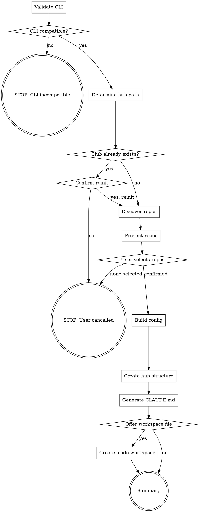

You set up a `.hub/` directory that orchestrates work across multiple repos via dx-core hub mode.

## Flow



## Node Details

### Validate CLI

Run:
```bash
claude --version
claude -p --help 2>&1 | grep -q 'output-format'
```

Both must succeed. If `claude --version` fails, the CLI is not installed. If `output-format` is absent, the CLI version is too old to support hub dispatch (requires `--output-format` flag for machine-readable output).

Fail with clear message:
```
ERROR: Hub mode requires Claude Code CLI with --output-format support.
  - Install: https://docs.anthropic.com/en/docs/claude-code
  - Minimum version: one that supports `claude -p --output-format`
```

### CLI compatible?

- **yes** — both checks passed → proceed to "Determine hub path"
- **no** — either check failed → go to "STOP: CLI incompatible"

### STOP: CLI incompatible

Print the error message from "Validate CLI". STOP.

### Determine hub path

If the user provided an argument, use it as the hub path. Otherwise default to `../.hub` relative to the current working directory.

Resolve to an absolute path for all subsequent operations:
```bash
HUB_PATH=$(realpath "${ARGUMENT:-../.hub}")
```

Print: `Hub path: $HUB_PATH`

### Hub already exists?

Check if `$HUB_PATH/.ai/config.yaml` exists.

- **yes** — a hub config already exists → go to "Confirm reinit"
- **no** → proceed to "Discover repos"

### Confirm reinit

Print:
```
Hub already exists at $HUB_PATH
Reinitializing will overwrite config.yaml and CLAUDE.md (state/ and existing specs are preserved).
Continue? [y/N]
```

Wait for user input.

- **yes, reinit** → proceed to "Discover repos"
- **no** → go to "STOP: User cancelled"

### STOP: User cancelled

Print: `Hub init cancelled. Existing hub at $HUB_PATH is unchanged.` STOP.

### Discover repos

Scan sibling directories (parent of `$HUB_PATH`) for repos that contain `.ai/config.yaml` with a `scm:` key.

**Strategy 1 — filesystem scan:**
```bash
PARENT=$(dirname "$HUB_PATH")
for dir in "$PARENT"/*/; do
  cfg="$dir/.ai/config.yaml"
  if [ -f "$cfg" ] && grep -q '^scm:' "$cfg"; then
    echo "$dir"
  fi
done
```

For each candidate, read `.ai/config.yaml` and extract:
- `name` — the directory name (basename)
- `scm.project` — ADO project name (may be absent)
- `scm.base-branch` — default branch (may be absent, fallback `main`)

**Strategy 2 — fallback (no siblings found):**
If no siblings are discovered, ask the user:
```
No repos with dx config found in <parent>.
Enter repo paths manually (absolute or relative to hub, comma-separated), or press Enter to abort:
```
Parse the paths and load their configs the same way.

Exclude the hub directory itself from the list.

### Present repos

Display discovered repos as a numbered checklist:
```
Discovered repos with dx config:

  [1] repo-alpha        (branch: develop, project: MyProject)
  [2] repo-beta         (branch: main, project: MyProject)
  [3] repo-gamma        (branch: main, project: OtherProject)

Select repos to include in hub (e.g. 1,2 or all):
```

### User selects repos

Wait for user input.

- **confirmed** — user entered at least one selection → resolve the list and proceed to "Build config"
- **none selected** — user entered nothing, pressed Enter, or typed `0` → go to "STOP: User cancelled"

Accept `all` to include every discovered repo.

### Build config

Merge selected repos into a hub `config.yaml`:

```yaml
hub:
  enabled: true
  auto-dispatch: false
  dispatch-mode: sequential
  state-dir: state/
  state-ttl: 7d

repos:
  - name: <dir-name>
    path: ../<dir-name>
    base-branch: <scm.base-branch from repo config, default: main>
    ado-project: <scm.project from repo config, omit if absent>
```

One entry per selected repo. Paths are relative to the hub directory. No hardcoded org URLs, project names, or credentials.

### Create hub structure

Create the hub directory layout:
```bash
mkdir -p "$HUB_PATH/.ai/specs"
mkdir -p "$HUB_PATH/.ai/rules"
mkdir -p "$HUB_PATH/.claude"
mkdir -p "$HUB_PATH/state"
```

Write `$HUB_PATH/.ai/config.yaml` with the content built in "Build config".

Write `$HUB_PATH/.gitignore`:
```
state/
.ai/specs/
```

### Generate CLAUDE.md

Write `$HUB_PATH/CLAUDE.md`:

```markdown
# Hub — Multi-Repo Orchestrator

This is a hub directory — it contains no code. It orchestrates work
across multiple repos via dx-core hub mode.

## Repos

<!-- populated by dx-hub-init, do not edit manually -->
<list of repo names and paths from config>

## Commands

No build commands. This directory dispatches to repos.

## Rules

- Never edit code files from this directory
- Use /dx-hub-status to check in-flight work
- Dispatch happens via hub-enabled dx-core skills
- Config lives in `.ai/config.yaml` — edit it to add/remove repos
```

Replace the `<list of repo names and paths from config>` placeholder with the actual repo list formatted as:
```
- **repo-alpha** → `../repo-alpha` (branch: develop)
- **repo-beta** → `../repo-beta` (branch: main)
```

### Offer workspace file

Ask:
```
Create a VS Code workspace file at $HUB_PATH/hub.code-workspace?
This lets you open all repos side-by-side in VS Code. [y/N]
```

- **yes** → proceed to "Create .code-workspace"
- **no** → proceed to "Summary"

### Create .code-workspace

Write `$HUB_PATH/hub.code-workspace`:

```json
{
  "folders": [
    { "name": "hub", "path": "." },
    { "name": "<repo-name>", "path": "../<repo-name>" }
  ],
  "settings": {}
}
```

One folder entry per selected repo, plus the hub itself as the first entry. Use the repo directory name as the `name` field.

### Summary

Print:

```markdown
## Hub Initialized

**Location:** $HUB_PATH
**Repos:** <N> repos configured
**Dispatch mode:** sequential
**Workspace file:** <created at hub.code-workspace | not created>

### Files created:
- `.ai/config.yaml` — hub config with repo registry
- `CLAUDE.md` — hub instructions for Claude
- `state/` — runtime dispatch state (gitignored)
- `.gitignore` — ignores state and specs

### Next steps:
- Open $HUB_PATH in Claude Code to use hub mode
- Run `/dx-hub-status` to verify connectivity
- Run `/dx-hub-dispatch` with a ticket ID to start coordinated work
```

## Examples

### Initialize hub with default path
```
/dx-hub-init
```
Scans `..` for sibling repos with dx config, prompts for selection, creates `../.hub/` with merged config, CLAUDE.md, and state directory.

### Initialize hub at a custom path
```
/dx-hub-init /workspace/my-hub
```
Same as above but creates the hub at the specified absolute path.

### Reinitialize an existing hub
```
/dx-hub-init
```
If `../.hub/.ai/config.yaml` already exists, prompts for confirmation before overwriting config and CLAUDE.md. State and existing specs are preserved.

## Troubleshooting

### "CLI incompatible" error
**Cause:** `claude --version` failed or `--output-format` flag is not available in the installed CLI version.
**Fix:** Update Claude Code CLI to the latest version. Hub dispatch relies on `claude -p --output-format json` for machine-readable subagent output.

### No repos discovered
**Cause:** Sibling directories either have no `.ai/config.yaml`, or their config does not contain a `scm:` key.
**Fix:** Run `/dx-init` in each repo first to generate the config. Then re-run `/dx-hub-init`. Alternatively, enter paths manually when prompted.

### Hub already exists — want to add a repo
**Cause:** Re-running init overwrites the full repo list.
**Fix:** Edit `.ai/config.yaml` directly to append a new entry under `repos:`. Follow the existing format (name, path, base-branch, ado-project).

### Workspace file not opening all repos
**Cause:** Relative paths in `hub.code-workspace` are resolved from the hub directory. If repos moved, paths break.
**Fix:** Edit `hub.code-workspace` to update the `path` values, or re-run `/dx-hub-init` to regenerate it.

## Rules

- **No hardcoded values** — all org names, project names, branch names, and URLs come from `.ai/config.yaml` in each repo
- **Relative paths in config** — repo paths in `hub/config.yaml` are always relative to the hub directory (e.g., `../repo-name`)
- **Preserve state on reinit** — `state/` and `.ai/specs/` are never deleted during reinit
- **CLI check is mandatory** — never skip the CLI compatibility check; hub dispatch will silently fail without it
