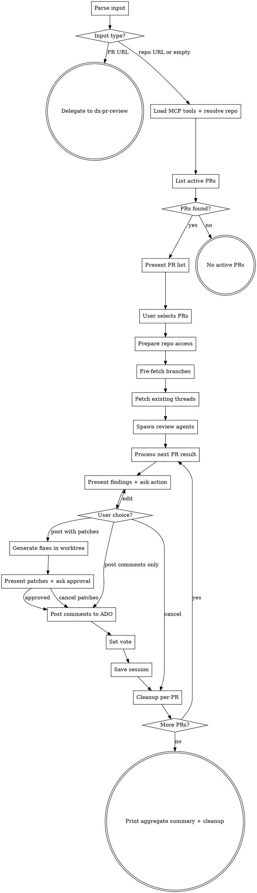

You list active Azure DevOps pull requests, present them for selection, then review each one using `/dx-pr-review` — which supports posting comments, proposing fix patches, and following up on author responses.

## Flow



## Node Details

### Parse input

Read `shared/ado-config.md` for how to look up ADO project from `.ai/config.yaml`.

- **Organization:** read from `.ai/config.yaml` `scm.org` — NEVER hardcode
- **Project:** read from `.ai/config.yaml` `scm.project`

Parse `$ARGUMENTS` to determine the mode:

| Input | Mode | Example |
|-------|------|---------|
| *(empty)* | Current repo, 5 PRs | `/dx-pr-reviews` |
| `<number>` | Current repo, N PRs | `/dx-pr-reviews 10` |
| `<repo URL>` | That repo, 5 PRs | `/dx-pr-reviews https://{org}/_git/My-Repo` |
| `<repo URL> <number>` | That repo, N PRs | `/dx-pr-reviews https://{org}/_git/My-Repo 10` |
| `<PR URL>` | Single PR (delegate) | `/dx-pr-reviews https://.../_git/.../pullrequest/12345` |

### Input type?

- **PR URL** — contains `/pullrequest/` → go to "Delegate to dx-pr-review"
- **repo URL or empty** — contains `/_git/` but no `/pullrequest/`, or numeric only, or empty → go to "Load MCP tools + resolve repo"

**Detect PR URL vs Repo URL:**
- Contains `/pullrequest/` → single PR mode
- Contains `/_git/` but no `/pullrequest/` → repo URL — extract project and repo name. URL-decode the project (e.g., `My%20Project` → `My Project`). **The URL-extracted project takes precedence over the config default.**
- Numeric only → count for current repo

### Delegate to dx-pr-review

Skip the listing and invoke `/dx-pr-review <PR URL>` directly. The URL contains the correct project — pass it through as-is. STOP.

### Load MCP tools + resolve repo

Load the tools:
```
ToolSearch("+ado repo")
ToolSearch("+ado pull request thread")
```

**Detect current repo** (when no URL is provided):
```bash
git remote get-url origin
```
Extract the repo name from the URL:
- `vs-ssh.visualstudio.com:v3/{org}/{project}/{repo}` → repo name is the last segment
- `{org}.visualstudio.com/{project}/_git/{repo}` → repo name after `_git/`

**Extract repo from URL** (when URL provided):
- `https://dev.azure.com/{org}/{project}/_git/{repo}` → project + repo
- `https://{org}.visualstudio.com/{project}/_git/{repo}` → project + repo

Resolve the repo name to an ID:
```
mcp__ado__repo_get_repo_by_name_or_id
  project: "<project from URL if provided, otherwise from config>"
  repositoryNameOrId: "<repo name>"
```

**Important:** If the user provided a URL, use the project extracted from that URL — NOT the config default. The same repo can exist in multiple ADO projects.

Save the `id` field and `sshUrl` — needed for all subsequent calls.

### List active PRs

Detect the current user from `git config user.email`.

```
mcp__ado__repo_list_pull_requests_by_repo_or_project
  repositoryId: "<repo ID>"
  status: "Active"
  top: <count>
```

Then fetch full details for each PR (parallel calls):
```
mcp__ado__repo_get_pull_request_by_id
  repositoryId: "<repo ID>"
  pullRequestId: <PR ID>
```

**Filter out own PRs:** Exclude PRs where `createdBy.uniqueName` or `createdBy.displayName` matches the current user. You can't review your own PRs. Show filtered count: "Found N active PRs (excluded M own)."

### PRs found?

- **yes** — at least one active PR (after filtering) → go to "Present PR list"
- **no** — no active PRs → go to "No active PRs"

### No active PRs

Print: "No active PRs in <repo name>." STOP.

### Present PR list

```markdown
## Active PRs — <repo name> (<count> found)

| # | PR | Title | Author | Created | Reviewers |
|---|-----|-------|--------|---------|-----------|
| 1 | [#12345](url) | Fix login bug | John D. | 2d ago | 2/4 approved |
| 2 | [#12346](url) | Add feature X | Jane S. | 5h ago | 0/3 approved |
| ... | | | | | |

Review all, or pick specific PRs? (e.g., "all", "1 3 5", "skip 2")
```

For each PR show:
- **PR number** with link: `{scm.org}/{scm.project}/_git/{repo}/pullrequest/{id}`
- **Title** — truncated to 60 chars if needed
- **Author** — display name (last name, first name → first name only for brevity)
- **Created** — relative time (e.g., "2d ago", "5h ago")
- **Reviewers** — `N/M approved` (count votes of 10 = approved, M = total non-container reviewers)

### User selects PRs

Wait for user to specify which PRs to review (e.g., "all", "1 3", "skip 2").

### Prepare repo access

Determine the repo path for diffing:

1. Check if PR repo matches current directory:
   ```bash
   basename $(git remote get-url origin)
   ```
2. If **same repo**: use current directory as `repoPath`.
3. If **different repo**: check `.ai/config.yaml` `repos:` section for a local checkout path. Use that as `repoPath`.
4. If **no local checkout**: shallow-clone once:
   ```bash
   git clone --no-checkout --filter=blob:none <sshUrl> /tmp/dx-review-<repo>
   ```
   Use `/tmp/dx-review-<repo>` as `repoPath`.

### Pre-fetch branches

Collect all unique source and target branches from the selected PRs (strip `refs/heads/` prefix). Fetch them all in one command:

```bash
git -C <repoPath> fetch origin <branch1> <branch2> <branch3> ...
```

### Fetch existing threads

For each selected PR, fetch existing review threads (make all calls in parallel):

```
mcp__ado__repo_list_pull_request_threads
  repositoryId: "<repo ID>"
  pullRequestId: <PR ID>
```

Summarize per PR: count of active threads and which files they cover.

### Spawn review agents

For each selected PR, spawn a `dx-pr-reviewer` agent via the Task tool.

**Spawn ALL agents in a single message** (multiple Task tool calls) for parallel execution:

```
Task(
  subagent_type: "dx-pr-reviewer",
  description: "Review PR #<id>",
  prompt: "Review this pull request:

    repoName: <name>
    repoPath: <path>
    pullRequestId: <id>
    title: <title>
    description: <description>
    author: <author display name>
    sourceBranch: <branch without refs/heads/>
    targetBranch: <branch without refs/heads/>
    existingThreadsSummary: <N active threads on: file1, file2, ...>"
)
```

### Process next PR result

Pick the next PR result from the batch of completed agents. Load `.ai/me.md` once (if it exists) to shape the voice of comments and patch proposals.

### Present findings + ask action

Print separator:
```markdown
---
## PR <N> of <M>: #<id> — <title>
**Repo:** <repo> | **Author:** <name> | **Files:** <count>
```

Display the agent's structured findings:

```markdown
| # | Sev | File | Line(s) | Comment | Fixable? |
|---|-----|------|---------|---------|----------|
| 1 | MUST-FIX | `path/to/file.js` | L42-L45 | hm, this null check is missing — will NPE when X is empty | YES |
| 2 | QUESTION | `path/to/file.js` | L10 | not sure this handles the edge case where... | NO |

**Verdict**: Approved / Approved with suggestions / Changes requested
Reviewed N files — N comments.
**Fixable issues:** <N> of <M> can have patches generated
```

**Fixable determination:** An issue is fixable if the reviewer agent provided enough detail to write a specific code change. Questions and ambiguous issues are NOT fixable.

Ask the user:
- **Post comments only** — post review comments as-is (no patches)
- **Post with fix patches** — generate patches first, then post comments with inline diffs
- **Edit** — remove, modify, or add comments
- **Cancel** — discard without posting, move to next PR

**Wait for explicit choice before proceeding.**

### User choice?

- **post with patches** → go to "Generate fixes in worktree"
- **post comments only** → go to "Post comments to ADO"
- **edit** → go back to "Present findings + ask action" (with edits applied)
- **cancel** → go to "Cleanup per-PR"

### Generate fixes in worktree

Use the Task tool with `isolation: "worktree"` to create fixes without touching local state:

```
Task(
  subagent_type: "general-purpose",
  isolation: "worktree",
  description: "Generate PR #<id> fix patches",
  prompt: "Generate code fixes for the issues found in PR #<id>. Work on the PR author's source branch.

    repoPath: <current working directory>
    sourceBranch: <source branch without refs/heads/>
    targetBranch: <target branch without refs/heads/>

    ## Setup

    1. Checkout the PR's source branch:
       ```bash
       git fetch origin <sourceBranch>
       git checkout origin/<sourceBranch>
       ```
    2. This is now the PR author's code. Your job is to fix the issues below.

    ## Issues to Fix

    <for each selected fixable issue:>
    ### Issue #<N>
    File: <filePath>
    Line(s): <line range>
    Severity: <MUST-FIX>
    Problem: <description from the review>
    What needs to change: <specific fix description>

    ## Persona

    <If .ai/me.md was found, paste its full content here.
     If not found, omit this entire Persona section.>

    ## Instructions

    For each issue:
    1. **Read the file** — full file or +/-50 lines around the target area
    2. **Understand the context** — what the code does, what's wrong
    3. **Apply the minimal fix** — ONLY what's needed. No refactoring
    4. **Verify consistency** — check if the same pattern exists elsewhere
    5. **Follow project conventions** — read .claude/rules/ for the file type
    6. **Report what you changed**

    ## Constraints
    - Minimal changes only. This is a PROPOSAL — the author decides.
    - If a fix seems risky, flag it instead of applying.
    - One fix = one logical change.

    ## Output Format

    ### Fix #<N> — <filePath>
    **Issue:** <1-line problem description>
    **What changed:** <1-line fix description>
    **Lines modified:** L<start>-L<end>
    **Risk:** low | medium | high
    **Notes:** <concerns, or 'none'>
    ---

    If a fix could NOT be applied:
    ### Fix #<N> — <filePath>
    **Status:** SKIPPED
    **Reason:** <why>
    ---
  "
)
```

After the worktree agent finishes, generate a unified diff:

```bash
git -C <worktreePath> diff origin/<sourceBranch> -- . > /tmp/dx-propose-pr-<id>.patch
git -C <worktreePath> diff origin/<sourceBranch> --stat
git -C <worktreePath> diff origin/<sourceBranch>
```

If the patch is empty, report and fall back to posting comments only.

### Present patches + ask approval

Only shown when patches were generated.

```markdown
## Proposed Fixes — PR #<id>: <title>

| # | File | Issue | Fix | Risk |
|---|------|-------|-----|------|
| 1 | `hero.js` L42 | Missing null check | Added null guard | low |
| 2 | `Model.java` L18 | Missing @Optional | Added annotation | low |

**Patch size:** <N> files, +<additions> -<deletions>
```

Show the full `git diff` so the user can inspect every change.

Ask: **Post all** / **Edit** / **Cancel** (discard patches, post comments only).

**Wait for explicit approval.**

- **approved** → go to "Post comments to ADO" (with patches included)
- **cancel patches** → go to "Post comments to ADO" (comments only, no patches)

### Post comments to ADO

**Without patches (default):** Post each comment as a thread:

```
mcp__ado__repo_create_pull_request_thread
  repositoryId: "<repo ID>"
  pullRequestId: <PR ID>
  content: "<approved comment text>"
  filePath: "/<path/to/file>"
  rightFileStartLine: <line>
  rightFileEndLine: <line>
  rightFileStartOffset: 1
  rightFileEndOffset: 1
  status: "active"
```

Then post the summary (no filePath = general PR comment):

```
mcp__ado__repo_create_pull_request_thread
  repositoryId: "<repo ID>"
  pullRequestId: <PR ID>
  content: "**Verdict**: <verdict>\n\nReviewed N files — N comments.\n\n<overall impression>"
  status: "active"
```

**With patches:** For each fix, post a comment with the issue AND the specific patch:

```markdown
<issue description — written like a colleague, not a linting tool>

<details>
<summary>Proposed fix (click to expand)</summary>

\`\`\`diff
<unified diff for this specific file only>
\`\`\`

To apply: \`git apply fix.patch\`
</details>
```

> **CRITICAL — diff rendering in `<details>` blocks:**
> 1. **Blank line after `</summary>` is mandatory** — without it, ADO won't process the code fence as markdown
> 2. **NEVER HTML-encode diff content** — write raw `<p>`, `<span>`, `<div>`, NOT `&lt;p&gt;`, `&lt;span&gt;`, `&lt;div&gt;`. The code fence handles escaping for display. HTML-encoding creates double-encoding that shows literal `&lt;` text to the reader.
> 3. **Always include the triple-backtick code fence** with `diff` language tag — without it, HTML tags in the diff get parsed as actual HTML

**For non-fixable issues (QUESTION):** regular comment without a patch.

**Summary thread** (no filePath):

```markdown
**Review with proposed fixes**

Reviewed <N> files — <M> issues found, <K> with proposed patches.

| # | File | Issue | Patch |
|---|------|-------|-------|
| 1 | `hero.js` L42 | Missing null check | included |
| 2 | `file.js` L10 | Edge case question | no patch |

<details>
<summary>Full combined patch (click to expand)</summary>

\`\`\`diff
<full unified patch combining all fixes>
\`\`\`

To apply all: \`git apply combined-fix.patch\`
</details>
```

If a comment fails to post: log the error, continue posting remaining, list failures at the end.

### Set vote

Ask the user what vote to set:
- **Approve** — no critical issues
- **Approve with suggestions** — minor improvements
- **Request changes** — critical issues
- **Skip voting** — comments only

Never auto-approve or auto-decline without explicit user confirmation.

### Save session

Save review state for future follow-up (enables `/dx-pr-review <PR URL>` follow-up mode later):

```bash
mkdir -p .ai/pr-reviews
```

Write `.ai/pr-reviews/pr-<id>.md`:

```markdown
# PR #<id> — <title> (Review)

**Author:** <name>
**Branch:** <sourceBranch> → <targetBranch>
**Repo:** <repoName> (ID: <repoId>)
**Project:** <ADO project name>
**Last reviewed:** <ISO date>
**Review commit:** <SHA>
**Status:** reviewed | follow-up-needed | complete

## My Threads

### Thread #<threadId> | <status>

- **File:** <filePath or 'General'>
- **Line(s):** <range or 'N/A'>
- **Severity:** MUST-FIX | QUESTION
- **Comment:** <my review comment text>
- **Thread ID:** <ADO thread ID>
- **Posted:** <ISO date>
- **Comment count at save:** <number of comments in thread>
- **Patch posted:** yes | no
- **Follow-up status:** pending | addressed | argued | ignored
```

**Review commit** = current SHA of `origin/<sourceBranch>`:
```bash
git -C <repoPath> rev-parse origin/<sourceBranch>
```

### Cleanup per-PR

```bash
# Worktree (if patches generated)
git worktree remove <worktreePath> --force 2>/dev/null

# Temp patch file
rm -f /tmp/dx-propose-pr-<id>.patch
```

Then check "More PRs?".

### More PRs?

- **yes** — more selected PRs remain → go to "Process next PR result"
- **no** — all PRs processed → go to "Print aggregate summary + cleanup"

### Print aggregate summary + cleanup

Print:

```markdown
## Review Summary — <repo name>

| # | PR | Title | Verdict | Comments | Patches |
|---|-----|-------|---------|----------|---------|
| 1 | #12345 | Fix login bug | Approved | 2 | 1 |
| 2 | #12346 | Add feature X | Changes requested | 5 | 3 |
| 3 | #12347 | Update docs | Skipped | — | — |

**Reviewed:** <N> PRs | **Approved:** <N> | **Changes requested:** <N> | **Skipped:** <N>
**Sessions saved:** .ai/pr-reviews/pr-<id>.md (for follow-up with `/dx-pr-review`)
```

If a temp clone was created in "Prepare repo access":
```bash
rm -rf /tmp/dx-review-<repo>
```

## Examples

1. `/dx-pr-reviews` — Lists 5 active PRs in the current repo (excluding your own), presents the list for selection. You type "1 3" to review PRs #1 and #3. Each PR gets the full review flow: analysis, findings presentation, optional patch generation, comment posting, and vote.

2. `/dx-pr-reviews https://dev.azure.com/myorg/MyProject/_git/Other-Repo 10` — Lists up to 10 active PRs from a different repo, fetches branches in one batch, spawns review agents in parallel, then processes results one at a time for approval.

3. `/dx-pr-reviews https://dev.azure.com/myorg/MyProject/_git/MyRepo/pullrequest/12345` — Detects a single PR URL, skips the listing step, and delegates directly to `/dx-pr-review` for that specific PR.

## Troubleshooting

- **"No active PRs in <repo>"**
  **Cause:** All PRs are either completed, abandoned, or created by you (own PRs are filtered out).
  **Fix:** Check ADO directly to confirm PR status. If you want to review your own PRs, use `/dx-pr-review <PR URL>` directly.

- **Review agent times out on large PRs**
  **Cause:** The PR has hundreds of changed files or very large diffs that exceed the agent's context window.
  **Fix:** Review the PR manually for the largest files. For subsequent reviews, consider breaking large PRs into smaller ones.

- **Comments fail to post to ADO**
  **Cause:** ADO PAT lacks "Pull Requests: Contribute" permission, or the PR was completed/abandoned between review and posting.
  **Fix:** The skill logs failures and continues posting remaining comments. Check your PAT permissions. Failed comments are listed in the summary.

## Rules

- **List before reviewing** — always show the PR list and let the user choose which to review
- **Parallel analysis** — spawn all `dx-pr-reviewer` agents in a single message for concurrent execution
- **Sequential approval** — present each PR's findings one at a time for user approval
- **Full review flow per PR** — each PR gets the identical flow as `/dx-pr-review`: present → patch → post → vote → save session
- **Respect user selection** — if user says "1 3", only review those two
- **Don't duplicate** — if `/dx-pr-review` was already run on a PR in this session, skip it and note "already reviewed"
- **Current repo as default** — when no arguments, detect repo from git remote
- **MCP tools are deferred** — always load via ToolSearch before first use
- **Pre-fetch branches** — do one `git fetch` for all branches before spawning agents
- **Agent handles analysis** — diff reading, context loading, and code review happen inside the agent, keeping main context lean
- **Never push to their branch** — generate patches, never commit or push to the author's branch
- **Worktree isolation** — all fix generation happens in an isolated worktree. Never modify local working directory
- **Patch, not push** — output is always a patch in a PR comment. The author decides whether to apply
- **Collapsible patches** — use `<details>` with mandatory blank line after `</summary>`, never HTML-encode diff content
- **Include apply instructions** — every patch comment includes `git apply` instructions
- **Combined + individual** — per-file patches on relevant lines AND a combined patch in the summary
- **Ask before acting** — never approve, decline, or post without user confirmation
- **Session persistence** — always save to `.ai/pr-reviews/pr-<id>.md` after posting each PR. Enables follow-up via `/dx-pr-review`
- **Continue on failure** — if one comment fails to post, log and continue
