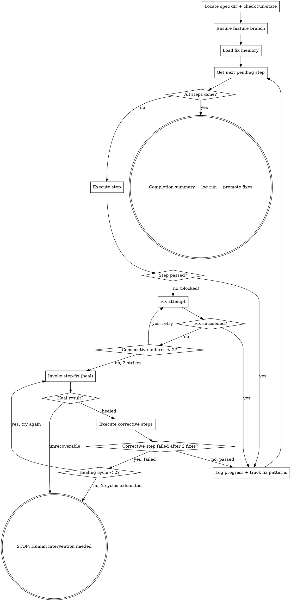

You are a coordinator. You run the step pipeline for each step in implement.md, delegating to skills via the Skill tool.

## Progress Tracking

After loading `implement.md`, use `TaskList` to check for existing tasks from a previous run. If stale tasks exist, cancel them first with `TaskUpdate` (status: `cancelled`). Then create a task for each plan step using `TaskCreate` (e.g., "Step 1: Create dialog XML"). Mark each `in_progress` when executing, `completed` when committed. On fix attempts, update the task subject (e.g., "Step 1: Create dialog XML (fix 1)"). On heal cycles, add a task: "Healing: <corrective action>".

## Flow



## Node Details

### Locate spec dir + check run-state

```bash
SPEC_DIR=$(bash .ai/lib/dx-common.sh find-spec-dir $ARGUMENTS)
```

Maintain run state in `$SPEC_DIR/run-state.json`:

```json
{
  "skill": "dx-step-all",
  "ticket": "<id>",
  "started": "<ISO-8601>",
  "phase": 0,
  "step": 0,
  "completed_phases": [],
  "last_action": "",
  "files_modified": []
}
```

**On invocation:**
1. Check for existing `$SPEC_DIR/run-state.json`
2. If exists and `started` < 2 hours ago → ask user: "Previous run found at phase {phase}, step {step}. Resume or start fresh?"
3. If exists and `started` ≥ 2 hours ago → warn: "Stale run state found (started {time}). Starting fresh." Delete run-state.json.
4. If not exists → create new run-state.json

**During execution:** Update run-state.json after each phase/step completion.
**On completion:** Delete run-state.json (clean exit).

Get the plan metadata (step count and status) — do NOT read full implement.md here:

```bash
bash .ai/lib/plan-metadata.sh $SPEC_DIR
```

This outputs a compact summary (~10 tokens/step vs ~200 for full file). Workers (step, step-fix) will read the full implement.md when they need it.

Print: `Starting execution: <N> steps total, <M> pending.`

### Ensure feature branch

Before executing any steps, run the shared branch guard:

```bash
bash .ai/lib/ensure-feature-branch.sh $SPEC_DIR
```

This no-ops if already on `feature/*` or `bugfix/*`. Creates a feature branch if on any other branch. The branch name is saved to `$SPEC_DIR/.branch`.

Print: `Branch: <BRANCH> (<BRANCH_ACTION>)`

**This is a hard gate** — never execute steps on a protected branch.

### Load fix memory

Before entering the execution loop, check if the project has accumulated fix knowledge from previous runs.

If `.ai/learning/fixes.md` exists:
- Read it
- Include a note when dispatching skills: append to the prompt: `Known fix patterns for this project: <summary of fixes.md content>`
- Print: `Learning: Loaded <N> known fix patterns from previous runs.`

If it does not exist, skip silently.

### Get next pending step

Re-read plan metadata to get the latest status (skills update implement.md). Especially important after step-fix creates new steps. Never read full implement.md in the orchestrator — workers handle that.

```bash
bash .ai/lib/plan-metadata.sh $SPEC_DIR
```

Identify the next step with status `pending`.

### All steps done?

Check if any `pending` or `in-progress` steps remain.

- **yes** → proceed to "Completion summary + log run + promote fixes"
- **no** → proceed to "Execute step" with the next pending step

### Execute step

Invoke `Skill(/dx-step)` for the current step. dx-step now handles implement + test + review + commit as internal phases — no separate dispatches needed.

### Step passed?

Check the result from dx-step:
- **success** → proceed to "Log progress + track fix patterns"
- **failure** → classify the error (see **Error Classification** below), then proceed to "Fix attempt"

**Error Classification:** Before triggering healing, classify the failure using `shared/error-handling.md`:
- **TRANSIENT** → Retry the step (counts toward consecutive failure limit)
- **VALIDATION** → Let dx-step-fix attempt repair (counts as healing cycle)
- **PERMANENT** → Skip healing entirely. Mark step blocked. Report to user immediately. Proceed to "STOP: Human intervention needed".

### Fix attempt

Invoke `Skill(/dx-step-fix)` for the current step.

Track fix attempts per step.

### Fix succeeded?

Check the fix result:
- **yes** → proceed to "Log progress + track fix patterns"
- **no** → proceed to "Consecutive failures < 2?"

### Consecutive failures < 2?

Check consecutive fix failure count for this step:
- **yes, retry** → proceed to "Fix attempt" for another attempt
- **no, 2 strikes** → proceed to "Invoke step-fix (heal)"

### Invoke step-fix (heal)

Track healing cycles per step. Max 2 healing cycles per original step.

Invoke `Skill(/dx-step-fix)` with healing context:
```
/dx-step-fix <SPEC_DIR> --heal --failure-type step-blocked --blocked-step <N>
```

dx-step-fix now handles both fix and heal modes internally.

### Heal result?

Check the step-fix return:
- **healed** → re-read implement.md to find the new corrective step(s). Proceed to "Execute corrective steps".
- **unrecoverable** → print: `Step <N> unrecoverable after 2 fixes + healing. Human intervention needed.` Proceed to "STOP: Human intervention needed".

### Execute corrective steps

Run the normal Execute step → Fix attempt cycle on each new corrective step created by step-fix.

### Corrective step failed after 2 fixes?

After running the corrective step through the full cycle (including up to 2 fix attempts):
- **no, passed** → proceed to "Log progress + track fix patterns"
- **yes, failed** → proceed to "Healing cycle < 2?"

### Healing cycle < 2?

Check the healing cycle count for the original step:
- **yes, try again** → proceed to "Invoke step-fix (heal)" for another healing cycle
- **no, 2 cycles exhausted** → print: `Step <N> blocked after 2 healing cycles. Human intervention needed.` Proceed to "STOP: Human intervention needed".

### Log progress + track fix patterns

After each step cycle, print:
```
Step <N>/<total> done — <step title>
```

**Track and persist learning signals** for each step that completes (or fails):
- `step_number`: which step
- `step_title`: the step's title from implement.md
- `fix_attempts`: number of fix attempts (0 if none needed)
- `fix_succeeded`: how many fix attempts succeeded
- `fix_failed`: how many fix attempts failed
- `heal_cycles`: number of healing cycles invoked (0 if none)
- `heal_succeeded`: how many heal cycles succeeded
- `heal_failed`: how many heal cycles failed
- `fix_types`: list of error types encountered (e.g., "compilation", "test-failure", "review-rejection")

**Persist immediately after each step** (not deferred to end-of-run):

```bash
mkdir -p .ai/learning/raw
```

If fix attempts occurred for this step, append one JSONL line per attempt to `.ai/learning/raw/fixes.jsonl`:
```json
{"timestamp":"<ISO-8601>","ticket":"<id>","step":<N>,"error_type":"<type>","fix_description":"<what was done>","result":"<success|failed>"}
```

**Incremental pattern promotion:** After appending, check if any pattern in `fixes.jsonl` now has 3+ successes and 0 failures. If so, promote it immediately (see "Completion summary + log run + promote fixes" for format). This ensures learning survives even if the run is interrupted.

### Completion summary + log run + promote fixes

After all steps are done:

```markdown
## Execution Complete

**<Title>**
**Steps:** <N>/<N> done (including <H> healing steps)
**Commits:** <N> commits created
**Fix attempts:** <N> total (<M> succeeded, <K> failed)
**Healing cycles:** <N> total (<M> healed, <K> unrecoverable)

### Cross-Repo Note:
<If implement.md has "Other repos required", print:>
> This plan covers **<current repo>** only. Switch to **<other repo(s)>** and run `/dx-req <id>` there to plan and execute those changes.
<Otherwise omit this section.>

### Next steps:
- `/dx-pr` — create pull request
- Review changes with `git log --oneline`
```

**Log run record:**

```bash
mkdir -p .ai/learning/raw
```

Append one JSONL line to `.ai/learning/raw/runs.jsonl`:
```json
{"timestamp":"<ISO-8601>","ticket":"<id>","flow":"step-all","total_steps":<N>,"steps_completed":<N>,"fix_attempts":{"succeeded":<N>,"failed":<N>},"heal_cycles":{"succeeded":<N>,"failed":<N>},"step_titles":["<title1>","<title2>"]}
```

Use Bash to append — `echo '<json>' >> .ai/learning/raw/runs.jsonl`

**Final promotion sweep:**

Run one final pattern promotion check (same logic as incremental promotion in "Log progress + track fix patterns") to catch any patterns that crossed the 3-success threshold during the last step. This is a safety net — most promotions happen incrementally.

Read `.ai/learning/raw/fixes.jsonl`. Group entries by `error_type` + `fix_description`. For each combination with **3+ successes AND 0 failures**:
- Generate slug from error type (e.g., `compilation-missing-import`)
- Skip if `.claude/rules/learned-fix-<slug>.md` already exists (promoted earlier)
- Otherwise create:
  ```markdown
  # Learned Fix: <error_type>

  When encountering: <error_type>
  Apply this fix: <fix_description>

  Evidence: <N> successful applications across <ticket list>.
  ```
- Print: `Learning: Promoted fix pattern to .claude/rules/learned-fix-<slug>.md — <fix_description>`

**Summary message:**

If fix patterns were logged:
- Print: `Learning: <N> fix patterns logged, <M> promoted to rules.`

If no fix patterns at all:
- Print: `Learning: Clean run — no fixes needed.`

### STOP: Human intervention needed

The execution loop has been halted. Either:
- A step was marked **unrecoverable** after 2 fix attempts + healing
- **2 healing cycles** were exhausted on the same original step

Print the blocked step number, the error type, and a summary of what was tried. The user must manually intervene (edit `implement.md`, fix the environment, or re-plan).

## Validation Gates

| After Phase | Gate | Fail Action |
|------------|------|-------------|
| Step execution (2a) | Step status is `done` in `implement.md` | Enter fix loop (2b-2d) |
| Fix attempt (2d) | Fix count < 2 for this step | If >=2: enter heal cycle (2d-heal) |
| Heal cycle (2d-heal) | Corrective steps added to `implement.md` | If unrecoverable: STOP with blocked step report |
| All steps complete | No `pending` or `in-progress` steps remain | Proceed to build phase |

## Examples

### Execute full plan
```
/dx-step-all 2416553
```
Reads `implement.md` from `.ai/specs/2416553-add-layout-switcher/`, finds 6 pending steps, and runs each through dx-step (which handles implement + test + review + commit internally). Prints progress after each step.

### Resume after partial completion
```
/dx-step-all 2416553
```
If steps 1-3 are already `done`, picks up at step 4 and continues. Only pending steps are executed.

### Self-healing on failure
When step 3 fails twice, triggers `dx-step-fix` in heal mode which analyzes the error, creates a corrective step 3a, executes it, then retries step 3. If healing also fails after 2 cycles, stops and reports.

## Troubleshooting

### "No pending steps" but plan isn't done
**Cause:** Steps are marked `blocked` or `in-progress` from a previous interrupted run.
**Fix:** Open `implement.md` and reset the stuck step's status to `pending`, then re-run.

### Build fails repeatedly on the same step
**Cause:** The plan step has incorrect instructions or missing context.
**Fix:** Let self-healing run (2 fix attempts + 2 heal cycles). If still failing, run `/dx-step-fix` manually to diagnose, or edit `implement.md` to fix the step instructions.

### "Cannot execute on protected branch"
**Cause:** You're on `development`, `main`, or `master` instead of a feature branch.
**Fix:** The branch guard should auto-create a feature branch. If it fails, manually create one: `git checkout -b feature/<id>-<slug>`.

## Decision Examples

### Heal: Flaky Test
**Failure:** Test passes locally but fails in step execution (timing-dependent assertion)
**Consecutive failures:** 2
**Decision:** HEAL — test is flaky. Fix: add wait/retry in test assertion.

### Escalate: Architecture Mismatch
**Failure:** Step creates a new utility, but existing utility covers the need
**Consecutive failures:** 2
**Decision:** ESCALATE — plan problem, not code problem. Report: "Step 4 violates reuse rule. Existing `forms.js:validateField()` covers this need."

## Success Criteria

- [ ] All steps in implement.md have status: done, blocked, or skipped
- [ ] No steps remain in pending or in-progress
- [ ] Build command exits 0 after final step
- [ ] run-state.json deleted (clean completion)

## Rules

- **Coordinator only** — never implement code yourself. Always delegate via Skill tool.
- **Sequential execution** — steps must run in order. Never parallelize steps.
- **2-strike then heal** — after 2 consecutive fix failures, invoke step-fix in heal mode before giving up.
- **2 healing cycles max** — after 2 healing cycles on the same original step, stop for real.
- **Progress reporting** — print status after each step so the user can follow along.
- **Re-read metadata between steps** — run `plan-metadata.sh` between steps to get the latest status (skills update implement.md). Especially important after step-fix creates new steps. Never read full implement.md in the orchestrator — workers handle that.
- **Don't skip blocked steps** — if a step is blocked and healing failed, stop. Steps have dependencies.

## Platform Compatibility

This skill uses `Skill()` tool calls which work on both Claude Code and Copilot CLI.

**Copilot CLI / VS Code Chat fallback:** If subagent skill invocation fails, run the skills manually in sequence for each plan step:
1. `/dx-step <step-number>` — execute a single step (implement + test + review + commit)
2. On failure: `/dx-step-fix <spec-dir>` — attempt repair (up to 2 tries)
3. On persistent failure: `/dx-step-fix <spec-dir> --heal` — diagnose and create corrective steps
4. Repeat from step 1 for each pending step in `implement.md`
