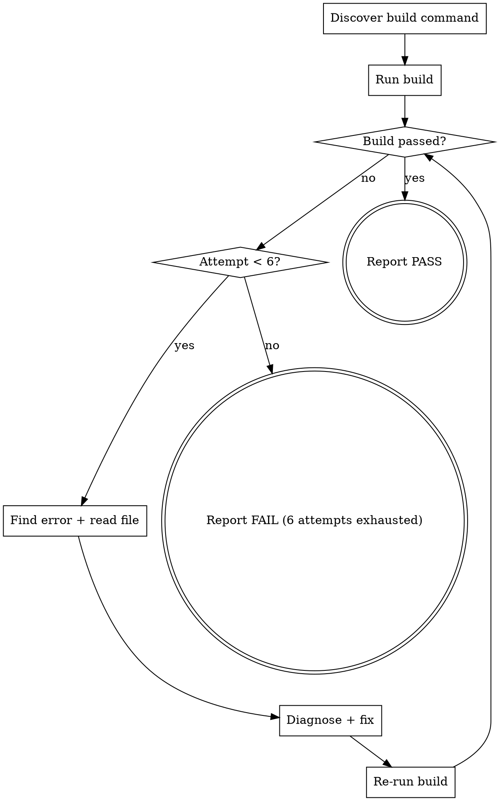

You build and deploy the project, diagnose any failures, fix them, and repeat until the build passes.

## Flow



## Node Details

### Discover build command

If the user provided an argument, use that as the build command.

Otherwise, read from `.ai/config.yaml`. Choose the right command based on context:

| Config key | When to use | Example |
|------------|-------------|---------|
| `build.deploy` | Quick rebuild during fix loops, FE verification, iterative development | `mvn clean install -PautoInstallPackage -DskipTests` |
| `build.command` | Final pipeline build, when tests must run | `mvn clean install -PautoInstallPackage` |

**Default:** Use `build.deploy` if available (faster — skips tests). Fall back to `build.command` if `build.deploy` is not configured.

**Exception:** When called from the main pipeline build phase (`dx-agent-all` Phase 5), use `build.command` to include tests. The caller can override by passing an explicit argument.

If neither is found, read `CLAUDE.md` and `README.md` to find the project's build-and-deploy command. Look for a command that both builds **and** deploys to a local dev environment.

Print: `Using build command: \`<command>\``

### Run build

Execute the build command using the Bash tool:
- Append `2>&1` to capture both stdout and stderr
- Use timeout 300000ms (5 minutes)

### Re-run build

Same as **Run build** above — execute the same build command again.

### Build passed?

Scan the output for success/failure indicators:
- **Success markers:** `BUILD SUCCESS`, `Compiled successfully`, `Done in`, exit code 0
- **Failure markers:** `BUILD FAILURE`, `ERROR`, `FAILED`, `error:`, non-zero exit code

### Attempt < 6?

Track attempt count starting at 1. Increment after each fix attempt. Maximum 6 attempts total.

### Find error + read file

**Find the error**
Scan the build output for the first actionable error. Look for:
- Compilation errors with file path and line number
- Build tool errors (failed goals, missing dependencies)
- XML/config parsing errors
- Frontend build errors (webpack, tsc, etc.)
- Test failures with class name + assertion message

Extract: **file path**, **line number**, **error message**.

**Read the broken file**
Use the Read tool to open the file. If a line number was reported, focus on that area.

### Diagnose + fix

**Diagnose**
Determine the root cause. Common causes:
- Syntax errors (unclosed tags, invalid attributes, encoding issues)
- Missing imports
- Wrong property names or type mismatches
- Missing test dependencies or mock registrations
- Incompatible method signatures

**Fix**
Use the Edit tool to correct the specific issue. Make the minimal change needed.

### Report PASS

Print:

```
Build & deploy passed.
```

Done. Stop here.

### Report FAIL (6 attempts exhausted)

STOP and print:

```
Build failed after 6 fix attempts.

**Command:** `<build command>`
**Last error:**
<the specific error message>

**Files modified during fix attempts:**
- <list of files edited>

Run `/dx-step-fix` to continue debugging, or fix manually and re-run `/dx-step-build`.
```

## AEM Projects — Frontend vs Maven Deployment

If the project is AEM (check `.ai/config.yaml` for `aem:` section):

- **Frontend builds** (`npm run build`, `webpack`, etc.) compile frontend code but do **NOT** auto-deploy to local AEM. The built artifacts land in the project's build output directory but are not installed on the AEM instance.
- **Maven builds** (`mvn clean install -PautoInstallSinglePackage`, etc.) compile AND deploy to local AEM. Only a Maven build makes changes visible on the running AEM instance.

**When local AEM testing is needed**, always use the Maven build command (from `build.command` in config) — not just a frontend build.

## Success Criteria

- [ ] Build command exits with code 0 (or output contains `BUILD SUCCESS`)
- [ ] No new lint errors introduced (if lint runs as part of build)
- [ ] Build completes within 6 fix attempts if errors occur

## Examples

### Standard build
```
/dx-step-build
```
Reads build command from `.ai/config.yaml` `build.command`, runs it. If it passes, prints "Build & deploy passed." If it fails, enters fix loop.

### Custom build command
```
/dx-step-build mvn clean install -pl core
```
Uses the provided command instead of config. Useful for building a specific module.

### Fix loop in action
```
/dx-step-build
```
Build fails with missing import → fixes it → rebuilds → passes. Up to 6 fix attempts before giving up.

## Troubleshooting

### Build fails after 6 attempts
**Cause:** The error is too complex for automatic fixing, or each fix introduces a new error.
**Fix:** Run `/dx-step-fix` for deeper diagnosis, or fix manually and re-run.

### "No build command found"
**Cause:** `.ai/config.yaml` doesn't have `build.command` and no `CLAUDE.md` build instructions exist.
**Fix:** Run `/dx-init` to configure the build command, or pass it directly: `/dx-step-build mvn clean install`.

### Frontend build passes but changes not visible on AEM
**Cause:** Frontend builds compile to `dist/` but don't deploy to AEM. Only Maven builds auto-deploy.
**Fix:** Use the Maven build command (from `build.command`) for local AEM verification.

## Rules

- **Minimal fixes only** — don't refactor or improve code, just fix the build error
- **One error at a time** — fix the first error, re-build, then tackle the next
- **Don't mask errors** — never suppress warnings/errors with flags like `-q` or `--silent`
- **Preserve intent** — if a fix would change the feature's behavior, STOP and ask the user
