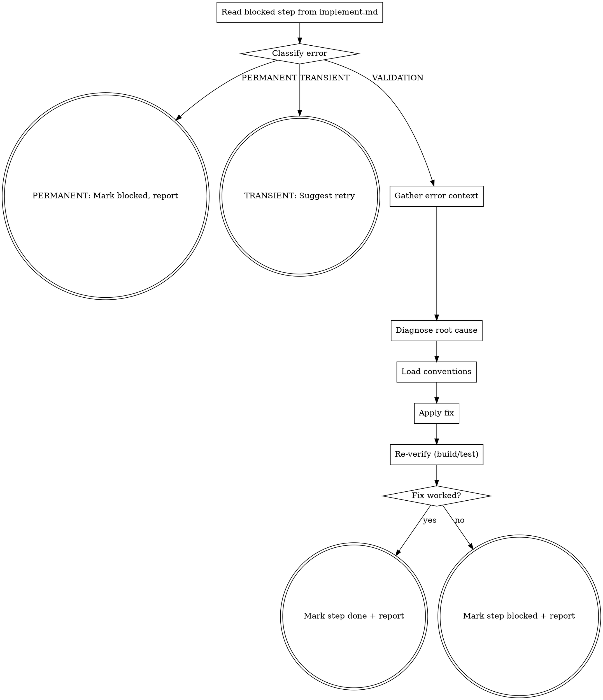

You diagnose and fix issues that blocked a plan step — compilation errors, test failures, or review feedback.

Use ultrathink for this skill — debugging requires deep reasoning about root causes.

## Flow



## Node Details

### Read blocked step from implement.md

```bash
SPEC_DIR=$(bash .ai/lib/dx-common.sh find-spec-dir $ARGUMENTS)
```

Read `implement.md` from `$SPEC_DIR`. Find the step that needs fixing:
- First `**Status:** blocked` step, OR
- First `**Status:** in-progress` step (interrupted), OR
- Last `**Status:** done` step if the issue is from post-step testing/review

### Classify error

Before attempting any fix, classify the error using `shared/error-handling.md`:
- If **PERMANENT** → go to "PERMANENT: Mark blocked, report"
- If **TRANSIENT** → go to "TRANSIENT: Suggest retry"
- If **VALIDATION** → proceed to "Gather error context"

### PERMANENT: Mark blocked, report

Do not attempt fix. Return: "PERMANENT error: [category]. Manual intervention required: [suggestion]."

### TRANSIENT: Suggest retry

Suggest retry, not code fix. Return: "TRANSIENT error: [category]. Re-run the step."

### Gather error context

Read ALL available error information:
- Compilation errors from the build output
- Test failure output (assertion messages, stack traces)
- Review feedback (specific issues listed)

Also read:
- The step's **What** instructions (what was intended)
- The step's **Files** list
- The actual current state of those files

### Diagnose root cause

Use extended thinking to analyze:
1. What was the step trying to do?
2. What went wrong?
3. Is the error in the code written for this step, or in the plan itself?
4. What's the minimal fix?

#### Debugging Methodology

If `superpowers:systematic-debugging` is available, invoke it to structure the diagnosis.

**Fallback (if superpowers not installed):** Follow this 4-phase approach:
1. **Gather evidence:** Read errors completely, reproduce consistently, check recent changes, trace data flow at component boundaries.
2. **Find references:** Locate working similar code, compare line-by-line, identify what differs.
3. **Test hypothesis:** Form a single hypothesis in writing, test minimally (1 variable at a time).
4. **Fix once:** Create failing test, implement single fix, verify. If 3+ fixes fail — stop and question architecture, not symptoms.

### Load conventions

Before applying any fix, read the coding standards for the file types being modified:

1. Check `.claude/rules/` — read rules matching the file types (e.g., `fe-javascript.md` for `.js`, `fe-styles.md` for `.scss`, `accessibility.md` for a11y fixes)
2. If `.github/instructions/` exists, read the relevant instruction file for deeper framework patterns (e.g., `fe.javascript.instructions.md` for `.js`, `fe.css-styles.md` for `.scss`)
3. If the fix involves AEM frontend components and `shared/aem-dom-rules.md` exists (from the dx-aem plugin), read it for DOM traversal constraints — especially for modals, overlays, focus traps, and inert management

These conventions constrain how the fix should be written. A fix that solves the error but violates project conventions is not acceptable.

### Apply fix

Implement the fix:
- If it's a code error → fix the code following the conventions loaded in the previous step
- If it's a plan error (wrong file path, wrong property name) → fix the code to match reality AND note the plan deviation
- If it's an environment issue (missing dependency, wrong config) → report and suggest manual resolution

### Re-verify (build/test)

Run the same verification that failed. Read the project's build/test commands from `.ai/config.yaml` if needed.

### Fix worked?

Did the re-verification pass? Check exit code and output for success/failure indicators.

### Mark step done + report

Update the step's status to `done` in implement.md and print the summary:

```markdown
## Fix Result: Step <N>

**Issue:** <one-line description of the problem>
**Root cause:** <one-line diagnosis>
**Fix applied:** <one-line description of what was changed>
**Verification:** ✅ PASSED
```

### Mark step blocked + report

Update the step's status to `blocked` with a diagnosis. Add a note to implement.md under the step:
```
**Blocked:** <diagnosis of what went wrong and why the fix didn't work>
```

STOP — don't loop. Let the coordinator or user decide next steps.

Print the summary:

```markdown
## Fix Result: Step <N>

**Issue:** <one-line description of the problem>
**Root cause:** <one-line diagnosis>
**Fix applied:** <one-line description of what was changed>
**Verification:** ❌ STILL FAILING

**Diagnosis:** <explanation of why the fix didn't work>
**Recommendation:** <what to try next — manual investigation, plan revision, etc.>
```

## Success Criteria

- [ ] Error is resolved — re-verification passes (build/test/lint exits 0)
- [ ] Step status updated in `implement.md` (back to `done` or remains `blocked`)
- [ ] Fix is minimal — only addresses the diagnosed root cause, no unrelated changes

## Examples

### Fix a compilation error
```
/dx-step-fix 2435084
```
Finds the blocked step, reads the error (e.g., missing import), applies the fix, re-runs compilation. If it passes, marks the step `done`.

### Fix a test failure
```
/dx-step-fix 2435084
```
Reads the test assertion error, diagnoses root cause (e.g., wrong expected value), fixes the test or the code, re-runs the specific test.

### Unfixable issue
```
/dx-step-fix 2435084
```
If the fix attempt fails, marks the step `blocked` with a diagnosis and stops. Reports what was tried and recommends next steps.

## Troubleshooting

### Fix changes the feature's behavior
**Cause:** The root cause is in the plan, not the code — wrong property name, wrong file path, etc.
**Fix:** The skill fixes code to match reality and notes the plan deviation. Review `implement.md` to correct future steps.

### "Environment issue — suggest manual resolution"
**Cause:** Missing dependency, wrong config, or AEM not running.
**Fix:** Address the environment issue manually (e.g., install dependency, start AEM), then re-run `/dx-step-fix`.

## Rules

- **One fix attempt** — try ONE fix, re-verify. If still broken, report and stop. Don't loop.
- **Minimal fix** — fix the immediate issue, don't refactor surrounding code
- **Read before fixing** — understand the full context before changing anything
- **Preserve plan intent** — the fix should accomplish what the step intended, not change direction
- **Update implement.md** — always update the status, whether fixed or still blocked
- **Be honest about uncertainty** — if you can't determine the root cause, say so
