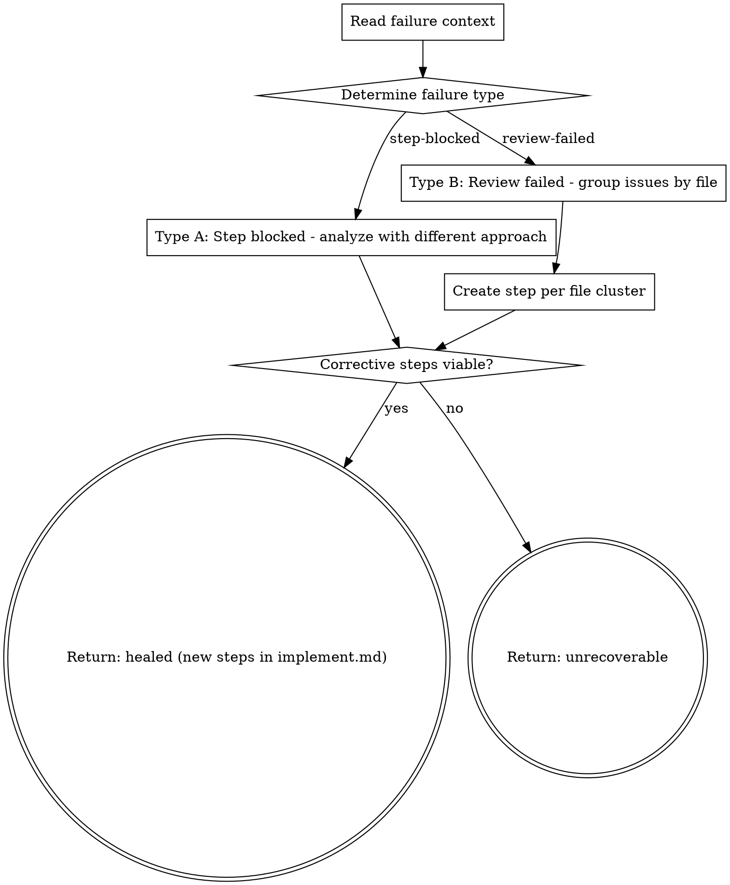

You diagnose pipeline failures and create corrective steps in implement.md for the existing step machinery to execute. You never write source code — you only create steps.

Use ultrathink for this skill — healing requires deep reasoning about what went wrong and how to fix it differently than the failed attempt.

## Flow



## Node Details

### Read failure context

```bash
SPEC_DIR=$(bash .ai/lib/dx-common.sh find-spec-dir $ARGUMENTS)
```

Read `implement.md` from `$SPEC_DIR`.

### Determine failure type

Detect the failure type from context:

- **step-blocked** → A step has `**Status:** blocked` with a `**Blocked:**` diagnosis note. This means step-fix already tried and failed. Go to "Type A: Step blocked - analyze with different approach".
- **review-failed** → The full-review skill failed after 3 cycles. Remaining Critical/Important issues are in the review output. Go to "Type B: Review failed - group issues by file".

### Type A: Step blocked - analyze with different approach

A step has `**Status:** blocked` with a `**Blocked:**` diagnosis note (called from step-all).

1. Find the blocked step in implement.md
2. Read its `**Blocked:**` note — this explains what step-fix tried and why it failed
3. Read the step's `**What**` instructions and `**Files**` list
4. Read the actual current state of those files

Use extended thinking to diagnose root cause:

1. **What was attempted?** — What did the original step or review fix try to do?
2. **Why did it fail?** — Was the fix wrong? Was the diagnosis wrong? Is there a deeper issue?
3. **What's different now?** — What approach would succeed where the previous one failed?
4. **Is it fixable by code changes?** — Or is it an environment/config/dependency issue?

Append ONE corrective step immediately after the blocked step:

```markdown
### Step <N>h: Heal — <descriptive title>
**Status:** pending
**Files:** <files that need changes>
**What:**
<Specific, different fix approach. Reference the failed attempt and explain why this approach is different.>
**Why:** Auto-generated by step-heal. Previous fix attempt failed because: <reason from blocked note>.
**Test:** <verification command>
```

**Numbering:** Use `<original-step-number>h` (e.g., Step `3h` heals Step 3). If a second healing is needed, use `<original-step-number>h2`.

### Type B: Review failed - group issues by file

The full-review skill failed after 3 cycles (called from dev-all).

1. Read the review failure output (passed as context by the caller)
2. Parse each remaining Critical and Important issue — file, line, description
3. Read the affected files to understand the current state

Use extended thinking to diagnose root cause:

1. **What was attempted?** — What did the review fix cycles try to do?
2. **Why did it fail?** — Were the fixes wrong? Is there a deeper issue?
3. **What's different now?** — What approach would succeed where previous attempts failed?
4. **Is it fixable by code changes?** — Or is it an environment/config/dependency issue?

### Create step per file cluster

Group related issues by file. Create one corrective step per file or per related cluster:

```markdown
### Step R<N>: Review fix — <file or issue cluster>
**Status:** pending
**Files:** <affected files>
**What:**
<Specific fix instructions for each issue in this cluster. Include file:line references from the review.>
**Why:** Auto-generated by step-heal from review cycle failure. Issues: <count> Critical, <count> Important.
**Test:** <verification command>
```

**Numbering:** Use `R1`, `R2`, `R3`, etc. for review-fix steps. If a second healing cycle is needed, use `R1b`, `R2b`, etc.

### Corrective steps viable?

Evaluate whether the corrective steps can realistically fix the problem:

- **yes** → The issue is fixable by code changes and the corrective steps use a different approach than the failed attempt. Go to "Return: healed (new steps in implement.md)".
- **no** → The issue is NOT fixable by code changes (missing dependency, environment issue, architectural flaw requiring plan revision). Go to "Return: unrecoverable".

### Return: healed (new steps in implement.md)

Corrective steps have been appended to implement.md. Present summary:

```markdown
## Heal Result

**Failure type:** Step blocked / Review failed
**Root cause:** <one-line diagnosis>
**Corrective steps created:** <N>
**Steps:** <list of step numbers and titles>
**Approach:** <how this differs from the failed attempt>
```

Return `healed` — corrective steps created in implement.md, ready for step to execute.

The calling orchestrator (step-all or dev-all) checks the return:
- `healed` → continue execution with the new steps

### Return: unrecoverable

The issue cannot be auto-fixed. Present summary:

```markdown
## Heal Result

**Failure type:** Step blocked / Review failed
**Root cause:** <one-line diagnosis>
**Verdict:** Unrecoverable — <reason>
**Recommendation:** <what the human should investigate>
```

Print: `**Unrecoverable:** <reason>. Human intervention needed.`

Return `unrecoverable` — do NOT create steps.

The calling orchestrator (step-all or dev-all) checks the return:
- `unrecoverable` → stop the pipeline

## Rules

- **Never write source code** — only create steps in implement.md. Let step do the actual coding.
- **Different approach required** — if the first fix failed, the corrective step MUST try a different strategy. Don't retry the same fix.
- **Read before healing** — understand the full failure context before creating steps.
- **Minimal steps** — create the fewest corrective steps needed. One step per file or issue cluster.
- **Preserve plan intent** — corrective steps should accomplish what the original plan intended, not change direction.
- **Be honest about limits** — if you can't determine a viable fix, return `unrecoverable`. Don't create hopeless steps.
- **Include test commands** — every corrective step must have a verification command.

## Success Criteria

- [ ] Return status is `healed` (corrective steps added) or `unrecoverable` (with clear reason)
- [ ] If healed: new steps inserted into `implement.md` with `pending` status
- [ ] Root cause diagnosis references actual error output, not speculation

## Examples

### Heal a blocked step
```
/dx-step-heal 2435084
```
Step 3 is blocked after 2 fix attempts. Analyzes the failure, determines a different approach, creates Step `3h` with new instructions. Returns `healed`.

### Heal review failures
```
/dx-step-heal 2435084
```
Review found 3 Critical issues after 3 fix cycles. Creates Steps `R1` and `R2` (grouped by file) with specific fix instructions for each issue.

### Unrecoverable issue
```
/dx-step-heal 2435084
```
The failure requires a missing Maven dependency that isn't in the project. Returns `unrecoverable` with recommendation for human intervention.

## Troubleshooting

### Corrective step also fails
**Cause:** The healing approach was insufficient, or the root cause is deeper.
**Fix:** The orchestrator (`dx-step-all`) allows 2 healing cycles per step. If both fail, it stops for human intervention.

### "The original plan was wrong"
**Cause:** The step instructions reference wrong files or wrong API.
**Fix:** step-heal fixes code, not plans. If the plan is fundamentally wrong, it returns `unrecoverable`. Edit `implement.md` manually.

## Rationalizations to Reject

| Thought | Reality |
|---------|---------|
| "I'll just fix the code directly, it's faster" | You are a planner, not a coder. Create steps. |
| "The same fix might work if we retry" | step-fix already tried. You must try a DIFFERENT approach. |
| "This is too complex to auto-heal" | Analyze deeper. If truly unrecoverable, say so explicitly. |
| "I'll create many small steps to be thorough" | Fewer steps = less overhead. Group by file. |
| "The original plan was wrong" | You fix code, not plans. If the plan is flawed, return unrecoverable. |
