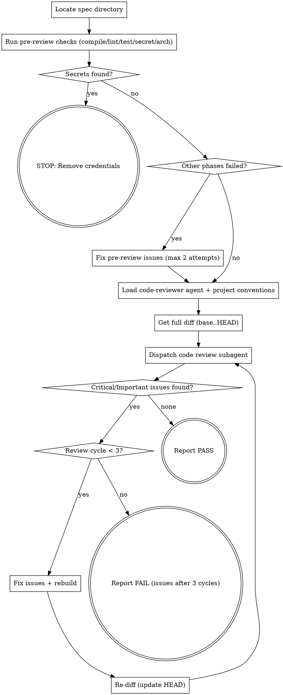

You perform a 6-phase verification of ALL changes: compile, lint, test, secret scan, architecture check, then code review with auto-fix. You only pass when all phases are clean.

Use ultrathink for this skill — code review benefits from deep reasoning about correctness.

## Flow



## Node Details

### Locate spec directory

```bash
SPEC_DIR=$(bash .ai/lib/dx-common.sh find-spec-dir $ARGUMENTS)
```

Read from `$SPEC_DIR`:
- `implement.md` — the full plan with all steps
- `explain.md` — original requirements

### Run pre-review checks (compile/lint/test/secret/arch)

Run the 5-phase pre-review gate before the expensive code review:

```bash
bash .ai/lib/pre-review-checks.sh --fix 2>&1
```

This runs:
1. **Compile** — project compilation (skipped if no compilable source changes)
2. **Lint** — lint with auto-fix (skipped if no lintable file changes)
3. **Test** — run tests (skipped if no source changes or compilation failed)
4. **Secret Scan** — grep for credential patterns in changed files
5. **Architecture** — file naming, package structure, convention checks

Parse the JSON output. Print the phase results table:

```markdown
### Pre-Review Verification (Phases 1-5)

| Phase | Check | Status |
|-------|-------|--------|
| 1 | Compile | ✅/❌/⏭️ |
| 2 | Lint | ✅/❌/⏭️ |
| 3 | Test | ✅/❌/⏭️ |
| 4 | Secret Scan | ✅/❌ |
| 5 | Architecture | ✅/❌ |
```

### Secrets found?

Check whether Phase 4 (secret scan) reported any findings. If yes, route to **STOP: Remove credentials**. If no, route to **Other phases failed?**.

### STOP: Remove credentials

Print: `Secret patterns detected. Remove credentials before proceeding.`

Do NOT continue to code review. The skill ends here — the user must remove the credentials and re-run `/dx-step-verify`.

### Other phases failed?

Check whether any of Phases 1-3 or Phase 5 reported failures. If all passed, route to **Load code-reviewer agent + project conventions**. If any failed, route to **Fix pre-review issues (max 2 attempts)**.

### Fix pre-review issues (max 2 attempts)

Fix the failing phases yourself:
- Compilation errors → read error output, apply fix, re-run compile
- Lint issues → the `--fix` flag auto-fixes most; fix any remaining manually
- Test failures → read failure output, apply fix, re-run test
- Architecture issues → fix naming/structure violations

After fixing, re-run the pre-review checks to confirm. Max 2 fix attempts for pre-review phases. If still failing after 2 attempts, report which phases failed and continue to **Load code-reviewer agent + project conventions** (code review may catch the root cause).

### Load code-reviewer agent + project conventions

Read `agents/dx-code-reviewer.md` — this contains:
- Review methodology (plan alignment, code quality, architecture, testing, production readiness)
- Severity definitions (Critical, Important, Minor)
- Output format specification
- DO/DON'T rules

This agent definition is the **single source of truth** for review standards. Pass its full content to the reviewer subagent.

**Also load project conventions** to pass alongside the agent definition:

1. Read `.claude/rules/*.md` — all rule files matching the changed file types
2. If `.github/instructions/` exists, read instruction files relevant to the changed file types (e.g., `fe.javascript.instructions.md` for JS, `fe.css-styles.md` for SCSS)

Include these conventions in the reviewer subagent prompt (in **Dispatch code review subagent**) under a `## Project Conventions` section so the reviewer can check code against them.

### Get full diff (base..HEAD)

Determine the base branch from `.ai/config.yaml` `scm.base-branch`, or auto-discover per `shared/git-rules.md`.

Determine the git range — all changes since branching from the base:

```bash
BASE_SHA=$(git merge-base $BASE_BRANCH HEAD)
HEAD_SHA=$(git rev-parse HEAD)
git diff --stat $BASE_SHA..$HEAD_SHA
git diff $BASE_SHA..$HEAD_SHA
```

Also read all modified files in full for broader context.

### Dispatch code review subagent

Use the Task tool with `dx-code-reviewer` subagent type (if available), otherwise `general-purpose`. The project's agent definition (`agents/dx-code-reviewer.md`) provides all the review intelligence.

**Prompt:**

```
<Include full content of agents/dx-code-reviewer.md here — the agent's system prompt>

---

## Review Context

### What Was Implemented
<Summary from implement.md — list all completed steps>

### Requirements
<Content from explain.md>

### Git Range
Base: <BASE_SHA>
Head: <HEAD_SHA>

Run these to see the changes:
git diff --stat <BASE_SHA>..<HEAD_SHA>
git diff <BASE_SHA>..<HEAD_SHA>

Also read each modified file in full for context beyond the diff.

<If this is cycle 2+:>
### Previous Review
This is review cycle <N>. Previous issues that were fixed:
<list of issues from prior cycle and what was changed>

Focus on verifying the fixes are correct AND check for any new issues introduced by the fixes.
```

### Critical/Important issues found?

Parse the subagent's response. Extract:
- Count of Critical, Important, Minor issues
- Specific file:line references for each Critical/Important issue
- The verdict (Yes/No/With fixes)

If **no Critical and no Important issues** → route to **Report PASS**.

If **Critical or Important issues found** → route to **Review cycle < 3?**.

### Review cycle < 3?

Track iteration count starting at 1. Increment after each fix-and-review cycle. Maximum 3 cycles total. If under 3, route to **Fix issues + rebuild**. If 3 reached, route to **Report FAIL (issues after 3 cycles)**.

### Fix issues + rebuild

For each Critical issue, then each Important issue:

1. **Read the file** at the referenced line
2. **Understand the issue** — what's wrong and why
3. **Apply the minimal fix** using the Edit tool
4. **Don't refactor** — fix the specific issue only

Rules for fixing:
- Fix Critical issues first, then Important
- One fix at a time — don't batch unrelated changes
- Preserve the feature's intent — fix bugs, don't redesign
- If a fix is unclear or risky, skip it and note it in the output

**Rebuild after fixes:**

Read the build command from `.ai/config.yaml` `build.command` and run it:

```bash
<build.command> 2>&1
```

If the build fails:
- Read the error, apply a minimal fix, rebuild once more
- If it still fails, STOP the loop and report

### Re-diff (update HEAD)

```bash
HEAD_SHA=$(git rev-parse HEAD)  # may change if fixes were committed
git diff --stat $BASE_SHA..$HEAD_SHA
```

Loop back to **Dispatch code review subagent** with the updated diff.

### Report PASS

**Provenance update:** If `implement.md` has a provenance frontmatter block, update `verified: false` to `verified: true`. If it has no provenance frontmatter (pre-migration file), skip this update.

Before claiming all phases passed, invoke `superpowers:verification-before-completion` if available.

**Fallback (if superpowers not installed):** For every success claim:
1. Identify the command that proves it.
2. Run the FULL command fresh (not cached).
3. Read full output and exit code.
4. Verify output actually confirms the claim.
5. THEN state the claim WITH the evidence.

Never use "should pass", "probably clean", or "seems fine." Show actual output.

**Output:**

```markdown
## Full Code Review: #<id>

**Verdict:** ✅ PASSED
**Review cycles:** <N> of 3

### Pre-Review Verification (Phases 1-5)

| Phase | Check | Status |
|-------|-------|--------|
| 1 | Compile | ✅/❌/⏭️ |
| 2 | Lint | ✅/❌/⏭️ |
| 3 | Test | ✅/❌/⏭️ |
| 4 | Secret Scan | ✅/❌ |
| 5 | Architecture | ✅/❌ |

### Code Review History (Phase 6)

| Cycle | Critical | Important | Minor | Action |
|-------|----------|-----------|-------|--------|
| 1 | <N> | <N> | <N> | <Fixed N issues / Clean> |
| 2 | <N> | <N> | <N> | <Fixed N issues / Clean> |

### Strengths
<From the final review — specific file:line references>

### Minor Issues (noted, not blocking)
<From all reviews — deduplicated>

### Plan Compliance
- All requirements from explain.md covered? ✅/❌
- Any unrequested features (scope creep)? ✅/❌
- All steps from implement.md reflected in code? ✅/❌

### Production Readiness
- Backward compatible? ✅/❌
- Tests passing? ✅/❌
- No hardcoded values? ✅/❌
- Config/template ↔ Model property names match? ✅/❌

### Files Modified During Fix Cycles
<List of files changed by the reviewer, not the original implementation>
```

Return verdict so the pipeline continues. The calling skill (dev-all) should continue to the next phase.

### Report FAIL (issues after 3 cycles)

**Output:**

```markdown
## Full Code Review: #<id>

**Verdict:** ❌ FAILED (issues remain after 3 fix cycles)
**Review cycles:** 3 of 3

### Pre-Review Verification (Phases 1-5)

| Phase | Check | Status |
|-------|-------|--------|
| 1 | Compile | ✅/❌/⏭️ |
| 2 | Lint | ✅/❌/⏭️ |
| 3 | Test | ✅/❌/⏭️ |
| 4 | Secret Scan | ✅/❌ |
| 5 | Architecture | ✅/❌ |

### Code Review History (Phase 6)

| Cycle | Critical | Important | Minor | Action |
|-------|----------|-----------|-------|--------|
| 1 | <N> | <N> | <N> | <Fixed N issues / Clean> |
| 2 | <N> | <N> | <N> | <Fixed N issues / Clean> |
| 3 | <N> | <N> | <N> | <Remaining issues listed below> |

### Strengths
<From the final review — specific file:line references>

### Remaining Issues
<List what couldn't be auto-fixed>

#### Critical
<file:line — what's wrong — why fix attempt failed>

#### Important
<file:line — what's wrong — why fix attempt failed>

### Minor Issues (noted, not blocking)
<From all reviews — deduplicated>

### Plan Compliance
- All requirements from explain.md covered? ✅/❌
- Any unrequested features (scope creep)? ✅/❌
- All steps from implement.md reflected in code? ✅/❌

### Production Readiness
- Backward compatible? ✅/❌
- Tests passing? ✅/❌
- No hardcoded values? ✅/❌
- Config/template ↔ Model property names match? ✅/❌

### Files Modified During Fix Cycles
<List of files changed by the reviewer, not the original implementation>
```

Return verdict so the pipeline STOPS. List remaining issues clearly. The calling skill (dev-all) should STOP the pipeline — user must fix manually and re-run `/dx-step-verify`.

## Examples

1. `/dx-step-verify 2416553` — Runs all 6 phases: compile passes, lint auto-fixes 2 issues, tests pass, no secrets found, architecture check passes, then dispatches a code review subagent. Review finds 1 Important issue (missing null check), auto-fixes it, rebuilds, re-reviews clean. Verdict: PASSED in 2 cycles.

2. `/dx-step-verify` (no argument) — Uses the most recent spec directory. Pre-review phases all pass. Code review finds 2 Critical issues after 3 fix cycles that couldn't be resolved. Verdict: FAILED with remaining issues listed for manual intervention.

3. `/dx-step-verify 2416553` (secrets detected) — Phase 4 (secret scan) detects a hardcoded API key pattern in a changed file. Stops immediately without proceeding to code review. Prints: "Secret patterns detected. Remove credentials before proceeding."

## Troubleshooting

- **Pre-review phases fail repeatedly**
  **Cause:** Compilation or test errors that the auto-fix can't resolve (e.g., missing dependency, broken import).
  **Fix:** Fix the build/test issue manually, then re-run `/dx-step-verify`. The skill continues to Phase 6 after 2 failed fix attempts.

- **Code review cycles exhaust without passing**
  **Cause:** The reviewer keeps finding new issues introduced by prior fixes, or the issues require architectural changes.
  **Fix:** Review the "Remaining Issues" section in the output. Fix them manually and re-run `/dx-step-verify`.

- **"Secret patterns detected" false positive**
  **Cause:** A test fixture or config file contains a string matching the secret pattern regex (e.g., `password=test123`).
  **Fix:** Verify the flagged content is not a real secret. If it's a false positive, the skill stops at Phase 4 — you'll need to proceed manually or adjust the secret scan patterns.

## Anti-Rationalization

Common excuses for skipping or weakening verification — and why they're wrong:

| False Logic | Reality Check |
|---|---|
| "Tests pass, that's enough" | Tests are necessary but not sufficient. They prove what you tested, not what you didn't. |
| "AI-generated code is fine — it compiled" | AI-generated code has higher false-confidence risk. Review it MORE carefully, not less. |
| "I wrote it, so I know it's correct" | Author blindness is real. The reviewer catches what the author's mental model skips. |
| "We'll clean it up later" | Deferred cleanup rarely happens. Technical debt compounds like interest. |
| "It's a small change, no review needed" | Small changes cause big outages. The 2-line off-by-one is the classic production incident. |
| "The review is slowing us down" | Shipping a bug to production is slower. Reviews are the fastest way to catch issues. |
| "This is just a config change" | Config changes can break entire environments. They deserve the same scrutiny as code. |

## Rules

- **Never switch branches or stash** — all git operations stay on the current branch. Use `git diff` and `git merge-base` only. Never `git stash`, `git checkout`, or `git switch`.
- **Full diff only** — review ALL changes from base branch to HEAD, not just the last commit
- **Agent-driven review** — always load the code-reviewer agent definition, never hardcode conventions
- **Self-healing** — fix issues yourself, don't punt to the user until you've tried 3 times
- **Rebuild after every fix** — never skip the build verification
- **Evidence-based** — every issue needs file:line reference
- **Severity matters** — don't mark nitpicks as Critical, don't downplay real bugs
- **No style nitpicking** — only flag real issues on code that was actually changed
- **Acknowledge strengths** — good code deserves recognition
- **Minimal fixes** — fix the bug, don't refactor the neighborhood
- **3 cycles max** — if it's not clean after 3 rounds, it needs human attention
