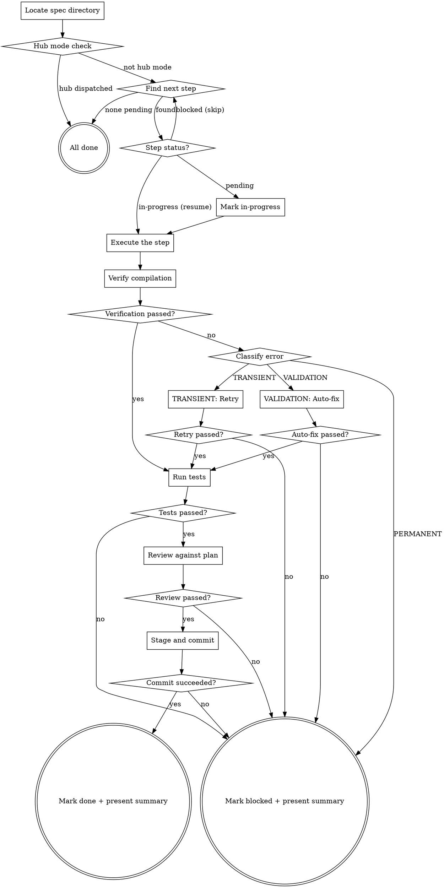

You execute the next pending step from implement.md — implement the changes, verify compilation, run tests, review against plan and conventions, commit, and mark the step done.

## Progress Tracking

Create a task for the current step using `TaskCreate` (e.g., "Step 3: Add dropdown field"). Mark `in_progress` when starting, `completed` when committed. On phase failures, update the task subject (e.g., "Step 3: Add dropdown field (test failed)").

## Flow



## Node Details

### Locate spec directory

```bash
SPEC_DIR=$(bash .ai/lib/dx-common.sh find-spec-dir $ARGUMENTS)
```

Read `implement.md` from `$SPEC_DIR`.

### Hub mode check

Read `shared/hub-dispatch.md` for hub detection logic.

If hub mode is active (`hub.enabled: true` AND cwd is `.hub/`):
1. Determine which repo owns this step:
   - Read `implement.md` step instructions for file paths
   - Match file paths to repo capabilities from config
   - Or: if step specifies a repo tag (from cross-repo plan), use that
2. Dispatch to the correct repo: `cd <repo.path> && claude -p "/dx-step <ticket-id>" --output-format json --allowedTools "Bash,Read,Edit,Write,Glob,Grep" --permission-mode bypassPermissions`
3. Collect result, write state
4. Print: `✓ <repo> — step <N> <status>`
5. Go to → "All done" (step executed in target repo)

If hub mode is not active: continue to "Find next step" (normal flow).

### Find next step

Parse implement.md and find the first step with `**Status:** pending`.

If a step has `**Status:** in-progress`, it was interrupted — route to "Step status?" with `in-progress`.

If a step has `**Status:** blocked`, skip it and find the next pending step. Print: "Skipping Step N (blocked). Executing Step M instead."

### All done

1. Check if implement.md has an `**Other repos required:**` line. If so, print:
   ```
   > Cross-repo: This plan covers <current repo> only. Switch to <other repo(s)> and run `/dx-req <id>` there.
   ```
2. Print: "All steps are done. Run `/dx-pr` to create a pull request."
3. STOP.

### Step status?

Route based on the step's current status:
- **pending** → go to "Mark in-progress"
- **in-progress** → go to "Execute the step" (resume interrupted step)
- **blocked** → go back to "Find next step" (skip and find next pending)

### Mark in-progress

Update the step's status in implement.md:
```
**Status:** in-progress
```

### Execute the step

Read the step's full instructions:
- **Files** — which files to modify or create
- **What** — specific instructions for changes
- **Why** — requirement being addressed (for context)

Implement the changes:
- Read each file listed in **Files** before modifying it
- Follow the **What** instructions precisely
- **Before creating any new utility, helper, or abstraction:** search the codebase (`commons/`, `utils/`, `shared/`, `lib/`, `scripts/libs/`, `mixins/`) for existing implementations. If one exists, use it instead of creating new code. If `research.md` exists in the spec directory, check its "Existing Implementation Check" section for reusable code.
- Use Edit tool for modifications, Write tool for new files
- Follow project conventions — read `.claude/rules/` for rules matching the file types being modified (e.g., `fe-javascript.md` for JS, `fe-styles.md` for SCSS). If `.github/instructions/` exists, also read the relevant instruction file for framework-specific patterns. For AEM frontend work involving modals, overlays, or focus traps, check if `shared/aem-dom-rules.md` exists (dx-aem plugin) and follow its DOM constraints.

**Test-first approach:**

If the step has a `Test:` line and `superpowers:test-driven-development` is available, invoke it to guide the RED-GREEN-REFACTOR cycle.

**Fallback (if superpowers not installed):** When a step includes tests:
1. **RED:** Write/locate the test first. Run it — confirm it fails (proves the test validates something).
2. **GREEN:** Write the minimal implementation to pass the test. No extras (YAGNI).
3. **REFACTOR:** Clean up only after green — duplication, naming, structure — while staying green.

If a test passes immediately before any code change, the test isn't validating new behavior — fix it.

### Verify compilation

Run the step's **Test** command if specified. Otherwise, read the build command from `.ai/config.yaml` `build.command` and run a compile check (not full build):

If the project uses Maven: `mvn compile -pl <module> -q`
If the project uses npm: `npm run build`
Otherwise: use whatever compile/typecheck command is configured.

### Verification passed?

- **yes** — compilation/test exits 0 → go to "Run tests"
- **no** — error detected → go to "Classify error"

### Classify error

Classify the error against the taxonomy in `shared/error-handling.md`:
- **TRANSIENT** → go to "TRANSIENT: Retry"
- **VALIDATION** → go to "VALIDATION: Auto-fix"
- **PERMANENT** → go to "Mark blocked + present summary"

### TRANSIENT: Retry

Retry the command (up to 2 times). If still failing, go to "Mark blocked + present summary".

### Retry passed?

- **yes** — retry succeeded → go to "Run tests"
- **no** — still failing after retries → go to "Mark blocked + present summary"

### VALIDATION: Auto-fix

Attempt ONE auto-fix (syntax fix, missing import, lint fix). Re-run verification. Do NOT attempt more than one auto-fix.

### Auto-fix passed?

- **yes** — fix + verify passes → go to "Run tests"
- **no** — fix fails or verify still fails → go to "Mark blocked + present summary"

### Run tests

Determine the test command:
1. Check the current step's **Test:** line
2. Fall back to `build.test` from `.ai/config.yaml`
3. Fall back to common patterns: Maven → `mvn test -pl <module>`, npm → `npm test`

Execute with a 5-minute timeout. Parse output:
- **Tests run** / **Passed** / **Failed** / **Errors** / **Skipped** / **Time elapsed**
- For each failure: extract test name and assertion message (max 10 lines per failure)

### Tests passed?

- **yes** — all tests pass (zero failures, zero errors) → go to "Review against plan"
- **no** — any test failure or error → go to "Mark blocked + present summary" with `{ status: "blocked", phase: "test", error: "<failure summary>" }`

### Review against plan

Use ultrathink for deep reasoning about correctness.

Get the diff: `git diff` for uncommitted changes, or `git diff HEAD~1` if already committed. Read modified files in full for context.

**Plan compliance:** Do changes match the step's instructions? Are all **Files:** modified? Any extra files changed?

**Convention check:** Read `.claude/rules/` and `.github/instructions/` for relevant file types. Check naming, framework patterns, interface separation, template patterns, test patterns.

**Bug check:** Null pointer risks, resource leaks, hardcoded values that should be configurable, missing imports, property name mismatches.

Verdict: APPROVED, APPROVED WITH NOTES, or CHANGES REQUESTED.

### Review passed?

- **yes** — verdict is APPROVED or APPROVED WITH NOTES → go to "Stage and commit"
- **no** — verdict is CHANGES REQUESTED → go to "Mark blocked + present summary" with `{ status: "blocked", phase: "review", error: "<list of required changes>" }`

### Stage and commit

**Before anything else**, read `shared/git-rules.md` — all git/SCM conventions.

**Branch check:** Verify on `feature/*` or `bugfix/*` branch. If not, run `bash .ai/lib/ensure-feature-branch.sh $SPEC_DIR`.

**Determine files:** From the step's **Files:** list + `git status` for files clearly part of this step. Never stage unrelated files, .env, credentials, or secrets.

**Stage specifically** (never `git add -A`):
```bash
git add <file1> <file2> ... <implement.md>
```
Always include implement.md to capture the status update.

**Commit message:** Extract work item ID from spec directory name. Format: `#<ID> <imperative description>`. Use HEREDOC:
```bash
git commit -m "$(cat <<'EOF'
#<ID> <description>
EOF
)"
```

If nothing to stage, report "Nothing to stage — no commit created" and go to "Mark blocked + present summary" with `{ status: "blocked", phase: "commit", error: "nothing to stage" }`.

### Commit succeeded?

- **yes** — commit created with valid hash → go to "Mark done + present summary"
- **no** — commit failed → go to "Mark blocked + present summary" with `{ status: "blocked", phase: "commit", error: "<message>" }`

### Mark done + present summary

Update implement.md:
```
**Status:** done
```

Print:
```markdown
## Step N complete: <step title>

**Files modified:** <list>
**Compilation:** passed
**Tests:** passed (<N> tests, <time>)
**Review:** <verdict>
**Commit:** `<short hash>` — `<commit message>`
**Next:** Step <N+1> — <title> (or "All steps done — run `/dx-pr`")

Run `/dx-step` for the next step, or `/dx-step-all` to continue autonomously.
```

### Mark blocked + present summary

Update implement.md:
```
**Status:** blocked
```

Include the phase, error category, message, and suggested action:
```
{ status: "blocked", phase: "compile|test|review|commit", error: "<message>" }
```

Print the summary with the failure details. The coordinator (`dx-step-all`) uses this to decide whether to call `dx-step-fix`.

## Success Criteria

- [ ] Target step status updated: pending → done (or blocked with reason)
- [ ] If done: compilation/build command exits 0
- [ ] If done: tests pass (zero failures)
- [ ] If done: review verdict is APPROVED or APPROVED WITH NOTES
- [ ] If done: commit created with work item ID in message
- [ ] If done: files modified match step's `**Files:**` list
- [ ] implement.md updated in-place (no corruption of other steps)

## Examples

### Execute next step (full pipeline)
```
/dx-step 2435084
```
Finds the first pending step in `implement.md`, marks it `in-progress`, implements code, verifies compilation, runs tests, reviews against plan and conventions, commits, and marks `done`.

### Resume interrupted step
```
/dx-step 2435084
```
If a step is `in-progress` (from a previous interrupted run), resumes it instead of starting the next pending step.

### All steps complete
```
/dx-step 2435084
```
If no pending steps remain, prints "All steps are done. Run `/dx-pr` to create a pull request."

## Troubleshooting

### Step marked blocked after compilation failure
**Cause:** The implemented code doesn't compile, and the one auto-fix attempt also failed.
**Fix:** Run `/dx-step-fix` to diagnose and fix the error, or manually fix and reset the status to `pending` in `implement.md`.

### Step marked blocked after test failure
**Cause:** Tests fail after implementation.
**Fix:** Run `/dx-step-fix` to diagnose and fix failures, then reset status to `pending`.

### Step marked blocked after review
**Cause:** Code review found issues (convention violations, bugs, plan deviations).
**Fix:** Run `/dx-step-fix` to address the required changes, then reset status to `pending`.

### Step creates a new helper instead of reusing existing one
**Cause:** The step instructions in `implement.md` say "create new" when an existing utility would work.
**Fix:** Fix `implement.md` first — update the step's What instructions to reference the existing code. Then re-run `/dx-step`.

### "No implement.md found"
**Cause:** Planning hasn't been done yet.
**Fix:** Run `/dx-plan <id>` to generate the implementation plan first.

### "Not on a feature branch"
**Cause:** Working on `development`, `main`, or another protected branch.
**Fix:** The skill auto-runs `ensure-feature-branch.sh`. If that fails, manually create: `git checkout -b feature/<id>-<slug>`.

## Decision Examples

### Fixable Error (VALIDATION)
**Error:** `error TS2304: Cannot find name 'HeroProps'`
**Classification:** VALIDATION / SYNTAX — missing import
**Action:** Add `import { HeroProps } from './hero.types'`, re-run compilation
**Outcome:** Fixed. Proceed to tests.

### Unfixable Error (PERMANENT)
**Error:** `bash: mvn: command not found`
**Classification:** PERMANENT / MISSING_DEPENDENCY
**Action:** Do NOT attempt fix. Mark step blocked: "Maven not installed on this machine."

### Ambiguous Error (needs classification)
**Error:** `ECONNREFUSED 127.0.0.1:4502`
**Classification:** TRANSIENT / TIMEOUT — AEM is not running
**Action:** Retry once (AEM may be starting). If still failing → mark blocked: "AEM instance not available."

### Test Failure
**Tests:** 3 failed out of 47
**Action:** Mark blocked with `{ status: "blocked", phase: "test", error: "3 test failures: TestDialog#testDropdown, ..." }`. Coordinator calls `/dx-step-fix`.

### Review Rejection
**Verdict:** CHANGES REQUESTED — hardcoded color `#FF0000` should use SCSS variable
**Action:** Mark blocked with `{ status: "blocked", phase: "review", error: "Convention violation: use $primary-color instead of #FF0000" }`. Coordinator calls `/dx-step-fix`.

## Rules

- **One step at a time** — execute exactly one step, then stop. Let the coordinator or user decide what's next.
- **Read before writing** — always read a file before editing it. Never blindly edit.
- **Follow conventions** — read `.claude/rules/` and `.github/instructions/` (if it exists) for the relevant file types before writing code. For AEM modal/overlay work, also check `shared/aem-dom-rules.md`.
- **Don't improvise** — implement exactly what the step says. If instructions are unclear, mark the step blocked with a note rather than guessing.
- **Update status immediately** — mark in-progress before starting, done/blocked when finished. This is the state machine that coordinators rely on.
- **Compile check is mandatory** — never mark a step done without verifying compilation passes.
- **Tests are mandatory** — never mark a step done without running tests.
- **Review is mandatory** — never mark a step done without reviewing against the plan.
- **Commit is mandatory** — never mark a step done without committing changes.
- **Follow git-rules.md** — read `shared/git-rules.md` before committing. Stage specifically, never `git add -A`.
- **No empty commits** — if nothing to stage, report and mark blocked.
