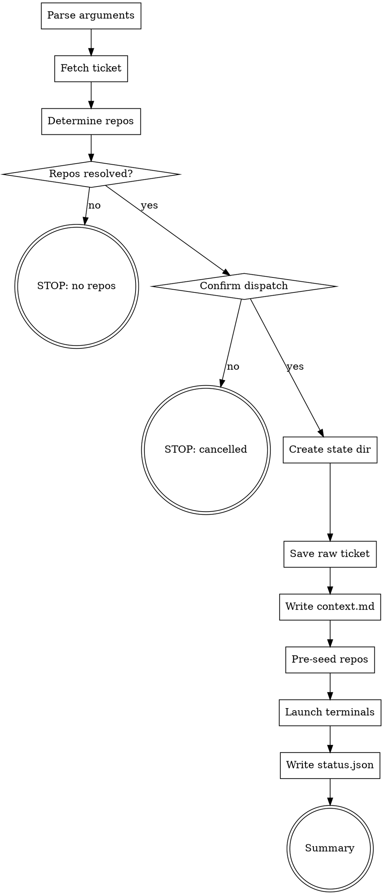

You dispatch a ticket to one or more repos by opening independent Claude Code sessions in VS Code terminals. The hub does NOT plan or implement — it fetches the ticket, determines which repos are involved, and launches real Claude sessions in each repo with a delegation prompt.

## Pre-flight

Read `.ai/config.yaml`. If `hub.enabled` is not `true`, STOP:

> Hub mode is not enabled. Run `/dx-hub-init` first.

Read:
- `hub.terminal-delay` — seconds to wait for Claude to start in terminal (default: `5`)
- `repos[]` — list of repos with `name`, `path`, `capabilities`

Read `shared/provider-config.md` for provider detection and tool mapping.

Read `.ai/config.yaml`:
- `tracker.provider` (or `scm.provider` for backward compat) — `ado` (default) or `jira`

**If provider = ado:**
- `scm.org`, `scm.project`

**If provider = jira:**
- `jira.url`, `jira.project-key`

## Flow



## Node Details

### Parse arguments

Parse `$ARGUMENTS`:

1. **Ticket ID** (required) — first positional arg. Numeric ADO ID, Jira key (`PROJ-123`), or full URL. Extract ID from URLs.
2. **Repo names** (optional) — additional positional args matching `repos[].name` from config. If provided, skip auto-detection and use these.
3. **`--skill`** (optional) — skill to run in each repo. Default: `/dx-agent-all`.

Examples:
```
/dx-hub-dispatch 2471234
/dx-hub-dispatch 2471234 repo-fe repo-be
/dx-hub-dispatch 2471234 --skill /dx-req
/dx-hub-dispatch PROJ-123 repo-fe --skill /dx-agent-all
```

### Fetch ticket

Fetch the work item using the configured provider.

**ADO:**
```
mcp__ado__wit_get_work_item
  project: "<scm.project>"
  id: <work item ID>
  expand: "relations"
```

**Jira:**
```
mcp__atlassian__jira_get_issue
  issue_key: "<issue key>"
```

Extract and hold in memory:
- **ID** — work item ID or Jira key
- **Title** — work item title
- **Type** — User Story, Bug, Task, etc.
- **Description** — full description text
- **Acceptance Criteria** — if present
- **State** — current state
- **Relations** — linked items

Also fetch comments:

**ADO:**
```
mcp__ado__wit_list_work_item_comments
  project: "<scm.project>"
  workItemId: <id>
```

### Determine repos

If repo names were provided as arguments, use those directly — look them up in `repos[]` by name.

If no repos specified, determine from ticket content:

1. **Check ticket title and description** for explicit repo/layer mentions:
   - Keywords like "frontend", "FE", "UI", "React", "Angular" → match repos with `capabilities: [fe]`
   - Keywords like "backend", "BE", "API", "service", "endpoint" → match repos with `capabilities: [be]`
   - Keywords like "full stack", "both", "end-to-end" → match both `fe` and `be` repos
   - Keywords matching a repo name directly → match that repo

2. **Check linked work items** — if the ticket has child tasks with repo-specific titles, use those as hints.

3. **If still ambiguous** — ask the user which repos to dispatch to, showing the full repo list from config.

### Repos resolved?

- **yes** — at least one repo matched → proceed to "Confirm dispatch"
- **no** — no repos could be determined → go to "STOP: no repos"

### STOP: no repos

Print:
```
Could not determine which repos are involved in ticket <id>.

Available repos:
  - <name> (capabilities: <caps>) — <path>
  ...

Re-run with explicit repos: /dx-hub-dispatch <id> <repo-name> [<repo-name> ...]
```
STOP.

### Confirm dispatch

Print the dispatch plan:
```
Hub Dispatch Plan
─────────────────────────────
Ticket:  <id> — <title>
Type:    <type>
Skill:   <skill>
Repos:   <repo-a> (<caps>), <repo-b> (<caps>)

This will open <N> VS Code terminals, each running an independent Claude session.
Proceed? [Y/n]
```

- **yes** (or Enter) → proceed
- **no** → go to "STOP: cancelled"

### STOP: cancelled

Print: `Dispatch cancelled.` STOP.

### Create state dir

```bash
HUB_ROOT="$(pwd)"
STATE_DIR="state/<ticket-id>"
mkdir -p "$STATE_DIR"
```

### Save raw ticket

Determine the correct filename based on ticket type:
- **Bug** type → `raw-bug.md`
- **All other types** (User Story, Task, etc.) → `raw-story.md`

Write the raw ticket content to `$STATE_DIR/<filename>` using the same faithful-dump format as `dx-req` (for stories) or `dx-bug-triage` (for bugs). Do NOT editorialize — this is a faithful copy of the ADO/Jira content.

For detailed format, follow the same structure as `dx-req` step 10 or `dx-bug-triage` step 9.

### Write context.md

Write `$STATE_DIR/context.md`:

```markdown
# Cross-Repo Context

**Ticket:** <id> — <title>
**Type:** <type>
**Dispatched:** <ISO timestamp>

## Involved Repos

| Repo | Role | Path |
|------|------|------|
| <repo-a> | <capabilities as role: fe→Frontend, be→Backend> | <absolute path> |
| <repo-b> | <role> | <absolute path> |

## Coordination Notes

- Each repo runs its own requirements analysis and implementation planning.
- This ticket involves multiple repos — coordinate shared interfaces (API contracts, shared types, event schemas) carefully.
- If you need to know what another repo is doing, check its spec directory: `<other-repo-path>/.ai/specs/<ticket-slug>/`

## What Each Repo Handles

<For each repo, write 1-2 sentences about what that repo's focus should be based on the ticket content and the repo's capabilities. Keep it brief — the repo's own dx-req will do the deep analysis.>
```

### Pre-seed repos

For each target repo:

1. Generate the spec directory name using the same slugify logic:
   ```bash
   DIR_NAME=$(<id>-<slugified-title>)
   REPO_SPEC_DIR="<repo-abs-path>/.ai/specs/${DIR_NAME}"
   ```

2. Create the directory:
   ```bash
   mkdir -p "$REPO_SPEC_DIR"
   ```

3. Copy the raw ticket file:
   ```bash
   cp "$STATE_DIR/<raw-story.md|raw-bug.md>" "$REPO_SPEC_DIR/"
   ```

This pre-seeds each repo so `dx-req` / `dx-bug-triage` will find `raw-story.md` / `raw-bug.md` already present and skip the ADO/Jira fetch.

### Launch terminals

For each target repo, open a VS Code terminal and start a Claude session:

**Step 1 — Open new terminal:**
```
mcp__vscode-automator__vscode_new_terminal
```

Wait 1 second for terminal to initialize.

**Step 2 — cd into the repo:**
```
mcp__vscode-automator__vscode_type
  text: "cd <repo-absolute-path>"
```
```
mcp__vscode-automator__vscode_keystroke
  key: "return"
```

Wait 1 second.

**Step 3 — Start Claude:**
```
mcp__vscode-automator__vscode_type
  text: "claude"
```
```
mcp__vscode-automator__vscode_keystroke
  key: "return"
```

Wait `hub.terminal-delay` seconds (default: 5) for Claude to start.

**Step 4 — Type the delegation prompt:**

Build the prompt (no line breaks — single continuous text):

```
Ticket <id> raw content is pre-seeded at .ai/specs/<dir-name>/<raw-file>. Cross-repo context at <hub-abs-path>/state/<ticket-id>/context.md — read it before starting. You handle the <repo-name> portion (<role>). Also involved: <other-repos-and-roles>. When done or blocked, update status in <hub-abs-path>/state/<ticket-id>/status.json — set repos.<repo-name> to done, blocked, or failed. Now run: <skill> <ticket-id>
```

```
mcp__vscode-automator__vscode_type
  text: "<delegation prompt>"
```
```
mcp__vscode-automator__vscode_keystroke
  key: "return"
```

Wait 2 seconds before opening the next terminal (to avoid focus conflicts).

### Write status.json

Write `$STATE_DIR/status.json`:

```json
{
  "ticket": "<ticket-id>",
  "title": "<title>",
  "type": "<type>",
  "skill": "<skill>",
  "started": "<ISO timestamp>",
  "repos": {
    "<repo-a>": "running",
    "<repo-b>": "running"
  }
}
```

### Summary

Print:

```
Hub Dispatch Started
────────────────────────────────
Ticket:    <id> — <title>
Skill:     <skill>
Terminals: <N> sessions launched

  <repo-a> (<role>) — running
  <repo-b> (<role>) — running

State: state/<ticket-id>/

Next:
  /dx-hub-status <ticket-id>    — check progress
  Switch to terminal tabs to monitor each session directly
```

## Examples

### Dispatch a story to auto-detected repos
```
/dx-hub-dispatch 2471234
```
Fetches ticket, detects FE/BE scope from content, opens 2 terminals.

### Dispatch to specific repos
```
/dx-hub-dispatch 2471234 repo-fe repo-be
```
Skips auto-detection, dispatches to named repos.

### Dispatch with a different skill
```
/dx-hub-dispatch 2471234 --skill /dx-req
```
Only runs requirements phase, not full pipeline.

### Dispatch a Jira ticket
```
/dx-hub-dispatch PROJ-123 repo-fe
```

## Troubleshooting

### VS Code terminals not opening
**Cause:** vscode-automator MCP server not running or macOS Accessibility permission not granted.
**Fix:** Check that vscode-automator is registered in `.mcp.json` and that your terminal app has Accessibility permission in System Preferences → Privacy & Security → Accessibility.

### Claude not starting in terminal
**Cause:** `hub.terminal-delay` too short — Claude CLI takes time to initialize.
**Fix:** Increase `hub.terminal-delay` in `.ai/config.yaml` (try `8` or `10`).

### Wrong repo detected
**Cause:** Ticket content didn't contain clear FE/BE keywords.
**Fix:** Re-run with explicit repo names: `/dx-hub-dispatch <id> <repo-name>`.

### Raw ticket not found in repo
**Cause:** Pre-seed step failed (directory permissions or path mismatch).
**Fix:** Check that repo paths in config are correct. The raw file should be at `<repo>/.ai/specs/<id>-<slug>/raw-story.md`.

## Rules

- **Hub never plans or implements** — it only fetches, routes, and launches
- **No hardcoded values** — all org names, project names, paths from config
- **Pre-seed raw files** — copy to each repo so skills skip redundant ADO fetches
- **One terminal per repo** — each gets its own independent Claude session
- **vscode-automator is macOS only** — this skill requires macOS with Accessibility permission
